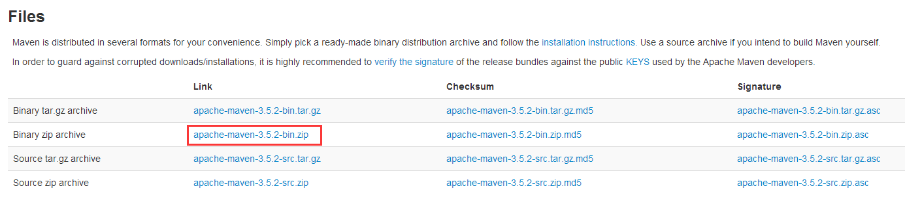
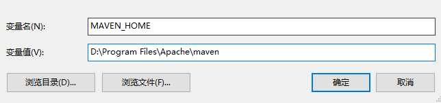
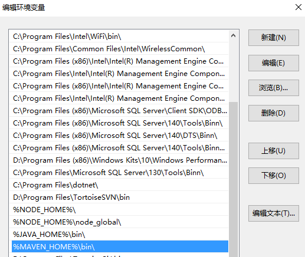

# 1. 环境搭建
## 1.1. Java jdk
### 1.1.1. 下载
JDK建议使用1.8及以上的版本。     
官方下载路径：[jdk下载地址](https://www.oracle.com/technetwork/java/javase/downloads/jdk8-downloads-2133151.html)

### 1.1.2. 安装
双击下载软件，一路单击下一步即可。

### 1.1.3. 配置环境变量
**Windows**：右击【我的电脑】→【属性】→【高级系统设置】→【环境变量】→【系统变量】→【新建】，接着如下图所示：    


在【系统变量】的path中添加 **%JAVA_HOME%\bin**、 **%JAVA_HOME%\jre\bin**。

验证，如下图所示：    


## 1.2. Maven
[maven](https://maven.apache.org/)

点击`Download`。

### 1.2.1. Windows


### 1.2.2. 配置环境变量




### 1.2.3. 配置本地仓库
修改文件`~\apache-maven-3.9.5\conf\settings.xml`：
```xml
<settings xmlns="http://maven.apache.org/SETTINGS/1.2.0"
          xmlns:xsi="http://www.w3.org/2001/XMLSchema-instance"
          xsi:schemaLocation="http://maven.apache.org/SETTINGS/1.2.0 https://maven.apache.org/xsd/settings-1.2.0.xsd">
  localRepository
   | The path to the local repository maven will use to store artifacts.
   |
   | Default: ${user.home}/.m2/repository
  <localRepository>自己设置的本地路径</localRepository>
```

### 1.2.4. 配置国内仓库
修改文件`~\apache-maven-3.9.5\conf\settings.xml`：
```xml
  <mirrors>
    <!-- mirror
     | Specifies a repository mirror site to use instead of a given repository. The repository that
     | this mirror serves has an ID that matches the mirrorOf element of this mirror. IDs are used
     | for inheritance and direct lookup purposes, and must be unique across the set of mirrors.
     |
    <mirror>
      <id>mirrorId</id>
      <mirrorOf>repositoryId</mirrorOf>
      <name>Human Readable Name for this Mirror.</name>
      <url>http://my.repository.com/repo/path</url>
    </mirror>
     -->
    <mirror>
      <id>maven-default-http-blocker</id>
      <mirrorOf>external:http:*</mirrorOf>
      <name>Pseudo repository to mirror external repositories initially using HTTP.</name>
      <url>http://0.0.0.0/</url>
      <blocked>true</blocked>
    </mirror>
    <mirror>
      <id>aliyunmaven</id>
      <mirrorOf>*</mirrorOf>
      <name>阿里云公共仓库</name>
      <url>https://maven.aliyun.com/repository/public</url>
    </mirror>
  </mirrors>
```