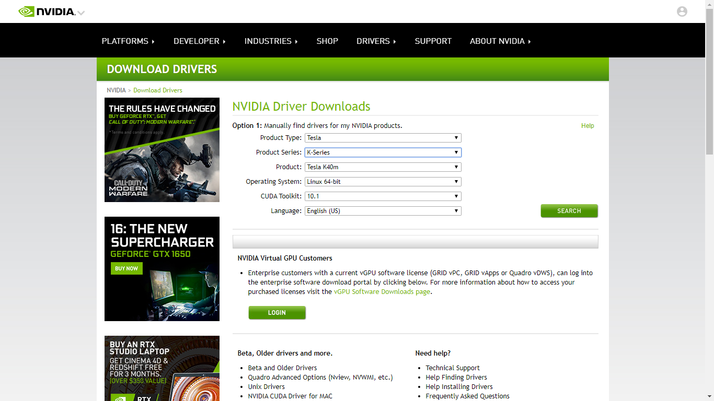

# 使用Docker搭建TensorFlow环境
## 相关准备工作
1. 更换国内软件源    
这里使用华为云的`sources.list`    
                
```bash
sudo sed -i "s@http://.*archive.ubuntu.com@http://repo.huaweicloud.com@g" /etc/apt/sources.list
sudo sed -i "s@http://.*security.ubuntu.com@http://repo.huaweicloud.com@g" /etc/apt/sources.list
```
           
2. `apt update`       
更换过软件源之后需要输入以下命令：
             
```bash
sudo apt update        ## 在root用户下则省略sudo


## 如果有需要进行更新的则使用以下命令,无则跳过
sudo apt upgrade -y    ## 在root用户下则省略sudo
```
            
3. 安装`tmux` 软件     
tmux 是一款终端复用命令行工具，一般用于 Terminal 的窗口管理。
        
```bash
sudo apt install tmux -y    ## 在root用户下则省略sudo
```

tmux：**[使用手册](https://www.cnblogs.com/kaiye/p/6275207.html)**    
              
## 安装docker
>Docker 是在 GPU 上运行 TensorFlow 的最简单方法，因为主机只需安装 NVIDIA® 驱动程序（无需安装 NVIDIA® CUDA® 工具包）。
          
### 使用APT安装
由于 apt 源使用 HTTPS 以确保软件下载过程中不被篡改。因此，我们首先需要添加使用 HTTPS 传输的软件包以及 CA 证书。      
     
```
sudo apt-get update

sudo apt-get install \
    apt-transport-https \
    ca-certificates \
    curl \
    software-properties-common
```
      
鉴于国内网络问题，强烈建议使用国内源，官方源请在注释中查看。    
为了确认所下载软件包的合法性，需要添加软件源的 GPG 密钥。     
      
```
(任选其一即可)
curl -fsSL https://mirrors.ustc.edu.cn/docker-ce/linux/ubuntu/gpg | sudo apt-key add -


官方源
curl -fsSL https://download.docker.com/linux/ubuntu/gpg | sudo apt-key add -
```
     
然后，我们需要向 source.list 中添加 Docker 软件源     
      
```
sudo add-apt-repository \
    "deb [arch=amd64] https://mirrors.ustc.edu.cn/docker-ce/linux/ubuntu \
    $(lsb_release -cs) \
    stable"


# 官方源
#  sudo add-apt-repository \
#    "deb [arch=amd64] https://download.docker.com/linux/ubuntu \
#    $(lsb_release -cs) \
#    stable"
```
      

### 安装 Docker CE

```
sudo apt update
sudo apt install docker-ce
```

### 建立 docker 用户组
建立docker组:   
   
```
sudo groupadd docker
```
    
将当前用户加入docker组：    
    
```
sudo usermod -aG docker $USER
```
           
### 更换国内Docker仓库
创建文件：       
    
```
sudo vim /etc/docker/daemon.json
```
     
加入以下内容：  
使用华为云Dockerhub镜像加速器：        
       
```
{
  "registry-mirrors": [
    "https://916ac5a1f07a4055ab4e9041f099a3c0.mirror.swr.myhuaweicloud.com"
  ]
}
```
         
然后**重启系统**或者输入以下命令：

```bash
sudo systemctl daemon-reload      ##root用户下不使用sudo
sudo systemctl restart docker     ##root用户下不使用sudo
```    
     
### 验证
输入以下命令：       
       
```
docker run hello-world
```
             
若输出以下内容则为成功。          
         
```
Unable to find image 'hello-world:latest' locally
latest: Pulling from library/hello-world
ca4f61b1923c: Pull complete
Digest: sha256:be0cd392e45be79ffeffa6b05338b98ebb16c87b255f48e297ec7f98e123905c
Status: Downloaded newer image for hello-world:latest

Hello from Docker!
This message shows that your installation appears to be working correctly.

To generate this message, Docker took the following steps:
 1. The Docker client contacted the Docker daemon.
 2. The Docker daemon pulled the "hello-world" image from the Docker Hub.
    (amd64)
 3. The Docker daemon created a new container from that image which runs the
    executable that produces the output you are currently reading.
 4. The Docker daemon streamed that output to the Docker client, which sent it
    to your terminal.

To try something more ambitious, you can run an Ubuntu container with:
 $ docker run -it ubuntu bash

Share images, automate workflows, and more with a free Docker ID:
 https://cloud.docker.com/

For more examples and ideas, visit:
 https://docs.docker.com/engine/userguide/
```
          
### 查看已下载的镜像
```bash
docker images
```
            
示例：          
          
```bash
root@002:~# docker images
REPOSITORY                TAG                 IMAGE ID            CREATED             SIZE
yancccccc/mysql5.6-utf8   latest              721bb6b0b741        10 days ago         286MB
yancccccc/php-apache      latest              e6f4473bc17d        4 weeks ago         263MB
```
           
### 查看正在运行的容器
```bash
docker ps -a
```
            
示例：      
        
```bash
root@002:~# docker ps -a
CONTAINER ID        IMAGE                     COMMAND                  CREATED             STATUS              PORTS                    NAMES
ea7b18474ae3        yancccccc/mysql5.6-utf8   "docker-entrypoint.s…"   10 days ago         Up 27 hours         0.0.0.0:3306->3306/tcp   mysql
a1c840339bd8        yancccccc/php-apache      "/bin/bash"              4 weeks ago         Up 27 hours         0.0.0.0:80->80/tcp       php-apache
```
          
上面的示例中运行着两个容器，两个容器的名字分别为php-apache和mysql。
             
### 停止与删除容器
```bash
docker stop xxx      ## xxx 为容器的名字
docker rm XXX       ## xxx为上一步中已停止的容器
```

示例：      

```bash
## 根据上一步查看正在运行的容器一步中的示例
## 停止php-apache这个容器
docker stop php-apache
## 删除上一个命令已停止的php-apache容器
docker rm php-apache
```
       
### 删除镜像
```bash
docker rmi xxx    ## xxx为镜像名字
```

示例：            
           
```bash
## 根据上一步查看正在运行的容器一步中的示例
## 删除php-apache镜像
docker rmi yancccccc/php-apache
```
            
## 安装NVIDIA® 驱动程序
### 下载对应的NVIDIA® 驱动程序

1. 首先检查 GPU 是否可用：
       
```bash
lspci | grep -i nvidia
```
         
以本服务器为例：     
       
```
ubuntu@ubuntu:~$ lspci | grep -i nvidia
82:00.0 3D controller: NVIDIA Corporation GK110BGL [Tesla K40m] (rev a1)
```
           
其中`Tesla K40m`为显卡型号。
        
2. 下载对应的NVIDIA®驱动程序
       
  2.1 [相关页面](https://www.nvidia.com/Download/index.aspx?lang=en-us)

  2.2 以`Tesla K40m`为例。如下图所示：
       
  
        
  2.3 下载即可。
        

3. 将下载的NVIDIA®驱动程序上传到服务器上。

首先在**对上传的服务器**创建对应的文件夹。
示例： 
     
```bash
ubuntu@ubuntu:~$ mkdir nvidia       ## 创建文件夹，用来保存要上传的驱动程序

ubuntu@ubuntu:~$ cd nvidia       ## 进入该目录

ubuntu@ubuntu:~$ pwd                ## 显示当前路径
/home/ubuntu/nvidia
```
       
然后使用`scp`命令将需要上传的文件上传到目标服务器上。
         
本命令使用的终端为`git`。
          
```bash
Yan@Yan-Pc MINGW64 ~/Downloads
$ scp NVIDIA-Linux-x86_64-418.87.00.run ubuntu@10.84.XXX.XXX:~/nvidia

## 输入对应的密码即可上传文件

## 需要注意相关权限问题
```
          
然后查看是否上传成功。
          
```bash
ubuntu@ubuntu:~$ ls
NVIDIA-Linux-x86_64-418.87.00.run
```
         
### 安装前的相关工作
1. 禁止集成的nouveau驱动
        
>Ubuntu系统集成的显卡驱动程序是nouveau，它是第三方为NVIDIA开发的开源驱动，我们需要先将其屏蔽才能安装NVIDIA官方驱动。 如果我们直接安装驱动的话，往往会报错：ERROR: The Nouveau kernel driver is currently in use by your system. This driver is incompatible with the NVIDIA driver。
            
查看属性：
       
```bash
sudo ls -lh /etc/modprobe.d/blacklist.conf
```
             
修改属性：
            
```bash
sudo chmod 666 /etc/modprobe.d/blacklist.conf
```
          
更改文件：
          
```bash
sudo vim /etc/modprobe.d/blacklist.conf
```
        
在打开的文件的**最后**加入以下几行：  
            
```bash
blacklist vga16fb
blacklist nouveau
blacklist rivafb
blacklist rivatv
blacklist nvidiafb
```
            
之后执行以下命令：
          
```bash
sudo update-initramfs -u
```
          
最后在**重启**之后再执行：     
       
```bash
lsmod | grep nouveau

## 如果该命令没有任何输出说明已屏蔽
```
             
### 开始安装
**以下是对初次安装显卡驱动程序的教程，如果安装过则先进行卸载再开始执行下面的流程**
         
输入以下命令:  
        
```
cd ~/nvidia      ## 进入上述步骤保存显卡驱动程序的目录

sudo chmod a+x NVIDIA-Linux-x86_64-418.87.00.run

sudo ./NVIDIA-Linux-x86_64-418.87.00.run      ## 必须在管理员权限下执行该命令
```
           
执行相关步骤后，若出现以下图片即为安装成功。
          

             
### 查看/验证是否安装成功
输入以下命令：     
       
```bash
ubuntu@ubuntu:~$ nvidia-smi
Wed Sep 18 18:29:30 2019
+-----------------------------------------------------------------------------+
| NVIDIA-SMI 418.87.00    Driver Version: 418.87.00    CUDA Version: 10.1     |
|-------------------------------+----------------------+----------------------+
| GPU  Name        Persistence-M| Bus-Id        Disp.A | Volatile Uncorr. ECC |
| Fan  Temp  Perf  Pwr:Usage/Cap|         Memory-Usage | GPU-Util  Compute M. |
|===============================+======================+======================|
|   0  Tesla K40m          Off  | 00000000:82:00.0 Off |                    0 |
| N/A   41C    P0    67W / 235W |      0MiB / 11441MiB |     86%      Default |
+-------------------------------+----------------------+----------------------+

+-----------------------------------------------------------------------------+
| Processes:                                                       GPU Memory |
|  GPU       PID   Type   Process name                             Usage      |
|=============================================================================|
|  No running processes found                                                 |
+-----------------------------------------------------------------------------+

```
          
## nvidia-docker
### 入门
- 参考链接：[NVIDIA/nvidia-docker](https://github.com/NVIDIA/nvidia-docker)
      
### 系统选择问题
对应系统进行如下对应的操作。
        
#### Ubuntu 16.04/18.04, Debian Jessie/Stretch/Buster
       
```bash
# Add the package repositories
$ distribution=$(. /etc/os-release;echo $ID$VERSION_ID)
$ curl -s -L https://nvidia.github.io/nvidia-docker/gpgkey | sudo apt-key add -
$ curl -s -L https://nvidia.github.io/nvidia-docker/$distribution/nvidia-docker.list | sudo tee /etc/apt/sources.list.d/nvidia-docker.list

$ sudo apt-get update && sudo apt-get install -y nvidia-container-toolkit
$ sudo systemctl restart docker
```
          
#### CentOS 7 (docker-ce), RHEL 7.4/7.5 (docker-ce), Amazon Linux 1/2
       
```bash
$ distribution=$(. /etc/os-release;echo $ID$VERSION_ID)
$ curl -s -L https://nvidia.github.io/nvidia-docker/$distribution/nvidia-docker.repo | sudo tee /etc/yum.repos.d/nvidia-docker.repo

$ sudo yum install -y nvidia-container-toolkit
$ sudo systemctl restart docker
```
             
### 验证 nvidia-docker 安装：    
```bash
#### Test nvidia-smi with the latest official CUDA image
$ docker run --gpus all nvidia/cuda:9.0-base nvidia-smi

# Start a GPU enabled container on two GPUs
$ docker run --gpus 2 nvidia/cuda:9.0-base nvidia-smi

# Starting a GPU enabled container on specific GPUs
$ docker run --gpus '"device=1,2"' nvidia/cuda:9.0-base nvidia-smi
$ docker run --gpus '"device=UUID-ABCDEF,1"' nvidia/cuda:9.0-base nvidia-smi

# Specifying a capability (graphics, compute, ...) for my container
# Note this is rarely if ever used this way
$ docker run --gpus all,capabilities=utility nvidia/cuda:9.0-base nvidia-smi
```

**以Test nvidia-smi with the latest official CUDA image为例**        
若成功结果如下：
          
```bash
ubuntu@ubuntu:~$ docker run --gpus all nvidia/cuda:9.0-base nvidia-smi
Unable to find image 'nvidia/cuda:9.0-base' locally
9.0-base: Pulling from nvidia/cuda
f7277927d38a: Pull complete
8d3eac894db4: Pull complete
edf72af6d627: Pull complete
3e4f86211d23: Pull complete
d6e9603ff777: Pull complete
9454aa7cddfc: Pull complete
a296dc1cdef1: Pull complete
Digest: sha256:1883759ad42016faba1e063d6d86d5875cecf21c420a5c1c20c27c41e46dae44
Status: Downloaded newer image for nvidia/cuda:9.0-base
Fri Sep 20 02:43:49 2019
+-----------------------------------------------------------------------------+
| NVIDIA-SMI 410.129      Driver Version: 410.129      CUDA Version: 10.0     |
|-------------------------------+----------------------+----------------------+
| GPU  Name        Persistence-M| Bus-Id        Disp.A | Volatile Uncorr. ECC |
| Fan  Temp  Perf  Pwr:Usage/Cap|         Memory-Usage | GPU-Util  Compute M. |
|===============================+======================+======================|
|   0  Tesla K40m          On   | 00000000:82:00.0 Off |                    0 |
| N/A   33C    P8    20W / 235W |      0MiB / 11441MiB |      0%      Default |
+-------------------------------+----------------------+----------------------+

+-----------------------------------------------------------------------------+
| Processes:                                                       GPU Memory |
|  GPU       PID   Type   Process name                             Usage      |
|=============================================================================|
|  No running processes found                                                 |
+-----------------------------------------------------------------------------+
```
        
## TensorFlow
1. 拉取镜像
        
```bash
docker pull tensorflow/tensorflow:latest-gpu-py3-jupyter
```
        
2. 运行容器
      
```bash
## 需要创建tensorflow目录
docker run --gpus all -it -d --name tensorflow --restart on-failure:10 -p 8888:8888 -v $PWD/tensorflow:/tf tensorflow/tensorflow:latest-gpu-py3-jupyter
```
        
3. jupyter配置
输入以下命令：
       
```bash
## 进入容器
docker exec -it tensorflow /bin/bash

## 生成juptyer配置文件
jupyter notebook --generate-config

## 这个命令会在  .jupyter    目录下生成  jupyter_notebook_config.py
```
         
4. 设置密码登录。      
  4.1. 输入`ipython`

  4.2. 执行`from notebook.auth import passwd;passwd()`

  4.3. 输入自定义的密码
  
  4.4. 生成hash后的密码类似如下：
        
```bash
In [2]: from notebook.auth import passwd; passwd()
Enter password:
Verify password:
Out[2]: 'sha1:e4ac9ea2e432:ce17c208cac9c15c59dd6f34ffe2a262f6d65bf3'
```
         
之后将第四步中生成的`sha1:e4ac9ea2e432:ce17c208cac9c15c59dd6f34ffe2a262f6d65bf3`拷贝到`.jupyter`目录下的`jupyter_notebook_config.py`中的`c.NotebookApp.password`。**记得将`#`去掉**。
          
## 相关命令
- 如果设置为token登录，容器重启后token改变后如何查看。
        
```bash
## 进入容器
docker exec -it tensorflow /bin/bash

## 查看token
juptyer notebook list
```
          
- 实时并高亮显示nvidia-smi
           
```bash
watch -n 1 -d nvidia-smi     ## 1s刷新一次
```
          
