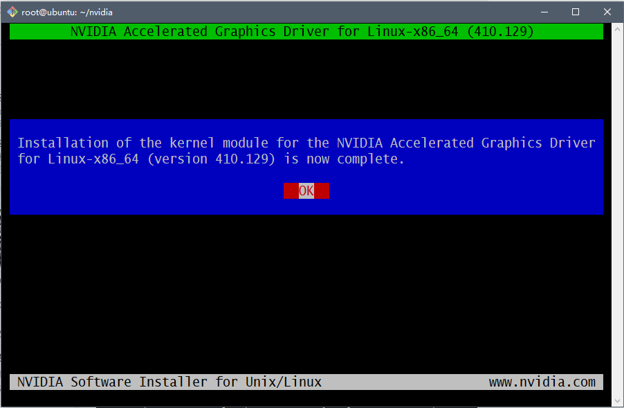

# 1. 系统安装
                     
**安装时设置不联网进行安装，安装完毕之后再进行网络配置**
                  
<iframe src="//player.bilibili.com/player.html?aid=71783542&cid=124384489&page=2" scrolling="no" border="0" frameborder="no" framespacing="0" allowfullscreen="true" height="500px"> </iframe>
                     
# 2. 服务器网络配置
## 2.1. 修改相对应的配置
输入以下命令：         
                     
```bash
sudo vim /etc/netplan/50-cloud-init.yaml 
```
                          
修改如下图：                   
                 


## 2.2. 使配置生效
输入以下命令：         
              
```bash
sudo netplan apply
```
              
## 2.3. 验证是否可以联网
输入以下命令：           
       
```bash
ping www.baidu.com
```
        
以下效果即可以联网       
        
```bash
[yan@yan-pc ~]$ ping www.baidu.com
PING www.baidu.com (61.135.169.125) 56(84) bytes of data.
64 bytes from 61.135.169.125 (61.135.169.125): icmp_seq=1 ttl=50 time=14.7 ms
64 bytes from 61.135.169.125 (61.135.169.125): icmp_seq=2 ttl=50 time=15.5 ms
64 bytes from 61.135.169.125 (61.135.169.125): icmp_seq=3 ttl=50 time=15.2 ms
64 bytes from 61.135.169.125 (61.135.169.125): icmp_seq=4 ttl=50 time=14.6 ms
64 bytes from 61.135.169.125 (61.135.169.125): icmp_seq=5 ttl=50 time=14.5 ms
64 bytes from 61.135.169.125 (61.135.169.125): icmp_seq=6 ttl=50 time=15.3 ms
64 bytes from 61.135.169.125 (61.135.169.125): icmp_seq=7 ttl=50 time=17.8 ms
64 bytes from 61.135.169.125 (61.135.169.125): icmp_seq=8 ttl=50 time=15.3 ms
64 bytes from 61.135.169.125 (61.135.169.125): icmp_seq=9 ttl=50 time=16.2 ms
64 bytes from 61.135.169.125 (61.135.169.125): icmp_seq=10 ttl=50 time=15.3 ms
^C
--- www.baidu.com ping statistics ---
10 packets transmitted, 10 received, 0% packet loss, time 9012ms
rtt min/avg/max/mdev = 14.492/15.447/17.837/0.927 ms
```
              
# 3. 设置国内软件源
华为云：                 
运行以下命令：                  
               
```bash
sed -i "s@http://.*archive.ubuntu.com@http://repo.huaweicloud.com@g" /etc/apt/sources.list
sed -i "s@http://.*security.ubuntu.com@http://repo.huaweicloud.com@g" /etc/apt/sources.list
```
                               
也可以选择其他的软件源。
                              
# 4. 安装Docker
## 4.1. 使用APT安装
由于 apt 源使用 HTTPS 以确保软件下载过程中不被篡改。因此，我们首先需要添加使用 HTTPS 传输的软件包以及 CA 证书。      
               
```
sudo apt-get update

sudo apt-get install \
    apt-transport-https \
    ca-certificates \
    curl \
    software-properties-common
```
      
## 4.2. 更换国内源
### 4.2.1. 如果过去安装过docker，则先删掉
```bash
sudo apt-get remove docker docker-engine docker.io
```
                
### 4.2.2. 安装依赖
```bash
sudo apt-get install apt-transport-https ca-certificates curl gnupg2 software-properties-common
```
                             
### 4.2.3. 信任Docker的GPG公钥
```bash
curl -fsSL https://download.docker.com/linux/ubuntu/gpg | sudo apt-key add -
```
                        
### 4.2.4. 添加软件仓库
```bash
sudo add-apt-repository \
   "deb [arch=amd64] https://mirrors.tuna.tsinghua.edu.cn/docker-ce/linux/ubuntu \
   $(lsb_release -cs) \
   stable"
```
                     
其他详细内容参考以下文章：
                   
- [Docker Community Edition 镜像使用帮助](https://mirror.tuna.tsinghua.edu.cn/help/docker-ce/)
                 
## 4.3. 安装 Docker CE

```
sudo apt update
sudo apt install docker-ce
```

## 4.4. 建立 docker 用户组
建立docker组:   
   
```
sudo groupadd docker
```
    
将当前用户加入docker组：    
    
```
sudo usermod -aG docker $USER
```
                     
退出重新登录即生效。
               
### 4.4.1. 关于重新登录后该用户无法正常使用docker的问题
#### 4.4.1.1. 重启docker服务
```bash
sudo service docker restart
```
                      
#### 4.4.1.2. 切换当前会话到新group或者重启X会话
```bash
newgrp - docker
```
                       
## 4.5. 更换国内Docker仓库
创建文件：       
    
```
sudo vim /etc/docker/daemon.json
```
     
加入以下内容：     
      
```
{
  "registry-mirrors": [
    "https://docker.mirrors.ustc.edu.cn"
  ]
}
```
         
然后重启系统。    
     
## 4.6. 验证
输入以下命令：       
       
```
docker run hello-world
```
             
若输出以下内容则为成功。          
         
```
Unable to find image 'hello-world:latest' locally
latest: Pulling from library/hello-world
ca4f61b1923c: Pull complete
Digest: sha256:be0cd392e45be79ffeffa6b05338b98ebb16c87b255f48e297ec7f98e123905c
Status: Downloaded newer image for hello-world:latest

Hello from Docker!
This message shows that your installation appears to be working correctly.

To generate this message, Docker took the following steps:
 1. The Docker client contacted the Docker daemon.
 2. The Docker daemon pulled the "hello-world" image from the Docker Hub.
    (amd64)
 3. The Docker daemon created a new container from that image which runs the
    executable that produces the output you are currently reading.
 4. The Docker daemon streamed that output to the Docker client, which sent it
    to your terminal.

To try something more ambitious, you can run an Ubuntu container with:
 $ docker run -it ubuntu bash

Share images, automate workflows, and more with a free Docker ID:
 https://cloud.docker.com/

For more examples and ideas, visit:
 https://docs.docker.com/engine/userguide/
```

# 5. Docker相关基础操作

<iframe src="//player.bilibili.com/player.html?aid=71783542&cid=124383794&page=1" scrolling="no" border="0" frameborder="no" framespacing="0" allowfullscreen="true" height="500px"> </iframe>
                               
# 6. 安装显卡程序
## 6.1. 安装gcc、g++、make
运行以下命令：                 
                
```bash
sudo apt install gcc
sudo apt install g++
sudo apt install make
```
                    
## 6.2. 驱动
### 6.2.1. 下载地址
官方渠道：[下载页面](https://www.nvidia.com/Download/index.aspx?lang=en-us)
                
### 6.2.2. 选择对应型号的驱动
#### 6.2.2.1. 查看显卡型号
输入以下命令：             
                  
```bash
lspci | grep -i nvidia
```
                    
以本服务器为例：                   
                    
```bash
ubuntu@ubuntu:~$ lspci | grep -i nvidia
82:00.0 3D controller: NVIDIA Corporation GK110BGL [Tesla K40m] (rev a1)
```
                    
#### 6.2.2.2. 选择对应的驱动
如图：                   
                  

                      
按照对应的步骤下载即可。
           
### 6.2.3. 将下载的驱动文件传输到服务器上
参考以下链接：           
- [Linux-scp命令](https://www.runoob.com/linux/linux-comm-scp.html)
              
如：        

将自己电脑上的一个路径为**C:/users/admin/desktop/下**的**demo.txt**文件发送到服务器的路径为**/home/ubuntu/ceshi**下。其命令为：       
         
```bash
# 在C:/users/admin/desktop/下打开终端（如git）应用程序
scp demo.txt ubuntu@10.84.132.100:/home/ubuntu/ceshi
# 输入对应的密码即可传输
# 如果目标文件为一个目录则应该加上 -r 参数
```
           
## 6.3. 禁用开源驱动
### 6.3.1. 查看属性
            
```bash
sudo ls -lh /etc/modprobe.d/blacklist.conf
```
          
### 6.3.2. 修改属性
           
```bash
sudo chmod 666 /etc/modprobe.d/blacklist.conf
```
              
### 6.3.3. 更改相关文件
              
```bash
sudo vim /etc/modprobe.d/blacklist.conf
```
              
在打开的文件的**最后**加入以下几行代码：      
           
```bash
blacklist vga16fb
blacklist nouveau
blacklist rivafb
blacklist rivatv
blacklist nvidiafb
```
            
### 6.3.4. 执行相关操作
```bash
sudo update-initramfs -u
```
             
### 6.3.5. 重启
进行上一步之后进行**重启**。
         
### 6.3.6. 最后的步骤
```bash
## 重启之后输入以下命令
lsmod | grep nouveau

## 如果没有输出任何结果则禁用成功
```
                 
## 6.4. 安装
### 6.4.1. 初次安装
**首先此步骤是初始安装显卡驱动，如果安装过首先对其进行卸载再进行以下步骤。**
             
输入以下命令：           
            
```bash
cd ~/nvidia      ##  ~/nvidia为上几步中存放驱动的目录

sudo chmod a+x NVIDIA-Linux-x86_64-418.87.00.run   ## NVIDIA-Linux-x86_64-418.87.00.run 为自己下载的驱动文件名


sudo ./NVIDIA-Linux-x86_64-418.87.00.run   ## 必须使用管理员权限进行安装

```
           
### 6.4.2. 成功安装的结果
             

           
### 6.4.3. 验证是否安装成功
输入以下命令：     
        
```bash
ubuntu@ubuntu:~$ nvidia-smi
Tue Oct 22 22:26:16 2019       
+-----------------------------------------------------------------------------+
| NVIDIA-SMI 384.183      Driver Version: 384.183      CUDA Version: 9.0      |
|-------------------------------+----------------------+----------------------+
| GPU  Name        Persistence-M| Bus-Id        Disp.A | Volatile Uncorr. ECC |
| Fan  Temp  Perf  Pwr:Usage/Cap|         Memory-Usage | GPU-Util  Compute M. |
|===============================+======================+======================|
|   0  Tesla K40m          Off  | 00000000:82:00.0 Off |                    0 |
| N/A   51C    P0    73W / 235W |   9314MiB / 11439MiB |     10%      Default |
+-------------------------------+----------------------+----------------------+
                                                                               
+-----------------------------------------------------------------------------+
| Processes:                                                       GPU Memory |
|  GPU       PID   Type   Process name                             Usage      |
|=============================================================================|
|    0      1243      C   /usr/bin/python3                            9301MiB |
+-----------------------------------------------------------------------------+
```
           
# 7. 安装nvidia-docker
## 7.1. 相关链接
- [nvidia-docker](https://github.com/NVIDIA/nvidia-docker)
               
## 7.2. 安装
### 7.2.1. Ubuntu 16.04/18.04, Debian Jessie/Stretch/Buster
          
```bash
# Add the package repositories
$ distribution=$(. /etc/os-release;echo $ID$VERSION_ID)
$ curl -s -L https://nvidia.github.io/nvidia-docker/gpgkey | sudo apt-key add -
$ curl -s -L https://nvidia.github.io/nvidia-docker/$distribution/nvidia-docker.list | sudo tee /etc/apt/sources.list.d/nvidia-docker.list

$ sudo apt-get update && sudo apt-get install -y nvidia-container-toolkit
$ sudo systemctl restart docker
```
            
### 7.2.2. CentOS 7 (docker-ce), RHEL 7.4/7.5 (docker-ce), Amazon Linux 1/2
          
```bash
$ distribution=$(. /etc/os-release;echo $ID$VERSION_ID)
$ curl -s -L https://nvidia.github.io/nvidia-docker/$distribution/nvidia-docker.repo | sudo tee /etc/yum.repos.d/nvidia-docker.repo

$ sudo yum install -y nvidia-container-toolkit
$ sudo systemctl restart docker
```
             
其他的查看第一步的相关链接。
          
## 7.3. 验证
```bash
#### Test nvidia-smi with the latest official CUDA image
$ docker run --gpus all nvidia/cuda:9.0-base nvidia-smi

# Start a GPU enabled container on two GPUs
$ docker run --gpus 2 nvidia/cuda:9.0-base nvidia-smi

# Starting a GPU enabled container on specific GPUs
$ docker run --gpus '"device=1,2"' nvidia/cuda:9.0-base nvidia-smi
$ docker run --gpus '"device=UUID-ABCDEF,1"' nvidia/cuda:9.0-base nvidia-smi

# Specifying a capability (graphics, compute, ...) for my container
# Note this is rarely if ever used this way
$ docker run --gpus all,capabilities=utility nvidia/cuda:9.0-base nvidia-smi
```
         
# 8. Tensorflow
## 8.1. 拉取镜像
        
```bash
docker pull tensorflow/tensorflow:latest-gpu-py3-jupyter
```
        
## 8.2. 运行容器
      
```bash
## 需要创建tensorflow目录和logs目录
docker run --gpus all -it -d --name tensorflow --restart on-failure:10 -p 8888:8888 -p 6006:6006 -v $PWD/tensorflow:/tf -v $PWD/logs:/root/logs tensorflow/tensorflow:latest-gpu-py3-jupyter

8888：对应jupyter
6006：对应tensorboard
```
        
## 8.3. jupyter配置
输入以下命令：
       
```bash
## 进入容器
docker exec -it tensorflow /bin/bash

## 生成juptyer配置文件
jupyter notebook --generate-config

## 这个命令会在  .jupyter    目录下生成  jupyter_notebook_config.py
```
         
### 8.3.1. 设置密码登录。      
1. 输入`ipython`

2. 执行`from notebook.auth import passwd;passwd()`

3. 输入自定义的密码
  
4. 生成hash后的密码类似如下：
        
```bash
In [2]: from notebook.auth import passwd; passwd()
Enter password:
Verify password:
Out[2]: 'sha1:e4ac9ea2e432:ce17c208cac9c15c59dd6f34ffe2a262f6d65bf3'
```
         
之后将第四步中生成的`sha1:e4ac9ea2e432:ce17c208cac9c15c59dd6f34ffe2a262f6d65bf3`拷贝到`.jupyter`目录下的`jupyter_notebook_config.py`中的`c.NotebookApp.password`。**记得将`#`去掉**。

### 8.3.2. 开启 tensorboard

```bash
## 进入容器
docker exec -it tensorflow /bin/bash

## 开启 tensorboard
tensorboard --logdir /root/logs

## 如需进行退出，则使用组合快捷键   Ctrl+p+q
```
         
# 9. 其他
## 9.1. 自动备份
### 9.1.1. 开启ssh免密登录
#### 9.1.1.1. ssh
安装ssh，若已安装则跳过。
         
```bash
sudo apt install ssh
```
          
#### 9.1.1.2. 生成密钥
输入以下命令：        
        
```bash
ssh-keygen -t rsa
## 回车即可
```
         
#### 9.1.1.3. 将公钥发送给目标服务器（保存备份的服务器）
输入以下命令：       
       
```bash
scp ~/.ssh/id_rsa.pub username@ip:~/.ssh/
```
           
#### 9.1.1.4. 将公钥添加到authorized_keys文件中
输入以下命令:       
           
```bash
## 目标服务器上进行操作
cat ~/.ssh/id_rsa.pub >> ~/.ssh/authorized_keys
```
          
### 9.1.2. 自动化备份脚本
创建`auto_backup.sh`文件。
          
修改内容为：           
         
```bash
#!/bin/bash

# 需要备份的文件路径
LocalBackupDir1=/home/ubuntu/www
LocalBackupDir2=/home/ubuntu/logs
LocalBackupDir3=/home/ubuntu/tensorflow

# 本地文件(文件较多不再使用)
# LocalBackupFile=$LocalBackupDir/backup_file (自行指定)

# 目标服务器保存备份文件的路径
RemoteBackupDir=/home/zhu/save

# 目标服务器 IP 地址
RemoteIP=172.21.1.62

# 目标服务器登录账户
RemoteUser=zhu

# 当前系统日期
DATE=`date +"%Y-%m-%d"`

# 本地Log存放路径
LogFileDir=/home/ubuntu/audo_logs

# 进入本地Log存放路径
cd $LogFileDir

# 新建日志文件
touch $DATE.log

# 本地 Log 存放路径
LogFile=/home/ubuntu/audo_logs/$DATE.log

# 追加日志到日志文件
echo "开始自动备份：" >>  $LogFile
echo "自动备份起始时间：$(date +"%Y-%m-%d %H:%M:%S")" >>  $LogFile
echo "-------------------------------------" >> $LogFile

# 删除之前备份文件
ssh $RemoteUser@$RemoteIP "rm -rf ~/save/*"
# 追加日志到日志文件
echo "已进行删除操作" >>  $LogFile
echo "-------------------------------------" >> $LogFile

#备份到远程服务器
echo "备份www目录的起始时间：$(date +"%Y-%m-%d %H:%M:%S")" >>  $LogFile

scp -r $LocalBackupDir1 $RemoteUser@$RemoteIP:$RemoteBackupDir

echo "备份www目录的结束时间：$(date +"%Y-%m-%d %H:%M:%S")" >>  $LogFile
echo "-------------------------------------" >> $LogFile

echo "备份logs目录的起始时间：$(date +"%Y-%m-%d %H:%M:%S")" >>  $LogFile

scp -r $LocalBackupDir2 $RemoteUser@$RemoteIP:$RemoteBackupDir

echo "备份logs目录的结束时间：$(date +"%Y-%m-%d %H:%M:%S")" >>  $LogFile
echo "-------------------------------------" >> $LogFile

echo "备份tensorflow目录的起始时间：$(date +"%Y-%m-%d %H:%M:%S")" >>  $LogFile

scp -r $LocalBackupDir3 $RemoteUser@$RemoteIP:$RemoteBackupDir

echo "备份tensorflow目录的结束时间：$(date +"%Y-%m-%d %H:%M:%S")" >>  $LogFile
echo "-------------------------------------" >> $LogFile

#追加日志到日志文件
echo "自动备份结束时间:$(date +"%Y-%m-%d %H:%M:%S")" >>  $LogFile
echo "-------------------------------------" >> $LogFile
```
         
同时注意脚本的权限问题，具体进行百度。
          
### 9.1.3. 添加定时任务
输入以下命令：           
          
```bash
sudo vim /etc/crontab
```
        
在最后添加以下内容：       
         
```bash
# 自动备份
# 添加定时任务，每天3:00,执行脚本
0  3  * * *  ubuntu /home/ubuntu/save/auto_backup.sh
```