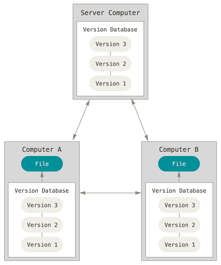

# 来自网络资源，仅用于学习
>来源[链接](https://snailclimb.top/JavaGuide/#/tools/Git)
             
# 版本控制
## 什么是版本控制
版本控制是一种记录一个或若干个文件内容变化，以便将来查阅特定版本修订情况的系统。除了项目源代码，你可以对任何类型的文件进行版本控制。
                
## 为什么要版本控制
有了它你就可以将某个文件回溯到之前的状态，甚至将整个项目都回退到过去某个时间点的状态，你可以比较文件变化的细节，查出最后是谁修改了哪个地方，从而找出导致怪异问题出现的原因，又是谁在何时报告了某个功能缺陷等等。
            
## 本地版本控制系统
许多人习惯用复制整个项目目录的方式来保存不同的版本，或许还会改名加上备份时间以示区别。这么做唯一的好处就是简单，但是特别容易犯错。有时候会混淆所在的工作目录，一不小心会写错文件或者覆盖意想外的文件。
        
为了解决问题，人们很久以前就开发了许多种本地版本控制系统，大多都是采用某种简单的数据库来记录文件的历次更新差异。
          

           

## 集中化的版本控制系统
接下来人们又遇到一个问题，如何让在不同系统上的开发者协同工作？ 于是，集中化的版本控制系统（Centralized Version Control Systems，简称 CVCS）应运而生。
            
集中化的版本控制系统都有一个单一的集中管理的服务器，保存所有文件的修订版本，而协同工作的人们都通过客户端连到这台服务器，取出最新的文件或者提交更新。
            

          
这么做虽然解决了本地版本控制系统无法让在不同系统上的开发者协同工作的诟病，但也还是存在下面的问题：      
      
- 单点故障：中央服务器宕机，则其他人无法使用；如果中心数据库磁盘损坏没有进行备份，你将丢失所有数据。本地版本控制系统也存在类似问题，只要整个项目的历史记录被保存在单一位置，就有丢失所有历史更新记录的风险。
- 必须联网才能工作：受网络状况、带宽影响。
          
## 分布式版本控制系统
于是分布式版本控制系统（Distributed Version Control System，简称 DVCS）面世了。 Git 就是一个典型的分布式版本控制系统。
              
这类系统，客户端并不只提取最新版本的文件快照，而是把代码仓库完整地镜像下来。这么一来，任何一处协同工作用的服务器发生故障，时候都可以用任何一个镜像出来的本地仓库恢复。因为每一次的克隆操作，实际上都是一次对代码仓库的完整备份。
            

                      
分布式版本控制系统可以不用联网就可以工作，因为每个人的电脑上都是完整的版本库，当你修改了某个文件后，你只需要将自己的修改推送给别人就可以了。但是，在实际使用分布式版本控制系统的时候，很少会直接进行推送修改，而是使用一台充当“中央服务器”的东西。这个服务器的作用仅仅是用来方便“交换”大家的修改，没有它大家也一样干活，只是交换修改不方便而已。
       
分布式版本控制系统的优势不单是不必联网这么简单。
         
# 认识Git
## Git简史
Linux 内核项目组当时使用分布式版本控制系统 BitKeeper 来管理和维护代码。但是，后来开发 BitKeeper 的商业公司同 Linux 内核开源社区的合作关系结束，他们收回了 Linux 内核社区免费使用 BitKeeper 的权力。 Linux 开源社区（特别是 Linux 的缔造者 Linus Torvalds）基于使用 BitKeeper 时的经验教训，开发出自己的版本系统，而且对新的版本控制系统做了很多改进。
          
## Git与其他版本管理系统的主要区别
Git在保存和对待各种信息的时候与其他版本控制系统有很大差异，尽管操作起来的命令形式非常相近，理解这些差异将有助于防止你使用中的困惑。
            
Git与其他版本管理系统的主要差别：对待数据的方式。
             
Git采用的是直接记录快照的方式，而非差异比较。
             
大部分版本控制系统（VS、Subversion、Perforce、Bazaar 等等）都是以文件变更列表的方式存储信息，这类系统将它们保存的信息看作是一组基本文件和每个文件随时间逐步累积的差异。
             
具体原理如下图所示，理解起来其实很简单，每个我们对提交更新一个文件之后，系统记录都会记录这个文件做了哪些更新，以增量符号Δ(Delta)表示。
            

               
然后只需要将这些原文件和这些增加进行相加就行了。
         
**存在的问题**
        
比如当增量特别特别多的时候，最终我们的文件是不是会耗费时间和性能。
         
Git不按照以上方式对待或保存数据。反之，Git更像是把数据看作是对小型文件系统的一组快照。每次你提交更新，或在Git中保存项目状态时，它主要对当时的全部文件制作一个快照并保存这个快照的索引。为了高效，如果文件没有修改，Git不再重新存储文件，而是只保留一个链接指向指向之前存储的文件。Git对待数据更像是一个快照流。
       

        

## Git的三种状态
Git有三种状态，你的文件可能处于其中之一：
        
1. 已提交（committed）：数据已经安全的保存在本地数据库中。
2. 已修改（modified）：已修改表示修改了文件，但还没保存到数据库中。
3. 已暂存（staged）：表示对一个已修改文件的当前版本做了标记，使之包含在下次提交的快照中。
         
由此引入Git项目的三个工作区域的概念：Git仓库（.git directory）、工作目录（Working Directory）以及暂存区域（Staging Area）。
        

              
**基本的Git工作流程如下：**
        
1. 在工作目录中修改文件。
2. 暂存文件，将文件的快照放入暂存区域。
3. 提交更新，找到暂存区域的文件，将快照永久存储到Git仓库目录。
            
# Git使用快速入门
## 获取Git仓库
## 记录每次更新到仓库
## 推送改动到远程仓库
## 远程仓库的移除与重命名
## 查看提交历史
## 撤销操作
## 分支