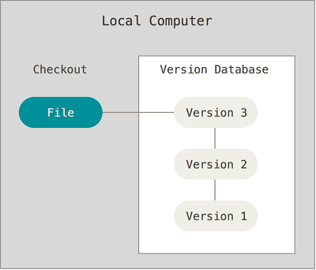
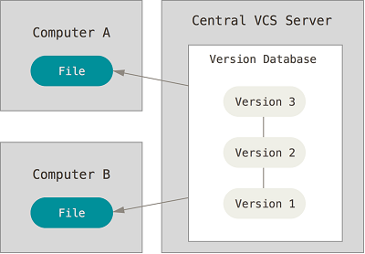

# 来自网络资源，仅用于学习
>来源[链接](https://snailclimb.top/JavaGuide/#/tools/Git)
             
# 版本控制
## 什么是版本控制
版本控制是一种记录一个或若干个文件内容变化，以便将来查阅特定版本修订情况的系统。除了项目源代码，你可以对任何类型的文件进行版本控制。
                
## 为什么要版本控制
有了它你就可以将某个文件回溯到之前的状态，甚至将整个项目都回退到过去某个时间点的状态，你可以比较文件变化的细节，查出最后是谁修改了哪个地方，从而找出导致怪异问题出现的原因，又是谁在何时报告了某个功能缺陷等等。
            
## 本地版本控制系统
许多人习惯用复制整个项目目录的方式来保存不同的版本，或许还会改名加上备份时间以示区别。这么做唯一的好处就是简单，但是特别容易犯错。有时候会混淆所在的工作目录，一不小心会写错文件或者覆盖意想外的文件。
        
为了解决问题，人们很久以前就开发了许多种本地版本控制系统，大多都是采用某种简单的数据库来记录文件的历次更新差异。
          

           

## 集中化的版本控制系统
接下来人们又遇到一个问题，如何让在不同系统上的开发者协同工作？ 于是，集中化的版本控制系统（Centralized Version Control Systems，简称 CVCS）应运而生。
            
集中化的版本控制系统都有一个单一的集中管理的服务器，保存所有文件的修订版本，而协同工作的人们都通过客户端连到这台服务器，取出最新的文件或者提交更新。
            

          
这么做虽然解决了本地版本控制系统无法让在不同系统上的开发者
## 分布式版本控制系统
# 认识Git
## Git简史
## Git与其他版本管理系统的主要区别
## Git的三种状态
# Git使用快速入门
## 获取Git仓库
## 记录每次更新到仓库
## 推送改动到远程仓库
## 远程仓库的移除与重命名
## 查看提交历史
## 撤销操作
## 分支