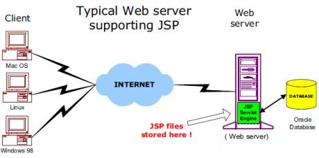
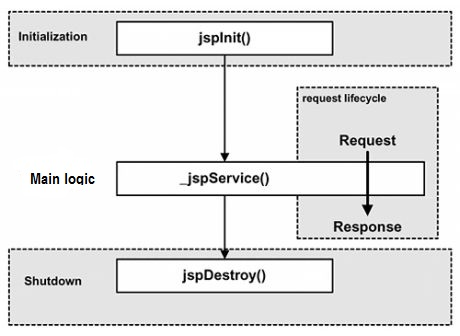

>来源于**菜鸟教程**
        
# JSP
>JSP全称Java Server Pages，是一种动态网页开发技术。它使用JSP标签在HTML网页中插入Java代码。标签通常以<%开头以%>结束。
         
>JSP是一种Java servlet，主要用于实现Java web应用程序的用户界面部分。网页开发者们通过结合HTML代码、XHTML代码、XML元素以及嵌入JSP操作和命令来编写JSP。
        
>JSP通过网页表单获取用户输入数据、访问数据库及其他数据源，然后动态地创建网页。
         
>JSP标签有多种功能，比如访问数据库、记录用户选择信息、访问JavaBeans组件等，还可以在不同的网页中传递控制信息和共享信息。
           
## 结构
>网络服务器需要一个 JSP 引擎，也就是一个容器来处理 JSP 页面。容器负责截获对 JSP 页面的请求。本教程使用内嵌 JSP 容器的 Apache 来支持 JSP 开发。
         
>JSP 容器与 Web 服务器协同合作，为JSP的正常运行提供必要的运行环境和其他服务，并且能够正确识别专属于 JSP 网页的特殊元素。
         
下图显示了 JSP 容器和 JSP 文件在 Web 应用中所处的位置。
       

         
### JSP处理
以下步骤表明了Web服务器是如何使用JSP来创建网页的：     
       
- 就像其他普通的网页一样，您的浏览器发送一个 HTTP 请求给服务器。
- Web 服务器识别出这是一个对 JSP 网页的请求，并且将该请求传递给 JSP 引擎。通过使用 URL或者 .jsp 文件来完成。
- JSP 引擎从磁盘中载入 JSP 文件，然后将它们转化为 Servlet。这种转化只是简单地将所有模板文本改用 println() 语句，并且将所有的 JSP 元素转化成 Java 代码。
- JSP 引擎将 Servlet 编译成可执行类，并且将原始请求传递给 Servlet 引擎。
- Web 服务器的某组件将会调用 Servlet 引擎，然后载入并执行 Servlet 类。在执行过程中，Servlet 产生 HTML 格式的输出并将其内嵌于 HTTP response 中上交给 Web 服务器。
- Web 服务器以静态 HTML 网页的形式将 HTTP response 返回到您的浏览器中。
- 最终，Web 浏览器处理 HTTP response 中动态产生的HTML网页，就好像在处理静态网页一样。
           
以上提及到的步骤可以用下图来表示：         
        

          
一般情况下，JSP 引擎会检查 JSP 文件对应的 Servlet 是否已经存在，并且检查 JSP 文件的修改日期是否早于 Servlet。如果 JSP 文件的修改日期早于对应的 Servlet，那么容器就可以确定 JSP 文件没有被修改过并且 Servlet 有效。这使得整个流程与其他脚本语言（比如 PHP）相比要高效快捷一些。
                
## 生命周期
JSP生命周期就是从创建到销毁的整个过程，类似于servlet生命周期，区别在于JSP生命周期还包括将JSP文件编译成servlet.
          
以下是JSP生命周期中所走过的几个阶段：          
- 编译阶段：
servlet容器编译servlet源文件，生成servlet类
- 初始化阶段：
加载与JSP对应的servlet类，创建其实例，并调用它的初始化方法
- 执行阶段：
调用与JSP对应的servlet实例的服务方法
- 销毁阶段：
调用与JSP对应的servlet实例的销毁方法，，然后销毁servlet实例
        
如下图：      
       

         
### 实例
代码如下：      
         
```html
<%@ page language="java" contentType="text/html; charset=UTF-8"
    pageEncoding="UTF-8"%>
<html>
<head>
<title>life.jsp</title>
</head>
<body>

<%! 
  private int initVar=0;
  private int serviceVar=0;
  private int destroyVar=0;
%>
  
<%!
  public void jspInit(){
    initVar++;
    System.out.println("jspInit(): JSP被初始化了"+initVar+"次");
  }
  public void jspDestroy(){
    destroyVar++;
    System.out.println("jspDestroy(): JSP被销毁了"+destroyVar+"次");
  }
%>

<%
  serviceVar++;
  System.out.println("_jspService(): JSP共响应了"+serviceVar+"次请求");

  String content1="初始化次数 : "+initVar;
  String content2="响应客户请求次数 : "+serviceVar;
  String content3="销毁次数 : "+destroyVar;
%>
<h1>菜鸟教程 JSP 测试实例</h1>
<p><%=content1 %></p>
<p><%=content2 %></p>
<p><%=content3 %></p>

</body>
</html>
```
            
## 语法
### 脚本程序
>脚本程序可以包含任意量的Java语句、变量、方法或表达式，只要它们在脚本语言中是有效的。
         
语法格式如下：       
         
```html
<% 代码片段 %>
```
        
或者：     
       
```html
<jsp:scriptlet>
   代码片段
</jsp:scriptlet>
```
         
同时任何文本、HTML标签、JSP元素必须写在脚本程序的外面。
          
示例如下：      
       
```html
<html>
<head><title>Hello World</title></head>
<body>
Hello World!<br/>
<%
out.println("Your IP address is " + request.getRemoteAddr());
%>
</body>
</html>
```
         
### 中文编码问题
如果需要在页面正常显示中文，需要在JSP文件头部添加以下代码：       
        
```html
<%@ page language="java" contentType="text/html; charset=UTF-8"
    pageEncoding="UTF-8"%>
```
        
完整示例如下：      
      
```html
<%@ page language="java" contentType="text/html; charset=UTF-8"
    pageEncoding="UTF-8"%>
<!DOCTYPE html>
<html>
<head>
<meta charset="utf-8">
<title>菜鸟教程(runoob.com)</title>
</head>
<body>
Hello World!<br/>
<%
out.println("你的 IP 地址 " + request.getRemoteAddr());
%>
</body>
</html>
```
        
### JSP声明
一个声明语句可以声明一个或多个变量、方法，供后面的Java代码使用。在JSP文件中，必须先声明这些变量和方法然后才能使用他们。
         
JSP声明的语法格式为：     
       
```html
<%! declaration; [ declaration; ]+ ... %>
```
        
或者，也可以编写与其等价的XML语句，如下：     
         
```html
<jsp:declaration>
   代码片段
</jsp:declaration>
```
          
代码示例：     
        
```html
<%! int i = 0; %> 
<%! int a, b, c; %> 
<%! Circle a = new Circle(2.0); %> 
```
             
### JSP表达式
一个JSP表达式中包含的脚本语言表达式，先被转化成String，然后插入到表达式出现的地方。          
由于表达式的值会被转化成String，所以可以在一个文本行中使用表达式而不用去管他是否是HTML标签。         
表达式元素中可以包含任何符合Java语言规范的表达式，但是不能使用分号来结束表达式。
         
JSP表达式的语法格式：      
         
```html
<%= 表达式 %>
```
              
与之等价的XML语句：      
        
```html
<jsp:expression>
   表达式
</jsp:expression>
```
           
代码示例：      
      
```html
<%@ page language="java" contentType="text/html; charset=UTF-8"
    pageEncoding="UTF-8"%>
<!DOCTYPE html>
<html>
<head>
<meta charset="utf-8">
<title>菜鸟教程(runoob.com)</title>
</head>
<body>
<p>
   今天的日期是: <%= (new java.util.Date()).toLocaleString()%>
</p>
</body> 
</html>
```
         
上述代码的运行结果：    
         
```html
今天的日期是: 2016-6-25 13:40:07
```
         
### JSP注释
JSP注释主要有两个作用：为代码作注释以及将某段代码注释掉。
          
JSP注释的语法格式：        
        
```html
<%@ page language="java" contentType="text/html; charset=UTF-8"
    pageEncoding="UTF-8"%>
<!DOCTYPE html>
<html>
<head>
<meta charset="utf-8">
<title>菜鸟教程(runoob.com)</title>
</head>
<body>
<%-- 该部分注释在网页中不会被显示--%> 
<p>
   今天的日期是: <%= (new java.util.Date()).toLocaleString()%>
</p>
</body> 
</html> 
```
          
上述代码的运行结果：      
        
```html
今天的日期是: 2016-6-25 13:41:26
```
          
不同情况下使用注释的语法规则：      
        
|语法|描述|
|--|--|
|<%-- 注释 --%>|JSP注释，注释内容不会被发送至浏览器甚至不会被编译|
|< !-- 注释 -->|HTML注释，通过浏览器查看网页源代码时可以看见注释内容|
|<\%|代表静态 <%常量|
|%\>|代表静态 %> 常量|
|\'|在属性中使用的单引号|
|\"|在属性中使用的双引号|
         
### JSP指令
JSP指令用来设置与整个JSP页面相关的属性。
       
JSP指令语法格式如下：      
       
```html
<%@ directive attribute="value" %>
```
        
这里有三个指令标签：      

|指令|描述|
|--|--|
|<%@ page ... %>|定义页面的依赖属性，比如脚本语言、error页面、缓存需求等等|
|<%@ include ... %>|包含其他文件|
|<%@ taglib ... %>|	引入标签库的定义，可以是自定义标签|
            
### JSP行为
JSP行为标签使用XML语法结构来控制servlet引擎。它能够动态插入一个文件，重用JavaBean组件，引导用户去另一个页面，为Java插件产生相关的HTML等等。           
行为标签只有一种语法格式，它严格遵守XML标准：
          
```html
<jsp:action_name attribute="value" />
```
            
行为标签基本上是一些预先就定义好的函数，下表罗列出一些可用的JSP行为标签：
　　　　　　　　

|语法|描述|
|--|--|
|jsp:include	|用于在当前页面中包含静态或动态资源|
|jsp:useBean	|寻找和初始化一个JavaBean组件|
|jsp:setProperty	|设置 JavaBean组件的值|
|jsp:getProperty|	将 JavaBean组件的值插入到 output中|
|jsp:forward	|从一个JSP文件向另一个文件传递一个包含用户请求的request对象|
|jsp:plugin	|用于在生成的HTML页面中包含Applet和JavaBean对象|
|jsp:element|	动态创建一个XML元素|
|jsp:attribute|	定义动态创建的XML元素的属性|
|jsp:body|	定义动态创建的XML元素的主体|
|jsp:text|	用于封装模板数据|
              
### JSP隐含对象
JSP支持九个自动定义的变量,江湖人称隐含对象。这九个隐含对象的简介如下表：
         
|对象|描述|
|--|--|
|request|HttpServletRequest类的实例|
|response|HttpServletResponse类的实例|
|out|PrintWriter类的实例，用于把结果输出至网页上|
|session|HttpSession类的实例|
|application|ServletContext类的实例，与应用上下文有关|
|config|	ServletConfig类的实例|
|pageContext|PageContext类的实例，提供对JSP页面所有对象以及命名空间的访问|
|page|	类似于Java类中的this关键字|
|Exception|Exception类的对象，代表发生错误的JSP页面中对应的异常对象|
               
### 控制流语句
JSP提供对Java语言的全面支持。可以在JSP程序中使用Java API甚至建立Java代码块，包括判断语句和循环语句等等。
          
### 判断语句
if...else块，代码如下：     
        
```html
<%@ page language="java" contentType="text/html; charset=UTF-8"
    pageEncoding="UTF-8"%>
<%! int day = 3; %> 
<!DOCTYPE html>
<html>
<head>
<meta charset="utf-8">
<title>菜鸟教程(runoob.com)</title>
</head>
<body>
<h3>IF...ELSE 实例</h3>
<% if (day == 1 | day == 7) { %>
      <p>今天是周末</p>
<% } else { %>
      <p>今天不是周末</p>
<% } %>
</body> 
</html> 
```
           
运行结果如下：       
        
```html
IF...ELSE 实例
今天不是周末
```
         
现在来看看switch…case块，与if…else块有很大的不同，它使用out.println()，并且整个都装在脚本程序的标签中，就像下面这样：
                
```html
<%@ page language="java" contentType="text/html; charset=UTF-8"
    pageEncoding="UTF-8"%>
<%! int day = 3; %> 
<!DOCTYPE html>
<html>
<head>
<meta charset="utf-8">
<title>菜鸟教程(runoob.com)</title>
</head>
<body>
<h3>SWITCH...CASE 实例</h3>
<% 
switch(day) {
case 0:
   out.println("星期天");
   break;
case 1:
   out.println("星期一");
   break;
case 2:
   out.println("星期二");
   break;
case 3:
   out.println("星期三");
   break;
case 4:
   out.println("星期四");
   break;
case 5:
   out.println("星期五");
   break;
default:
   out.println("星期六");
}
%>
</body> 
</html> 
```
           
运行结果如下：       
          
```html
SWITCH...CASE 实例

星期三
```
            
### 循环语句
在JSP程序中可以使用Java的三个基本循环类型：for，while，和 do…while。
            
for循环示例代码如下：      
        
```html
<%@ page language="java" contentType="text/html; charset=UTF-8"
    pageEncoding="UTF-8"%>
<%! int fontSize; %> 
<!DOCTYPE html>
<html>
<head>
<meta charset="utf-8">
<title>菜鸟教程(runoob.com)</title>
</head>
<body>
<h3>For 循环实例</h3>
<%for ( fontSize = 1; fontSize <= 3; fontSize++){ %>
   <font color="green" size="<%= fontSize %>">
    菜鸟教程
   </font><br />
<%}%>
</body> 
</html> 
```
         
while循环示例代码如下：      
        
```html
<%@ page language="java" contentType="text/html; charset=UTF-8"
    pageEncoding="UTF-8"%>
<%! int fontSize=0; %> 
<!DOCTYPE html>
<html>
<head>
<meta charset="utf-8">
<title>菜鸟教程(runoob.com)</title>
</head>
<body>
<h3>While 循环实例</h3>
<%while ( fontSize <= 3){ %>
   <font color="green" size="<%= fontSize %>">
    菜鸟教程
   </font><br />
<%fontSize++;%>
<%}%>
</body> 
</html> 
```
           
### JSP运算符
JSP支持所有Java逻辑和算术运算符。如下，优先级从高到低：       
        
|类别|操作符|结合性|
|--|--|--|
|后缀|() [] . (点运算符)|左到右|
|一元|	++ - - ! ~|	右到左|
|可乘性|* / % |	左到右|
|可加性|+ - |	左到右|
|移位|	>> >>> <<  |	左到右 |
|关系|> >= < <=  |	左到右|
|相等/不等|	== != |左到右|
|位与|& |左到右|
|位异或|^ |左到右|
|位或|	&#124; |	左到右|
|逻辑与|&& |	左到右|
|逻辑或| &#124;&#124; |	左到右|
|条件判断|	?: |右到左|
|赋值|= += -= *= /= %= >>= <<= &= ^= |= |右到左|
|逗号 |	, |左到右 |
               
### JSP字面量
JSP语言定义了以下几个字面量：
                
- 布尔值(boolean)：true 和 false;
- 整型(int)：与 Java 中的一样;
- 浮点型(float)：与 Java 中的一样;
- 字符串(string)：以单引号或双引号开始和结束;
- Null：null。
              
## 指令
## 动作元素
## 隐式对象
## 客户端请求
## 服务器响应
## HTTP状态码
## 表单处理
## 过滤器
## Cookie处理
## Session
## 文件上传
## 日期处理
## 页面重定向
## 点击量统计
## 自动刷新
## 发送邮件
        
# 高级操作
## 标准标签库（JSTL）
## 连接数据库
## XML数据处理
## JavaBean
## 自定义标签
## 表达式语言
## 异常处理
## 调试
## 国际化