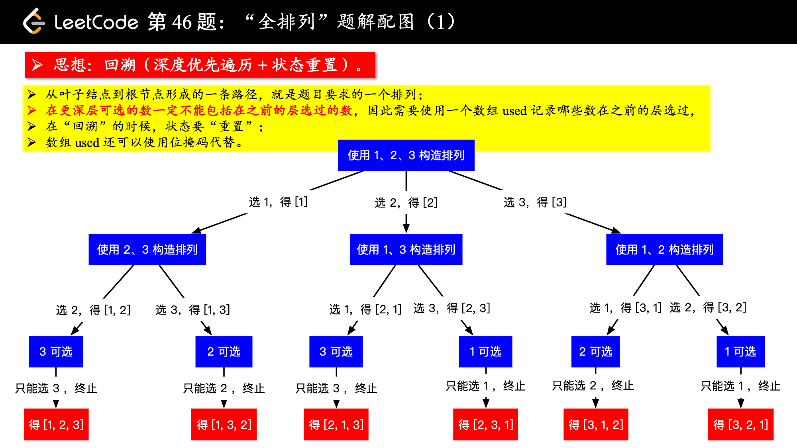
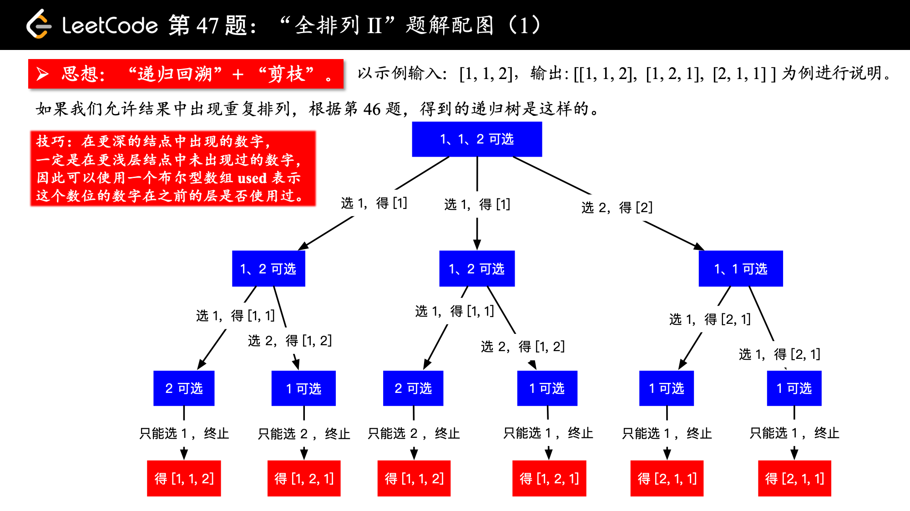

# 算法思想
>该笔记参考以下来源。
      

     
>详情请点击[链接](https://cyc2018.github.io/CS-Notes/#/)
       
## 二分查找
### 1. x的平方根
输入输出样例
- 示例一
       
```html
输入: 4
输出: 2
```
       
- 示例二
       
```html
输入: 8
输出: 2
说明: 8 的平方根是 2.82842..., 
     由于返回类型是整数，小数部分将被舍去。
```
       
题目描述          
实现 int sqrt(int x) 函数。
计算并返回 x 的平方根，其中 x 是非负整数。
由于返回类型是整数，结果只保留整数的部分，小数部分将被舍去。
        
思路      
1. 首先一个数不会超过其一半的平方
2. 使用二分查找来缩小每次的范围
           
代码示例     
      
```java
class Solution {
    public int mySqrt(int x) {
    if (x <= 1) {
        return x;
    }
    int l = 1, h = x;
    while (l <= h) {
        int mid = l + (h - l) / 2;
        int sqrt = x / mid;
        if (sqrt == mid) {
            return mid;
        } else if (mid > sqrt) {
            h = mid - 1;
        } else {
            l = mid + 1;
        }
    }
    return h;
    }
}
```
        
### 2. 寻找比目标字母大的最小字母
输入输出样例
              
```html
输入:
letters = ["c", "f", "j"]
target = "a"
输出: "c"

输入:
letters = ["c", "f", "j"]
target = "c"
输出: "f"

输入:
letters = ["c", "f", "j"]
target = "d"
输出: "f"

输入:
letters = ["c", "f", "j"]
target = "g"
输出: "j"

输入:
letters = ["c", "f", "j"]
target = "j"
输出: "c"

输入:
letters = ["c", "f", "j"]
target = "k"
输出: "c"
```

注:
1. letters长度范围在[2, 10000]区间内。
2. letters 仅由小写字母组成，最少包含两个不同的字母。
3. 目标字母target 是一个小写字母。
             
题目描述         
给定一个只包含小写字母的有序数组letters 和一个目标字母 target，寻找有序数组里面比目标字母大的最小字母。        
数组里字母的顺序是循环的。举个例子，如果目标字母target = 'z' 并且有序数组为 letters = ['a', 'b']，则答案返回 'a'。      
           
代码示例
         
```java
class Solution {
    public char nextGreatestLetter(char[] letters, char target) {
        int n=letters.length;
        int i=0,j=n-1;
        while(i<=j){
            int mid=i+(j-i)/2;
            if(letters[mid]<=target){
                i=mid+1;
            }else{
                j=mid-1;
            }
        }
        return 1 < n ? letters[i] : letters[0];
    }
}
```

### 3. 有序数组中的单一元素
输入输出样例
- 示例一
       
```html
输入: [1,1,2,3,3,4,4,8,8]
输出: 2
```
       
- 示例二
       
```html
输入: [3,3,7,7,10,11,11]
输出: 10
```
        
**注意: 您的方案应该在 O(log n)时间复杂度和 O(1)空间复杂度中运行**
        
题目描述          
给定一个只包含整数的有序数组，每个元素都会出现两次，唯有一个数只会出现一次，找出这个数。
            
思路        
1. 出现一次的元素在奇数位上,同时需要保证mid为偶数
2. nums[mid]==nums[mind+1]，则使i=mid+2
3. nums[mid]!=nums[mid+1],则使j=mid
           
代码示例
             
```java
class Solution {
    public int singleNonDuplicate(int[] nums) {
        int i=0,j=nums.length-1;
        while(i<j){
            int mid=i+(j-i)/2;
            if(mid%2==1){ //保证查找的位置在奇数位，在奇数位与m+1位的不同就表明m位置只出现一次
                mid--;
            }
            if(nums[mid]==nums[mid+1]){  
                i=mid+2;
            }else{
                j=mid;
            }
        }
        return nums[i];
    }
}
```
              
### 4. 第一个错误的版本
输入输出样例           
```html
给定 n = 5，并且 version = 4 是第一个错误的版本。
调用 isBadVersion(3) -> false
调用 isBadVersion(5) -> true
调用 isBadVersion(4) -> true
所以，4 是第一个错误的版本。 
```
             
题目描述            
你是产品经理，目前正在带领一个团队开发新的产品。不幸的是，你的产品的最新版本没有通过质量检测。由于每个版本都是基于之前的版本开发的，所以错误的版本之后的所有版本都是错的。                     
假设你有 n 个版本 [1, 2, ..., n]，你想找出导致之后所有版本出错的第一个错误的版本。               
你可以通过调用 bool isBadVersion(version) 接口来判断版本号 version 是否在单元测试中出错。实现一个函数来查找第一个错误的版本。你应该尽量减少对调用 API 的次数。          
             
思路             
1. 二分查找
          
代码示例
             
```java
/* The isBadVersion API is defined in the parent class VersionControl.
      boolean isBadVersion(int version); */

public class Solution extends VersionControl {
    public int firstBadVersion(int n) {
        int i=1,j=n;
        while(i<j){
            int mid=i+(j-i)/2;
            if(isBadVersion(mid)){
                j=mid;
            }else{
                i=mid+1;
            }
        }
        return i;
    }
}
```
           
### 5. 寻找旋转排序数组中的最小值
输入输出样例
- 示例一
       
```html
输入: [3,4,5,1,2]
输出: 1
```
       
- 示例二
       
```html
输入: [4,5,6,7,0,1,2]
输出: 0
```
       
题目描述                 
假设按照升序排序的数组在预先未知的某个点上进行了旋转。                
( 例如，数组 [0,1,2,4,5,6,7] 可能变为 [4,5,6,7,0,1,2] )。              
请找出其中最小的元素。            
你可以假设数组中不存在重复元素。                 
               
思路               
1. 首先需要注意的是该数组的排序是被打乱的，因此需要考虑中间的值与那个值比较
2. 数组原本是升序，比如，如果中间位置的值与最后一个值比较，若小于，说明最小值在左边，若大于则在右边
              
代码示例
```java
class Solution {
    public int findMin(int[] nums) {
        int i=0,j=nums.length-1;
        while(i<j){
            int mid=i+(j-i)/2;
            if(nums[mid]<=nums[j]){
                j=mid;
            }else{
                i=mid+1;
            }
        }
        return nums[i];
    }
}
```
         
### 6. 在排序数组中查找元素的第一个和最后一个位置
输入输出样例
- 示例一
       
```html
输入: nums = [5,7,7,8,8,10], target = 8
输出: [3,4]
```
       
- 示例二
       
```html
输入: nums = [5,7,7,8,8,10], target = 6
输出: [-1,-1]
```
       
题目描述               
给定一个按照升序排列的整数数组nums，和一个目标值target。找出给定目标值在数组中的开始位置和结束位置。            
你的算法时间复杂度必须是O(log n)级别。            
如果数组中不存在目标值，返回[-1,-1]。            
              
思路            
1. 需要考虑数组中是否有相同的元素
2. 通过查找target+1的目标值，来确定区间的边界
3. 同时需要考虑只有一个元素的数组的情况
            
代码示例
```java
class Solution {
    public int[] searchRange(int[] nums, int target) {
        int first=binarySearch(nums,target);
        int last=binarySearch(nums,target+1)-1;//target+1是为了找比目标值大1的数，通过last来找到一个小于target的区间
        if(first==nums.length||nums[first]!=target){
            return new int[]{-1,-1};
        }else{
            return new int[]{first,last}; //可以判断first和last的大小来决定谁在前谁在后，防止结果出错
        }
        
    }
    private int binarySearch(int[] nums,int target){
        int i=0,j=nums.length; //j=nums.length需要注意，考虑如果数组中只有一个元素的情况
        while(i<j){
            int mid=i+(j-i)/2;
            if(nums[mid]>=target){
                j=mid;
            }else{
                i=mid+1;
            }
        }
        return i;
    }
}
```
     
## 排序
### 快速选择
用于求解 Kth Element 问题，也就是第 K 个元素的问题。            
可以使用快速排序的 partition() 进行实现。需要先打乱数组，否则最坏情况下时间复杂度为 O(N2)。        
               
### 堆
用于求解 TopK Elements 问题，也就是 K 个最小元素的问题。可以维护一个大小为 K 的最小堆，最小堆中的元素就是最小元素。最小堆需要使用大顶堆来实现，大顶堆表示堆顶元素是堆中最大元素。这是因为我们要得到 k 个最小的元素，因此当遍历到一个新的元素时，需要知道这个新元素是否比堆中最大的元素更小，更小的话就把堆中最大元素去除，并将新元素添加到堆中。所以我们需要很容易得到最大元素并移除最大元素，大顶堆就能很好满足这个要求。             
堆也可以用于求解 Kth Element 问题，得到了大小为 k 的最小堆之后，因为使用了大顶堆来实现，因此堆顶元素就是第 k 大的元素。                  
快速选择也可以求解 TopK Elements 问题，因为找到 Kth Element 之后，再遍历一次数组，所有小于等于 Kth Element 的元素都是 TopK Elements。          
可以看到，快速选择和堆排序都可以求解 Kth Element 和 TopK Elements 问题。          
              
### 1. 数组中的第K个最大元素
输入输出样例
- 示例一
```html
输入：[3,2,1,5,6,4]和k=2
输出：5
```
          
- 示例二
```html
输入：[3,2,3,1,2,4,5,5,6]和k=4
输出：4
```
        
说明：你可以假设k总是有效的，且1≤ k ≤ 数组的长度。
题目描述      
在未排序的数组中找到第k个最大的元素。请注意，你需要找的是数组排序后的第k个最大的元素，而不是第k个不同的元素。
                
思路      
1. 排序。对数组进行排序，然后找到第K大的数
2. 堆
3. 快速选择
              
代码示例      
1. 排序            
```java
class Solution {
    public int findKthLargest(int[] nums, int k) {
        Arrays.sort(nums);
        return nums[nums.length-k];
    }
}
```
             
2. 堆
```java
class Solution {
    public int findKthLargest(int[] nums, int k) {
        PriorityQueue<Integer> pq = new PriorityQueue<>(); // 小顶堆
        for (int val : nums) {
            pq.add(val);
            if (pq.size() > k) // 维护堆的大小为 K
                pq.poll();
        }
        return pq.peek();
    }
}
```
             
3. 快速选择              
```java
class Solution {
    public int findKthLargest(int[] nums, int k) {
        k = nums.length - k;
        int l = 0, h = nums.length - 1;
        while (l < h) {
            int j = partition(nums, l, h);
            if (j == k) {
                break;
            } else if (j < k) {
                l = j + 1;
            } else {
                h = j - 1;
            }
        }
        return nums[k];
    }

    private int partition(int[] a, int l, int h) {
        int i = l, j = h + 1;
        while (true) {
            while (a[++i] < a[l] && i < h)
                ;
            while (a[--j] > a[l] && j > l)
                ;
            if (i >= j) {
                break;
            }
            swap(a, i, j);
        }
        swap(a, l, j);
        return j;
    }

    private void swap(int[] a, int i, int j) {
        int t = a[i];
        a[i] = a[j];
        a[j] = t;
    }
}
```
                  
### 2. 前K个高频元素
输入输出样例
- 示例一
```html
输入：nums=[1,1,1,2,2,3],k=2
输出：[1,2]
```
          
- 示例二
```html
输入：nums=[1],k=1
输出：[1]
```
        
说明：
- 你可以假设给定的k总是合理的，且 1 ≤ k ≤ 数组中不相同的元素的个数。
- 你的算法的时间复杂度必须优于O(n log n) , n 是数组的大小。
            
题目描述          
给定一个非空的整数数组，返回其中出现频率前k高的元素。
           
思路      
设置若干个桶，每个桶存储出现频率相同的数。桶的下标表示数出现的频率，即第 i 个桶中存储的数出现的频率为 i。             
把数都放到桶之后，从后向前遍历桶，最先得到的 k 个数就是出现频率最多的的 k 个数
                   
代码示例           
```java
class Solution {
    public List<Integer> topKFrequent(int[] nums, int k) {
        List<Integer> res = new ArrayList();
        // 使用字典，统计每个元素出现的次数，元素为键，元素出现的次数为值
        HashMap<Integer, Integer> map = new HashMap();
        for (int num : nums) {
            if (map.containsKey(num)) {
                map.put(num, map.get(num) + 1);
            } else {
                map.put(num, 1);
            }
        }

        // 桶排序
        // 将频率作为数组下标，对于出现频率不同的数字集合，存入对应的数组下标
        List<Integer>[] list = new List[nums.length + 1];
        for (int key : map.keySet()) {
            // 获取出现的次数作为下标
            int i = map.get(key);
            if (list[i] == null) {
                list[i] = new ArrayList();
            }
            list[i].add(key);
        }

        // 倒序遍历数组获取出现顺序从大到小的排列
        for (int i = list.length - 1; i >= 0 && res.size() < k; i--) {
            if (list[i] == null)
                continue;
            res.addAll(list[i]);
        }
        return res;
    }
}
```
                  
### 3. 根据字符出现频率排序
输入输出样例
- 示例一
```html
输入：
"tree"
输出：
"eert"
解释：
'e'出现两次，'r'和't'都只出现一次。
因此'e'必须出现在'r'和't'之前。此外，'eetr'也是一个有效的答案。
```
          
- 示例二
```html
输入：
"cccaaa"
输出：
"cccaaa"
解释：
'c'和'a'都出现三次。此外，"aaaccc"也是有效的答案。
注意"cacaca"是不正确的，因为相同的字母必须放在一起。
```
          
- 示例三
```html
输入：
"Aabb"
输出：
"bbAa"
解释：
此外，"bbaA"也是一个有效的答案，但"Aabb"是不正确的。
注意'A'和'a'被认为是两种不同的字符。
```
              
题目描述          
给定一个字符串，请将字符串里的字符按照出现的频率降序排列。
             
思路          
- 遍历字符数组，将每个字符的和它对应的频次存入哈希表中。
- 新建一个桶，将每个字符存入索引为它的频次的那个桶中。由于桶的索引本身就是自增的，因此这样就直接利用桶完成了对每个字符按照它的出现次数进行了从大到小的排序。
- 倒着遍历桶，将每个桶里的元素取出来，并按照它的频次存入要返回的结果中。
             
代码示例           
```java
class Solution {
    public String frequencySort(String s) {
        Map<Character, Integer> frequencyForNum = new HashMap<>();
        for (char c : s.toCharArray())
            frequencyForNum.put(c, frequencyForNum.getOrDefault(c, 0) + 1);

        List<Character>[] frequencyBucket = new ArrayList[s.length() + 1];
        for (char c : frequencyForNum.keySet()) {
            int f = frequencyForNum.get(c);
            if (frequencyBucket[f] == null) {
                frequencyBucket[f] = new ArrayList<>();
            }
            frequencyBucket[f].add(c);
        }
        StringBuilder str = new StringBuilder();
        for (int i = frequencyBucket.length - 1; i >= 0; i--) {
            if (frequencyBucket[i] == null) {
                continue;
            }
            for (char c : frequencyBucket[i]) {
                for (int j = 0; j < i; j++) {
                    str.append(c);
                }
            }
        }
        return str.toString();
    }
}
```
               
### 4. 荷兰国旗问题
>荷兰国旗包含三种颜色：红、白、蓝。
>有三种颜色的球，算法的目标是将这三种球按颜色顺序正确地排列。它其实是三向切分快速排序的一种变种，在三向切分快速排序中，每次切分都将数组分成三个区间：小于切分元素、等于切分元素、大于切分元素，而该算法是将数组分成三个区间：等于红色、等于白色、等于蓝色。
         

          
输入输出样例
- 示例一
```html
输入：[2,0,2,1,1,0]
输出：[0,0,1,1,2,2]
```
        
题目描述          
给定一个包含红色、白色和蓝色，一共 n 个元素的数组，原地对它们进行排序，使得相同颜色的元素相邻，并按照红色、白色、蓝色顺序排列。      
此题中，我们使用整数 0、 1 和 2 分别表示红色、白色和蓝色       
**注意:**       
不能使用代码库中的排序函数来解决这道题。     
                      
代码示例           
```java
class Solution {
    public void sortColors(int[] nums) {
        int zero = -1, one = 0, two = nums.length;
        while (one < two) {
            if (nums[one] == 0) {
                swap(nums, ++zero, one++);
            } else if (nums[one] == 2) {
                swap(nums, --two, one);
            } else {
                ++one;
            }
        }
    }

    private void swap(int[] nums, int i, int j) {
        int t = nums[i];
        nums[i] = nums[j];
        nums[j] = t;
    }
}
```
               
## 双指针
### 1. 两数平方和
输入输出样例
- 示例一
```html
输入：5
输出：True
解释：1*1+2*2=5
```
          
- 示例二
```html
输入：3
输出：False
```
           
题目描述             
给定一个非负整数 c ，你要判断是否存在两个整数 a 和 b，使得 a2 + b2 = c。
           
思路         
- a2 + b2 = c==》a2 + b2 = r2。其中r2=c,可以通过求c的平方根。以此来缩小范围；
- 之后进行比较。
            
代码示例            
```java
class Solution {
    public boolean judgeSquareSum(int c) {
        int i=0,j=(int)Math.sqrt(c); //求平方根来缩小范围
        while(i<=j){
            // 通过result来保存两数平方之和
            int result=i*i+j*j;
            if(result==c){
                return true;
            }
            else if(result<c){
                i++;
            }
            else{
                j--;
            }
        }
        return false;
    }
}
```
             
### 2. 反转字符串中的元音字母
输入输出样例
- 示例一
```html
输入："hello"
输出："holle"
```
          
- 示例二
```html
输入："leetcode"
输出："leotcede"
```

说明：元音子没有不包含字母“y”
          
题目描述             
编写一个函数，以字符串作为输入，反转该字符串中的元音子母。
           
思路          
使用双指针指向带反转的两个元音字符，一个指针从头向尾遍历，一个指针从尾到头遍历。
               
代码示例            
```java
class Solution {
    private final static HashSet<Character> vowels = new HashSet<>(Arrays.asList('a', 'e', 'i', 'o', 'u', 'A', 'E', 'I', 'O', 'U'));
    public String reverseVowels(String s) {
         // 设置下标，一个从头向尾遍历，一个从尾向头遍历
        int i=0,j=s.length()-1;
        // 新增一个数组来保存替换之后的新数组
        char[] result=new char[s.length()];
        while(i<=j){
            // 获取当前指针指向的值
            char ci=s.charAt(i);
            char cj=s.charAt(j);
            if(!vowels.contains(ci)){ // 不包含元音字母，则继续遍历
                result[i++]=ci;
            }
            else if(!vowels.contains(cj)){
                result[j--]=cj;
            }
            else{ // 包含元音字母，则交换
                result[i++]=cj;
                result[j--]=ci;
            }
        }
        return new String(result);
    }
}
```
         
### 3. 有序数组的Two Sum
输入输出样例
- 示例一
```html
输入: numbers = [2, 7, 11, 15], target = 9
输出: [1,2]
解释: 2 与 7 之和等于目标数 9 。因此 index1 = 1, index2 = 2 。
```
                   
题目描述             
给定一个已按照升序排列的有序数组，找到两个数使得它们相加之和等于目标数。           
函数应该返回这两个下标值 index1 和 index2，其中 index1 必须小于 index2。
               
说明:
- 返回的下标值（index1 和 index2）不是从零开始的。
- 你可以假设每个输入只对应唯一的答案，而且你不可以重复使用相同的元素。
                   
思路          
使用双指针，一个指针指向值较小的元素，一个指针指向值较大的元素。指向较小元素的指针从头向尾遍历，指向较大元素的指针从尾向头遍历。             
- 如果两个指针指向元素的和sum==target，那么得到要求的结果；
- 如果sum>target,移动较大的元素，使sum变小一些；
- 如果sum<target，移动较小的元素，使sum变大一些。
               
代码示例            
```java
class Solution {
    public int[] twoSum(int[] numbers, int target) {
        // 设置两个下标，一个从较小的位置开始遍历，一个从较大的位置开始遍历
        int i=0,j=numbers.length-1;
        // 使numbers中的两个开始相加，结果与target进行比较
        while(i<j){
            // 保存两个数相加之和
            int sum=numbers[i]+numbers[j];
            // 比较sum与target
            if(sum==target){ //如果相等，则返回一个数组，其中为下标值
                return new int[]{i+1,j+1};
            }
            // 当sum大于target时，将从较大值开始遍历的下标减小
            else if(sum>target){
                j--;
            }
            // 当sum小于target时，将从较小值开始遍历的下标增大
            else{
                i++;
            }
        }
        return null;
    }
}
```
             
### 4. 验证回文字符串||
输入输出样例
- 示例一
```html
输入："abc"
输出：True
```
          
- 示例二
```html
输入：
输出：
解释：你可以删除c字符
```

注意：字符串只包含从a-z的小写子没有。字符串的最大长度为50000。
             
题目描述            
给定一个非空字符串s，最多删除一个字符。判断是否能成为回文字符串。（“回文串”是一个正读和反读都一样的字符串，比如“level”或者“noon”等等就是回文串。）
               
思路     
1. 先循环遍历字符串，一个从头到尾开始，一个从尾到头开始
2. 然后进行比较，如果遇到两个不相等的时候，就将两个中的一个进行排序，不去考虑。
3. 由于只能最多删除一个字符，所以只需要对排除后的字符串再次循环遍历，并进行比较。能成为回文字符串则返回true，否则返回false。
                 
代码示例            
```java
class Solution {
    public boolean validPalindrome(String s) {
        // 先循环遍历
        for(int i=0,j=s.length()-1;i<j;i++,j--){
            if(s.charAt(i)!=s.charAt(j)){  
                return isPalindrome(s,i+1,j)||isPalindrome(s,i,j-1);
            }
        }
        return true;
    }
    private boolean isPalindrome(String s,int i,int j){
        while(i<j){
            if(s.charAt(i++)!=s.charAt(j--)){
                return false;
            }
        }
        return true;
    }
}
```
             
### 5. 合并两个有序数组
输入输出样例
- 示例一
```html
输入：
nums1=[1,2,3,0,0,0],m=3
nums2=[2,5,6],      n=3
输出：[1,2,2,3,5,6]
```
                     
题目描述             
给定两个有序整数数组nums1和nums2，将nums2合并到nums1中，使得nums1成为一个有序数组。               
说明：
- 初始化nums1和nums2的元素数量分别为m和n
- 你可以假设nums1有足够的空间（空间大小大于或等于m+n）来保存nums2中的元素。
                
思路          
- 从尾开始遍历
- index1从nums1开始，index2从nums2开始，index3则是合并后数组长度
- nums2[index2]>nums1[index1]时，则将num2[index2]放置于nums1[index3]位置上，然后index2--,index3--;此时index1没有发生改变
- nums2[index1]<nums1[index1]时，则将nums1[index1]放置于nums1[index3]位置上，然后index1--,index3--;此时index2没有发生改变
- 同时需要考虑index1、index2小于0的情况
            
代码示例            
```java
class Solution {
    public void merge(int[] nums1, int m, int[] nums2, int n) {
        int index1=m-1;   
        int index2=n-1;
        int index3=m+n-1;
        while(index1>=0||index2>=0){
            if(index1<0){
                nums1[index3--]=nums2[index2--];
            }
            else if(index2<0){
                nums1[index3--]=nums1[index1--];
            }
            else if(nums1[index1]>nums2[index2]){
                nums1[index3--]=nums1[index1--];
            }else{
                nums1[index3--]=nums2[index2--];
            }
        }
    }
}
```
             
### 6. 通过删除字母匹配到字典里最长单词
输入输出样例
- 示例一
```html
输入：
s = "abpcplea", d = ["ale","apple","monkey","plea"]
输出：
"apple"
```
          
- 示例二
```html
输入：
s = "abpcplea", d = ["a","b","c"]
输出：
"a"
```

说明：         
1. 所有输入的字符串只包含小写字母
2. 字典的大小不会超过1000
3. 所有输入的字符串长度不会超过1000
              
题目描述     
给定一个字符串和一个字符串字典。找到字典里面最长的字符串，该字符串可以通过删除给定字符串的某些字符来得到。如果答案不止一个，返回长度最长且字典顺序最小的字符串。如果答案不存在，则返回空字符串。
                    
思路          
通过删除字符串 s 中的一个字符能得到字符串 t，可以认为 t 是 s 的子序列，我们可以使用双指针来判断一个字符串是否为另一个字符串的子序列。
             
代码示例            
```java
class Solution {
    public String findLongestWord(String s, List<String> d) {
        String longestWord="";
        for(String target:d){
            int l1=longestWord.length(),l2=target.length();
            if(l1>l2||(l1==l2&&longestWord.compareTo(target)<0)){
                continue;
            }
            if(isSubstr(s,target)){
                longestWord=target;
            }
        }
        return longestWord;
    }
    private boolean isSubstr(String s,String target){
        int i=0,j=0;
        while(i<s.length()&&j<target.length()){
            if(s.charAt(i)==target.charAt(j)){
                j++;
            }
            i++;
        }
        return j==target.length();
    }
}
```
             
### 7. 环形链表
输入输出样例
- 示例一
```html
输入：head=[3,2,0,-4],pos=1
输出：true
解释：链中有一个环，其尾部连接到第二个节点
```
              

            
- 示例二
```html
输入：head=[1,2],pos=0
输出：true
解释：链表中有一个环，其尾部连接到第一个节点
```
                

               
- 示例三
```html
输入：head=[1],pos=-1
输出：false
解释：链表中没有环
```
                 

             
题目描述         
给定一个链表，判断链表中是否有环。         
为了表示给定链表中的环，我们使用整数pos来表示链尾连接到链表中的位置（索引从0开始）。如果pos是-1，则在该链表中没有环。   
             
思路    
- 使用双指针，一个指针每次移动一个节点，一个指针每次移动两个节点，如果存在环，那么这两个指针一定会相遇。
                
代码示例            
```java
/**
 * Definition for singly-linked list.
 * class ListNode {
 * int val;
 * ListNode next;
 * ListNode(int x) {
 * val = x;
 * next = null;
 * }
 * }
 */
public class Solution {
    public boolean hasCycle(ListNode head) {
        if(head==null){
            return false;
        }
        ListNode L1=head,L2=head.next;
        while(L1!=null&&L2!=null&&L2.next!=null){
            if(L1==L2){
                return true;
            }
            L1=L1.next;
            L2=L2.next.next;
        }
        return false;
    }
}
```
 
## 贪心思想
>保证每次操作都是局部最优的，并且最后得到的结果是全局最优的。
           
### 1. 分发饼干
输入输出样例
- 示例一
```html
输入: [1,2,3], [1,1]
输出: 1
解释: 
你有三个孩子和两块小饼干，3个孩子的胃口值分别是：1,2,3。
虽然你有两块小饼干，由于他们的尺寸都是1，你只能让胃口值是1的孩子满足。
所以你应该输出1。
```
        
- 示例二
```html
输入: [1,2], [1,2,3]
输出: 2
解释: 
你有两个孩子和三块小饼干，2个孩子的胃口值分别是1,2。
你拥有的饼干数量和尺寸都足以让所有孩子满足。
所以你应该输出2.
```
          
题目描述      
假设你是一位很棒的家长，想要给你的孩子们一些小饼干。但是，每个孩子最多只能给一块饼干。对每个孩子 i ，都有一个胃口值 gi ，这是能让孩子们满足胃口的饼干的最小尺寸；并且每块饼干 j ，都有一个尺寸 sj 。如果 sj >= gi ，我们可以将这个饼干 j 分配给孩子 i ，这个孩子会得到满足。你的目标是尽可能满足越多数量的孩子，并输出这个最大数值。

**注意：**     
你可以假设胃口值为正。      
一个小朋友最多只能拥有一块饼干。       
                 
代码示例           
```java
class Solution {
    public int findContentChildren(int[] g, int[] s) {
        Arrays.sort(g);
        Arrays.sort(s);
        int i=0,j=0;
        while(i<g.length&&j<s.length){
            if(g[i]<=s[j]){
                i++;
            }
            j++;
        }
        return i;
    }
}
```
              
### 2. 无重叠区间
输入输出样例
- 示例一
```html
输入: [ [1,2], [2,3], [3,4], [1,3] ]
输出: 1
解释: 移除 [1,3] 后，剩下的区间没有重叠。
```
        
- 示例二
```html
输入: [ [1,2], [1,2], [1,2] ]
输出: 2
解释: 你需要移除两个 [1,2] 来使剩下的区间没有重叠。
```
          
- 示例三
```html
输入: [ [1,2], [2,3] ]
输出: 0
解释: 你不需要移除任何区间，因为它们已经是无重叠的了。
```
          
题目描述         
给定一个区间的集合，找到需要移除区间的最小数量，使剩余区间互不重叠。
           
注意:      
可以认为区间的终点总是大于它的起点。      
区间 [1,2] 和 [2,3] 的边界相互“接触”，但没有相互重叠。      
         
思路      
先计算最多能组成的不重叠区间个数，然后用区间总个数减去不重叠区间的个数。        
在每次选择中，区间的结尾最为重要，选择的区间结尾越小，留给后面的区间的空间越大，那么后面能够选择的区间个数也就越大。
按区间的结尾进行排序，每次选择结尾最小，并且和前一个区间不重叠的区间。          
             
代码示例           
```java
class Solution {
    public int eraseOverlapIntervals(int[][] intervals) {
        // 如果集合为空，则返回0
        if (intervals.length == 0) {
            return 0;
        }
        // 以区间的结尾进行排序
        Arrays.sort(intervals, new Comparator<int[]>() {
            @Override
            public int compare(int[] o1, int[] o2) {
                return o1[1] - o2[1];    // 1代表以结尾排序，0代表以开头排序
            }
        });
        int num=1; //不重复区间的数量
        int end=intervals[0][1];
        for(int i=1;i<intervals.length;i++){
            if(intervals[i][0]<end){
                continue;
            }
            end=intervals[i][1];
            num++;
        }
        return intervals.length-num;

    }
}
```
              
### 3. 用最少数量的箭引爆气球
输入输出样例
- 示例一
```html
输入:
[[10,16], [2,8], [1,6], [7,12]]
输出:
2
解释:
对于该样例，我们可以在x = 6（射爆[2,8],[1,6]两个气球）和 x = 11（射爆另外两个气球）。
```
                  
题目描述         
在二维空间中有许多球形的气球。对于每个气球，提供的输入是水平方向上，气球直径的开始和结束坐标。由于它是水平的，所以y坐标并不重要，因此只要知道开始和结束的x坐标就足够了。开始坐标总是小于结束坐标。平面内最多存在104个气球。           
一支弓箭可以沿着x轴从不同点完全垂直地射出。在坐标x处射出一支箭，若有一个气球的直径的开始和结束坐标为 xstart，xend， 且满足 xstart ≤ x ≤ xend，则该气球会被引爆。可以射出的弓箭的数量没有限制。 弓箭一旦被射出之后，可以无限地前进。我们想找到使得所有气球全部被引爆，所需的弓箭的最小数量。
              
思路      
该题计算的是区间的重叠区间。[1,2][2,3]是重叠区间。
               
代码示例           
```java
class Solution {
    public int findMinArrowShots(int[][] points) {
        // 首先考虑points是否为空
        if(points.length==0){
            return 0;
        }
        //进行排序，以结尾进行升序排序
        Arrays.sort(points,new Comparator<int[]>() {
            @Override
            public int compare(int[] o1, int[] o2) {
                return o1[1] - o2[1];
            }
        });
        int num=1;
        int end=points[0][1];
        for(int i=1;i<points.length;i++){
            if(points[i][0]<=end){
                continue;
            }
            end=points[i][1];
            num++;
        }
        return num;
    }
}
```
              
### 4. 根据身高重建队列
输入输出样例
- 示例一
```html
输入:
[[7,0], [4,4], [7,1], [5,0], [6,1], [5,2]]
输出:
[[5,0], [7,0], [5,2], [6,1], [4,4], [7,1]]
```
           
题目描述         
假设有打乱顺序的一群人站成一个队列。 每个人由一个整数对(h, k)表示，其中h是这个人的身高，k是排在这个人前面且身高大于或等于h的人数。 编写一个算法来重建这个队列。
           
**注意：**          
总人数少于1100人。
            
思路           
为了使插入操作不影响后续的操作，身高较高的学生应该先做插入操作，否则身高较小的学生原先正确插入的第 k 个位置可能会变成第 k+1 个位置。
身高 h 降序、个数 k 值升序，然后将某个学生插入队列的第 k 个位置中。
             

             
代码示例           
```java
class Solution {
    public int[][] reconstructQueue(int[][] people) {
        // 首先判断是否为空
        if (people.length == 0) {
            return new int[0][0];
        }
        // 排序，身高降序，人数升序
        Arrays.sort(people, new Comparator<int[]>() {
            @Override
            public int compare(int[] a1, int[] a2) {
                if (a1[0] == a2[0]) {
                    return a1[1] - a2[1];
                } else {
                    return a2[0] - a1[0];
                }
            }
        });
        List<int[]> queue = new ArrayList<>();
        for (int[] p : people) {
            queue.add(p[1], p);
        }
        return queue.toArray(new int[queue.size()][]);
    }
}
```
              
### 5. 买股票的最佳时机
输入输出样例
- 示例一
```html
输入: [7,1,5,3,6,4]
输出: 5
解释: 在第 2 天（股票价格 = 1）的时候买入，在第 5 天（股票价格 = 6）的时候卖出，最大利润 = 6-1 = 5 。
     注意利润不能是 7-1 = 6, 因为卖出价格需要大于买入价格。
```
        
- 示例二
```html
输入: [7,6,4,3,1]
输出: 0
解释: 在这种情况下, 没有交易完成, 所以最大利润为 0。
```
          
题目描述         
给定一个数组，它的第 i 个元素是一支给定股票第 i 天的价格。             
如果你最多只允许完成一笔交易（即买入和卖出一支股票），设计一个算法来计算你所能获取的最大利润。
注意你不能在买入股票前卖出股票。
           
思路       
1. 记录当前最小值
2. 与后面的值相减，求最大值
             
代码示例           
```java
class Solution {
    public int maxProfit(int[] prices) {
        int n=prices.length;
        if(n==0){
            return 0;
        }
        int min=prices[0];
        int max=0;
        for(int i=0;i<n;i++){
            if(min>prices[i]){
                min=prices[i];
            }else{
                max=Math.max(max,prices[i]-min);
            }
        }
        return max;
    }
}
```
              
### 6. 买股票的最佳时机||
输入输出样例
- 示例一
```html
输入: [7,1,5,3,6,4]
输出: 7
解释: 在第 2 天（股票价格 = 1）的时候买入，在第 3 天（股票价格 = 5）的时候卖出, 这笔交易所能获得利润 = 5-1 = 4 。
     随后，在第 4 天（股票价格 = 3）的时候买入，在第 5 天（股票价格 = 6）的时候卖出, 这笔交易所能获得利润 = 6-3 = 3 。
```
        
- 示例二
```html
输入: [1,2,3,4,5]
输出: 4
解释: 在第 1 天（股票价格 = 1）的时候买入，在第 5 天 （股票价格 = 5）的时候卖出, 这笔交易所能获得利润 = 5-1 = 4 。
     注意你不能在第 1 天和第 2 天接连购买股票，之后再将它们卖出。
     因为这样属于同时参与了多笔交易，你必须在再次购买前出售掉之前的股票。
```
          
- 示例三
```html
输入: [7,6,4,3,1]
输出: 0
解释: 在这种情况下, 没有交易完成, 所以最大利润为 0。
```
            
题目描述         
给定一个数组，它的第 i 个元素是一支给定股票第 i 天的价格。           
设计一个算法来计算你所能获取的最大利润。你可以尽可能地完成更多的交易（多次买卖一支股票）。         
注意：你不能同时参与多笔交易（你必须在再次购买前出售掉之前的股票）。        
           
思路        
对于 [a, b, c, d]，如果有 a <= b <= c <= d ，那么最大收益为 d - a。而 d - a = (d - c) + (c - b) + (b - a) ，因此当访问到一个 prices[i] 且 prices[i] - prices[i-1] > 0，那么就把 prices[i] - prices[i-1] 添加到收益中。
             
代码示例           
```java
class Solution {
    public int maxProfit(int[] prices) {
        int max=0;
        for(int i=1;i<prices.length;i++){   //注意i=1
            if(prices[i]>prices[i-1]){
                max+=(prices[i]-prices[i-1]);
            }
        }
        return max;
    }
}
```
              
### 7. 种花问题
输入输出样例
- 示例一
```html
输入: flowerbed = [1,0,0,0,1], n = 1
输出: True
```
        
- 示例二
```html
输入: flowerbed = [1,0,0,0,1], n = 2
输出: False
```

注意:          
1. 数组内已种好的花不会违反种植规则。
2. 输入的数组长度范围为 [1, 20000]。
3. n 是非负整数，且不会超过输入数组的大小。
               
题目描述         
假设你有一个很长的花坛，一部分地块种植了花，另一部分却没有。可是，花卉不能种植在相邻的地块上，它们会争夺水源，两者都会死去。          
给定一个花坛（表示为一个数组包含0和1，其中0表示没种植花，1表示种植了花），和一个数 n 。能否在不打破种植规则的情况下种入 n 朵花？能则返回True，不能则返回False。          
                
思路           
1. 遍历
2. 如果是1，则结束此次循环
3. 如果是0，则判断前后是否为0
              
代码示例           
```java
class Solution {
    public boolean canPlaceFlowers(int[] flowerbed, int n) {
        int len=flowerbed.length;
        int count=0;
        for(int i=0;i<len&&count<n;i++){
            if(flowerbed[i]==1){
                continue;
            }
            // 判断是否只有一个花坛             
            int pre=i==0?0:flowerbed[i-1];
            int next=i==len-1?0:flowerbed[i+1];
            if(pre==0&&next==0){
                count++;
                flowerbed[i]=1;
            }
        }
        return count>=n;
    }
}
```
              
### 8. 判断子序列
输入输出样例
- 示例一
```html
输入：s="abc",t="ahbgdc"
输出：true
```
        
- 示例二
```html
输入：s="axc",t="ahbgdc"
输出：false
```
          
题目描述      
给定字符串 s 和 t ，判断 s 是否为 t 的子序列。                    
你可以认为 s 和 t 中仅包含英文小写字母。字符串 t 可能会很长（长度 ~= 500,000），而 s 是个短字符串（长度 <=100）。
字符串的一个子序列是原始字符串删除一些（也可以不删除）字符而不改变剩余字符相对位置形成的新字符串。（例如，"ace"是"abcde"的一个子序列，而"aec"不是。）
                  
代码示例           
```java
class Solution {
    public boolean isSubsequence(String s, String t) {
        int index=-1;
        for(char c:s.toCharArray()){ //将字符串转化为数组
            index=t.indexOf(c,index+1); //找出c在t中第一次出现的位置，如果出现过，则从下一个位置找下一个字符
            if(index==-1){
                return false;
            }
        }
        return true;
            
    }
}
```
              
### 9. 非递减数列
输入输出样例
- 示例一
```html
输入: [4,2,3]
输出: True
解释: 你可以通过把第一个4变成1来使得它成为一个非递减数列。
```
        
- 示例二
```html
输入: [4,2,1]
输出: False
解释: 你不能在只改变一个元素的情况下将其变为非递减数列。
```
          
题目描述         
给定一个长度为 n 的整数数组，你的任务是判断在最多改变 1 个元素的情况下，该数组能否变成一个非递减数列。        
我们是这样定义一个非递减数列的： 对于数组中所有的 i (1 <= i < n)，满足 array[i] <= array[i + 1]。       
             
思路        
1. 从前往后开始遍历，初始时，i=1,如果nums[i-1]>nums[i]，由于要将数组改为非递减数组，所以可以使nums[i-1]变小，也就是nums[i-1]=nums[i]。
2. 同时当nums[i-2]>nums[i]时，需要使nums[i]=nums[i-1]，将nums[i]变大。
              
代码示例           
```java
class Solution {
    public boolean checkPossibility(int[] nums) {
        int count=0;
        for(int i=1;i<nums.length&&count<2;i++){
            if(nums[i]>=nums[i-1]){
                continue;
            }
            count++;
            if(i-2>=0&&nums[i-2]>nums[i]){
                nums[i]=nums[i-1]; //nums[i-2]>nums[i]时，nums[i-1]>nums[i],所以只能是nums[i]=nums[i-1]
            }else{
                nums[i-1]=nums[i];
            }
        }
        return count<=1;
    }
}
```
              
### 10. 最大字序和
输入输出样例
- 示例一
```html
输入: [-2,1,-3,4,-1,2,1,-5,4],
输出: 6
解释: 连续子数组 [4,-1,2,1] 的和最大，为 6。
```
                 
题目描述         
给定一个整数数组 nums ，找到一个具有最大和的连续子数组（子数组最少包含一个元素），返回其最大和。
         
思路       
1. sun为连续子数组之和，ans为输出结果
2. 如果 sum > 0，则说明 sum 对结果有增益效果，则 sum 保留并加上当前遍历数字
3. 如果 sum <= 0，则说明 sum 对结果无增益效果，需要舍弃，则 sum 直接更新为当前遍历数字
4. 每次比较 sum 和 ans的大小，将最大值置为ans，遍历结束返回结果
             
代码示例           
```java
class Solution {
    public int maxSubArray(int[] nums) {
        //判断nums是否为空
        if(nums.length==0){
            return 0;
        }
        
        int start=nums[0];
        int sum=start;
        
        for(int i=1;i<nums.length;i++){
            if(start>0){ //如果start大于0，则加上下一个数
                start=start+nums[i];
            }else{ //否则，将start改为下一个数
                start=nums[i];
            }
            sum=Math.max(sum,start); //找出最大值
        }
        return sum;
    }
}
```
            
### 11. 划分字母区间
输入输出样例
- 示例一
```html
输入: S = "ababcbacadefegdehijhklij"
输出: [9,7,8]
解释:
划分结果为 "ababcbaca", "defegde", "hijhklij"。
每个字母最多出现在一个片段中。
像 "ababcbacadefegde", "hijhklij" 的划分是错误的，因为划分的片段数较少。
```
           
注意:
1. S的长度在[1, 500]之间。
2. S只包含小写字母'a'到'z'。
           
题目描述      
字符串 S 由小写字母组成。我们要把这个字符串划分为尽可能多的片段，同一个字母只会出现在其中的一个片段。返回一个表示每个字符串片段的长度的列表。
            
思路      
1. 首先遍历，将每个字符出现的最后的位置保存在一个事先准备好的数组中
2. 创建一个list用来保存每个字母最多出现在一个片段中的长度，同时创建两个变量，一个为左端点preIndex，一个为右端点MaxIndex，同时还有一个变量index使其等于上一步中存储每个字符最后出现的位置的值
3. 通过MaxIndex与index比较，来确定右端点的位置
4. 之后将MaxIndex的值赋给preIndex。
5. 同时也需要preIndex的初始值，会影响计算list的长度的大小     
            
代码示例           
```java
class Solution {
    public List<Integer> partitionLabels(String S) {
        // 存放每个字母最后一次出现在字符串中的位置
        int[] last=new int[50];
        for(int i=0;i<S.length();i++){
            last[S.charAt(i)-'a']=i; // S.charAt(i)-'a'：两个字符相减实际上是ASCII码对应的数相减;
        }
        
        List<Integer> list=new ArrayList<>();
        int preIndex=-1,maxIndex=0; //preIndex表示上个区间的右端点，maxIndex表示当前遍历的字符最后出现位置的最大值
        for(int i=0;i<S.length();i++){
            int index=last[S.charAt(i)-'a'];
            
            // 更新区间的右端点，向右延展
            if(index>maxIndex){
                maxIndex=index;
            }
            
            //如果当前位置i等于当前所遍历的字符最后出现位置的最大值
            //说明maxIndex即为区间的右端点
            if(i==maxIndex){
                //添加区间的长度
                list.add(maxIndex-preIndex);
                preIndex=maxIndex;
            }
        }
        return list;
    }
}
```
              
## 分治
### 1. 为运算表达式设计优先级
输入输出样例          
- 示例一
```html
输入: "2-1-1"
输出: [0, 2]
解释: 
((2-1)-1) = 0 
(2-(1-1)) = 2
```
          
- 示例二
```html
输入: "2*3-4*5"
输出: [-34, -14, -10, -10, 10]
解释: 
(2*(3-(4*5))) = -34 
((2*3)-(4*5)) = -14 
((2*(3-4))*5) = -10 
(2*((3-4)*5)) = -10 
(((2*3)-4)*5) = 10
```
          
题目描述      
给定一个含有数字和运算符的字符串，为表达式添加括号，改变其运算优先级以求出不同的结果。你需要给出所有可能的组合的结果。有效的运算符号包含+，-以及*。
                 
思路        
1. 分解成容易解决的子问题，也就是按照运算符分成左右两部分，分别计算后，利用分隔符进行合并。
2. 如果没有运算符，就返回其本身。
         
代码示例          
```java
class Solution {
    public List<Integer> diffWaysToCompute(String input) {
        List<Integer> ways=new ArrayList<>();
        for(int i=0;i<input.length();i++){
            char c=input.charAt(i);
            if(c=='+'||c=='-'||c=='*'){
                List<Integer> left=diffWaysToCompute(input.substring(0,i));
                List<Integer> right=diffWaysToCompute(input.substring(i+1));
                for(int l:left){
                    for(int r:right){
                        switch(c){
                            case '+':
                                ways.add(l+r);
                                break;
                            case '-':
                                ways.add(l-r);
                                break;
                            case '*':
                                ways.add(l*r);
                                break;
                        }
                    }
                }
            }
        }
        if(ways.size()==0){
            ways.add(Integer.valueOf(input));
        }
        return ways;
    }
}
```
               
### 2. 不同的二叉搜索树||
输入输出样例          
- 示例一
```html
输入: 3
输出:
[
  [1,null,3,2],
  [3,2,null,1],
  [3,1,null,null,2],
  [2,1,3],
  [1,null,2,null,3]
]
解释:
以上的输出对应以下 5 种不同结构的二叉搜索树：

   1 3 3 2 1
    \ / / / \ \
     3 2 1 1 3 2
    / / \ \
   2 1 2 3
```
               
题目描述           
给定一个整数n，生成所有由1...n为节点所组成的二叉搜索树。
           
思路        
首先要了解二叉搜索树的特点：           
1. 若任意节点的左子树不空，则左子树上所有节点的值均小于它的根节点的值；
2. 若任意节点的右子树不空，则右子树上所有节点的值均大于它的根节点的值；
3. 任意节点的左、右子树也分别为二叉查找树；
4. 没有键值相等的节点。
              
代码示例          
```java
/**
 * Definition for a binary tree node.
 * public class TreeNode {
 * int val;
 * TreeNode left;
 * TreeNode right;
 * TreeNode(int x) { val = x; }
 * }
 */
class Solution {
    public List<TreeNode> generateTrees(int n) {
        if(n<1){
            return new LinkedList<TreeNode>();
        }
        return generateSubtrees(1,n);
    }
    
    private List<TreeNode> generateSubtrees(int s,int e){
        List<TreeNode> res=new LinkedList<TreeNode>();
        if(s>e){
            res.add(null);
            return res;
        }
        for (int i = s; i <= e; ++i) {
        List<TreeNode> leftSubtrees = generateSubtrees(s, i - 1);
        List<TreeNode> rightSubtrees = generateSubtrees(i + 1, e);
        for (TreeNode left : leftSubtrees) {
            for (TreeNode right : rightSubtrees) {
                TreeNode root = new TreeNode(i);
                root.left = left;
                root.right = right;
                res.add(root);
            }
        }
    }
    return res;
    }
}
```
               
## 搜索
### BFS
      
 
           
广度优先搜索一层一层地进行遍历，每层遍历都以上一层遍历的结果作为起点，遍历一个距离能访问的所有节点。需要注意的是，遍历过的节点不能再次被遍历。
        
**第一层**      
- 0->{6,2,1,5}
           
**第二层**       
- 6->{4}
- 2->{}
- 1->{}
- 5->{3}
            
**第三层**      
- 4->{}
- 3->{}
       
每一层遍历的节点都与根节点距离相同。设设 di 表示第 i 个节点与根节点的距离，推导出一个结论：对于先遍历的节点 i 与后遍历的节点 j，有 di <= dj。利用这个结论，可以求解最短路径等。
        
**最优解**问题：第一次遍历到目的节点，其所经过的路径为最短路径。应该注意的是，使用BFS只能求解无权图的最短路径，无权图是指从一个节点到另一个节点的代价都记为1.
       
在程序实现BFS时需要考虑以下问题：            
- 队列：用来存储每一轮遍历得到的节点
- 标记：对于遍历过的节点，应该将它标记，防止重复遍历。
             
#### 1. 计算在网格中从远点到特定点的最短路径长度
输入输出样例      
- 示例一
```html
[[1,1,0,1], [1,0,1,0], [1,1,1,1], [1,0,1,1]]
```
           
题目描述     
1表示可以经过某个位置，求解从（0，0）位置到（tr,tc）位置的最短路径长度。
                     
代码示例          
```java
public int minPathLength(int[][] grids, int tr, int tc) {
    final int[][] direction = {{1, 0}, {-1, 0}, {0, 1}, {0, -1}};
    final int m = grids.length, n = grids[0].length;
    Queue<Pair<Integer, Integer>> queue = new LinkedList<>();
    queue.add(new Pair<>(0, 0));
    int pathLength = 0;
    while (!queue.isEmpty()) {
        int size = queue.size();
        pathLength++;
        while (size-- > 0) {
            Pair<Integer, Integer> cur = queue.poll();
            int cr = cur.getKey(), cc = cur.getValue();
            grids[cr][cc] = 0; // 标记
            for (int[] d : direction) {
                int nr = cr + d[0], nc = cc + d[1];
                if (nr < 0 || nr >= m || nc < 0 || nc >= n || grids[nr][nc] == 0) {
                    continue;
                }
                if (nr == tr && nc == tc) {
                    return pathLength;
                }
                queue.add(new Pair<>(nr, nc));
            }
        }
    }
    return -1;
}
```
          
#### 2. 完全平方数
输入输出样例      
- 示例一
```html
输入: n = 12
输出: 3 
解释: 12 = 4 + 4 + 4.
```

- 示例二
```html
输入: n = 13
输出: 2
解释: 13 = 4 + 9.
```

题目描述     
给定正整数n，找到若干个完全平方数（比如：1，4，9，16，...）使得它们的和等于n。你需要让组成和的完全平方数的个数最少。
                 
思路        
1. 先生成一个小于正整数n的完全平方数集合
2. 通过正整数n与完全平方数的差来确定一个最少个数的完全平方数队列
           
代码示例          
```java
class Solution {
    public int numSquares(int n) {
        List<Integer> squares=generateSquares(n); //获得一个小于n的完全平方数集合
        Queue<Integer> queue=new LinkedList<>(); //创建一个队列
        boolean[] marked=new boolean[n+1]; //用于标记
        queue.add(n);
        marked[n]=true;
        int level=0;
        while(!queue.isEmpty()){ //如果队列不为空
            int size=queue.size();
            level++;
            while(size-->0){
                int cur=queue.poll(); //删除，同时cur作为两个数之差的一个被减数
                for(int s:squares){
                    int next=cur-s;
                    if(next<0){ //两个数之差小于0，就结束循环
                        break;
                    }
                    if(next==0){ //两个数之差等于0，就返回最终结果
                        return level;
                    }
                    if(marked[next]){ //遍历过的节点不能再次被遍历。
                        continue;
                    }
                    marked[next]=true; //做标记
                    queue.add(next); //将next添加到队列中
                    
                }
            }
        }
        return n; //队列为空则返回n
    }
    
    //生成一个小于n的完全平方数队列
    private List<Integer> generateSquares(int n){
        List<Integer> squares=new ArrayList<>();
        int square=1;
        int diff=3;
        while(square<=n){
            squares.add(square);
            square+=diff;
            diff+=2; //完全平方数：两个数之差是按照3，5，7，...增加的，也就是两个数之差的之差为2。
        }
        return squares;
    }
}
```
          
#### 3. 单词接龙
输入输出样例      
- 示例一
                
```html
输入:
beginWord = "hit",
endWord = "cog",
wordList = ["hot","dot","dog","lot","log","cog"]

输出: 5

解释: 一个最短转换序列是 "hit" -> "hot" -> "dot" -> "dog" -> "cog",
     返回它的长度 5。

```

- 示例二
             
```html
输入:
beginWord = "hit"
endWord = "cog"
wordList = ["hot","dot","dog","lot","log"]

输出: 0

解释: endWord "cog" 不在字典中，所以无法进行转换。
```

题目描述       
给定两个单词（beginWord和endWord）和一个字典，找到从beginWord到endWord的最短转换序列的长度。转换需遵循如下规则：
              
1. 每次转换只能改变一个字母
2. 转换过程中的中间单词必须是字典中的单词。   

说明：          
- 如果不存在这样的转换序列，返回0
- 所有单词具有相同的长度
- 所有单词只由小写字母组成
- 字典中不存在重复的单词
- 你可以假设beginWord和endWord是非空的，且二者不相同
            
思路    
1. 使用hashset来保存beginWord、endWord、wordList。同时也将重复的元素消除
2. 如果在wordList中没有endWord则返回0
3. 通过改变beginWord中的一个子母，改变后的beginWord与wordList和endWord进行比较，如果有对应的值存在，则返回输出值。如果只有wordList中有对应值存在，就将其结果加入一个队列中，这时beginWord的长度要比endWord长，因此就用短的去查找长度，也就是双向BFS。
               
代码示例          
```java
class Solution {
    //递归
    public int ladderLength(String beginWord, String endWord, List<String> wordList) {
        if (wordList == null || wordList.size() == 0) return 0;
        //hashset的好处：去重也完成了
        //开始端
        HashSet<String> start = new HashSet<>();
        //结束端
        HashSet<String> end = new HashSet<>();
        //所有字符串的字典
        HashSet<String> dic = new HashSet<>(wordList);
        start.add(beginWord);
        end.add(endWord);
        if (!dic.contains(endWord)) return 0;
        //经历过上面的一系列判定，到这里的时候，若是有路径，则最小是2，所以以2开始
        return bfs(start, end, dic, 2);

    }

    public int bfs(HashSet<String> st, HashSet<String> ed, HashSet<String> dic, int l) {
        //双端查找的时候，若是有任意一段出现了“断裂”，也就是说明不存在能够连上的路径，则直接返回0
        if (st.size() == 0) return 0;
        if (st.size() > ed.size()) {
            //双端查找，为了优化时间，永远用少的去找多的，比如开始的时候塞进了1000个，而结尾只有3个，则肯定是从少的那一端开始走比较好
            return bfs(ed, st, dic, l);
        }
        //BFS的标记行为，即使用过的不重复使用
        dic.removeAll(st);
        //收集下一层临近点
        HashSet<String> next = new HashSet<>();
        for (String s : st) {
            char[] arr = s.toCharArray();
            for (int i = 0; i < arr.length; i++) {
                char tmp = arr[i];
                //变化
                for (char c = 'a'; c <= 'z'; c++) {
                    if (tmp == c) continue;
                    arr[i] = c;
                    String nstr = new String(arr);
                    if (dic.contains(nstr)) {
                        if (ed.contains(nstr)) return l;
                        else next.add(nstr);
                    }
                }
                //复原
                arr[i] = tmp;
            }
        }
        return bfs(next, ed, dic, l + 1);
    }

}
```

### DFS

              
广度优先搜索一层一层遍历，每一层得到的所有新节点，要用队列存储起来以备下一层遍历的时候再遍历。
                
而深度优先搜索在得到一个新节点时立即对新节点进行遍历：从节点0出发开始遍历，得到新节点6时，立马对新节点进行遍历，得到新节点4；如此反复以这种方式遍历新节点，直到没有新节点了，此时返回。返回到根节点0的情况时，继续对根节点0进行遍历，得到新节点2，然后继续以上步骤。
              
从一个节点出发，使用DFS对一个图进行遍历时，能够遍历到的节点都是从初始节点可达的，DFS长用来求解这种**可达性**问题。
在程序实现DFS时需要考虑以下问题：         
- 栈：用栈来保存当前节点信息，当遍历新节点返回时能够继续遍历当前节点。可以使用递归栈。
- 标记：和BFS一样同样需要对已经遍历过的节点进行标记。       
              
#### 1. 岛屿的最大面积
输入输出样例      
- 示例一
```html
[[0,0,1,0,0,0,0,1,0,0,0,0,0],
 [0,0,0,0,0,0,0,1,1,1,0,0,0],
 [0,1,1,0,1,0,0,0,0,0,0,0,0],
 [0,1,0,0,1,1,0,0,1,0,1,0,0],
 [0,1,0,0,1,1,0,0,1,1,1,0,0],
 [0,0,0,0,0,0,0,0,0,0,1,0,0],
 [0,0,0,0,0,0,0,1,1,1,0,0,0],
 [0,0,0,0,0,0,0,1,1,0,0,0,0]]
```
           
对于上面这个给定矩阵应返回6.注意答案不应该是11，因为岛屿只能包含水平或垂直的四个方向的‘1’
           
- 示例二
```html
[[0,0,0,0,0,0,0,0]]
```
        
对于上面这个给定的矩阵，返回0          
注意：给定的矩阵grid的长度和宽度都不超过50。     
          
题目描述     
给定一个包含了一些0和1的非空二维数组grid，一个岛屿是由四个方向（水平或者垂直）的1（代表土地）构成的组合。你可以假设二维矩阵的四个边缘都被水包围着。             
找到给定的二维数组中最大的岛屿面积。（如果没有岛屿，则返回面积为0）                
           
思路      
1. 首先注意一个岛屿是由四个方向（水平或者垂直）的1构成的组合。
2. 使用深度优先搜索，当搜索到一个1时，同时去搜索它的水平和垂直方向的是不是1
           
代码示例           
```java
class Solution {
    private int m, n;
    private int[][] direction = {{0, 1}, {0, -1}, {1, 0}, {-1, 0}}; //用于检查一个位置的上下左右位置是否为1

    public int maxAreaOfIsland(int[][] grid) {
        // 考虑grid是否为null的情况
        if (grid == null || grid.length == 0) {
            return 0;
        }
        m = grid.length;
        n = grid[0].length;
        int maxArea = 0; //保存岛屿的最大面积
        for (int i = 0; i < m; i++) {
            for (int j = 0; j < n; j++) {
                maxArea = Math.max(maxArea, dfs(grid, i, j));
            }
        }
        return maxArea;
    }

    private int dfs(int[][] grid, int r, int c) {
        if (r < 0 || r >= m || c < 0 || c >= n || grid[r][c] == 0) { //如果为0则不再考虑
            return 0;
        }
        grid[r][c] = 0; //做标记，之后不再遍历
        int area = 1;
        for (int[] d : direction) {
            area += dfs(grid, r + d[0], c + d[1]); //对其垂直和水平方向的坐标的值进行检查
        }
        return area;
    }
}
```
               
#### 2. 岛屿数量
输入输出样例      
- 示例一
         
```html
输入:
11110
11010
11000
00000

输出: 1
```
           
- 示例二
       
```html
输入:
11000
11000
00100
00011

输出: 3
```
      
题目描述        
给定一个由‘1’（陆地）和‘0’（水）组成的二维网格，计算岛屿的数量。一个岛屿的数量。一个岛被水包围，并且它是通过水平方向或垂直方向上相邻的陆地连接而成的。你可以假设网格的四个边均被水包围。
          
思路      
一个岛屿的数量。一个岛被水包围，并且它是通过水平方向或垂直方向上相邻的陆地连接而成的。   
           
如果遍历的值是1，就检查他的水平或者垂直方向是否为1。
            
代码示例           
```java
class Solution {
    private int m, n;
    private int[][] direction = {{0, 1}, {0, -1}, {1, 0}, {-1, 0}};

    public int numIslands(char[][] grid) {
        if (grid == null || grid.length == 0) {
            return 0;
        }
        m = grid.length;
        n = grid[0].length;
        int islandsNum = 0;
        for (int i = 0; i < m; i++) {
            for (int j = 0; j < n; j++) {
                if (grid[i][j] != '0') {
                    dfs(grid, i, j);
                    islandsNum++;
                }
            }
        }
        return islandsNum;
    }

    private void dfs(char[][] grid, int i, int j) {
        if (i < 0 || i >= m || j < 0 || j >= n || grid[i][j] == '0') {
            return;
        }
        grid[i][j] = '0';
        for (int[] d : direction) {
            dfs(grid, i + d[0], j + d[1]);
        }
    }
}
```
               
#### 3. 朋友圈
输入输出样例      
- 示例一
```html
输入: 
[[1,1,0],
 [1,1,0],
 [0,0,1]]
输出: 2 
说明：已知学生0和学生1互为朋友，他们在一个朋友圈。
第2个学生自己在一个朋友圈。所以返回2。
```
           
- 示例二
```html
输入: 
[[1,1,0],
 [1,1,1],
 [0,1,1]]
输出: 1
说明：已知学生0和学生1互为朋友，学生1和学生2互为朋友，所以学生0和学生2也是朋友，所以他们三个在一个朋友圈，返回1。
```
        
注意：         
1. N在[1,200]的范围内
2. 对于所有学生，有M[i][i]=1
3. 如果有M[i][j]=1,则有M[j][i]=1
            
题目描述       
班上有N名学生。其中有些人是朋友，有些则不是。他们的友谊具有是传递性。如果已知A是B的朋友，B是C的朋友，那么我们可以认为A也是C的朋友。所谓的朋友圈，是指所有朋友的集合。
           
给定一个N*N的矩阵M，表示班级中学生之间的朋友关系。如果M[i][j]=1,表示已知第i个和j个学生互为朋友关系，否则为不知道。你必须输出所有学生中的已知的朋友圈总数。 
           
思路      
1. 如果已知A是B的朋友，B是C的朋友，那么我们可以认为A也是C的朋友。相当于遍历过学生0，如果他与学生1是朋友的话，就可以不用去遍历学生1。
2. 注意是否被访问这个条件
           
代码示例           
```java
class Solution {
   public int findCircleNum(int[][] M) {//使用深度优先搜索，类似岛屿个数的题目
        int length = M.length;//二维数组长度，即所有人的个数
        int count = 0;//统计朋友圈个数
        boolean[] flag = new boolean[length];//访问标志
        for(int i = 0;i < length;i++){//对于每个人
            if(flag[i] == false){//如果未被访问
                DFS(i,M,flag);//深度优先搜索，访问
                count++;//朋友圈个数+1
            }
        }
        return count;
    }

    //深度优先搜索
    public void DFS(int i,int[][] M,boolean[] flag){
        flag[i] = true;

        for(int j = 0;j < M[i].length;j++){
            if(flag[j] == false && M[i][j] == 1){
                DFS(j,M,flag);
            }
        }
    }
}

```
               
#### 4. 被围绕的区域
输入输出样例      
- 示例一
```html
X X X X
X O O X
X X O X
X O X X
```

运行你的函数后，矩阵变为：      
```html
X X X X
X X X X
X X X X
X O X X
```    
               
解释：           
被围绕的区间不会存在于边界上，换句话说，任何边界上的‘0’都不会被填充为‘X’。任何不再边界上，或不与边界上的‘0’最终都会被填充为‘X’。如果两个元素在水平或垂直方向相邻，则称它们是“相连”的。
            
题目描述      
给定一个二维的矩阵，包含‘X’和‘O’（字母O）。           
找到所有被‘X’围绕的区域，并将这些区域里所有的‘O'用‘X’填充。
                    
思路      
1. 首先考虑边界是否会相连，将相连的O都做标记
2. 然后再考虑里侧的，没有被标记的O都改为X，做过标记都改为原来的值
            
代码示例           
```java
class Solution {
    private int[][] direction = {{0, 1}, {0, -1}, {-1, 0}, {1, 0}}; //水平和垂直方向
    private int m, n;

    public void solve(char[][] board) {
        // board为空的情况
        if (board == null || board.length == 0) {
            return;
        }
        m = board.length;
        n = board[0].length;
        //先查找边界是否相连
        for (int i = 0; i < m; i++) {
            dfs(board, i, 0); //最左边
            dfs(board, i, n - 1); //最右边
        }
        for (int i = 0; i < n; i++) {
            dfs(board, 0, i); //最上边
            dfs(board, m - 1, i); //最下边
        }

        //在查找里侧的
        for (int i = 0; i < m; i++) {
            for (int j = 0; j < n; j++) {
                if (board[i][j] == 'T') { //如果被标记为'T'，则变为O
                    board[i][j] = 'O';
                } else if (board[i][j] == 'O') { //没有被标记的且值为'O'都被改为‘X’
                    board[i][j] = 'X';
                }
            }
        }

    }

    private void dfs(char[][] board, int r, int c) {
        if (r < 0 || r >= m || c < 0 || c >= n || board[r][c] != 'O') { //只要是相连的O都会被访问
            return;
        }
        board[r][c] = 'T';
        for (int[] d : direction) {
            dfs(board, r + d[0], c + d[1]);
        }
    }
}

```
               
#### 5. 太平洋大西洋水流问题
输入输出样例      
- 示例一
          
```html
给定下面的 5x5 矩阵:

  太平洋 ~ ~ ~ ~ ~ 
       ~ 1 2 2 3 (5) *
       ~ 3 2 3 (4) (4) *
       ~ 2 4 (5) 3 1 *
       ~ (6) (7) 1 4 5 *
       ~ (5) 1 1 2 4 *
          * * * * * 大西洋

返回:

[[0, 4], [1, 3], [1, 4], [2, 2], [3, 0], [3, 1], [4, 0]] (上图中带括号的单元).
```
            
题目描述       
给定一个mxn的非负整数矩阵来表示一片大陆上各个单元格的高度。“太平洋”处于大陆的左边界和上边界，而“大西洋”处于大陆的右边界和下边界。
                
规定水流只能按照上、下、左、右四个方向流动，且只能从高到底或者在同等高度上流动。请找出那些水流既可以流动到“太平洋”，又能流动到“大西洋”的陆地单元的坐标。
           
提示：         
1. 输出坐标的顺序不重要
2. m和n都小于150   
               
代码示例           
```java
class Solution {
    public int[][] matrix;
    public int[][] direction = {{0, -1}, {1, 0}, {0, 1}, {-1, 0}};

    public List<List<Integer>> pacificAtlantic(int[][] matrix) {
        List<List<Integer>> res = new ArrayList<>();
        if (matrix == null || matrix.length == 0) {
            return res;
        }
        this.matrix = matrix;
        int m = matrix.length;
        int n = matrix[0].length;
        boolean[][] canReachP = new boolean[m][n];
        boolean[][] canReachA = new boolean[m][n];
        for (int i = 0; i < m; i++) {
            dfs(canReachP, i, 0);
            dfs(canReachA, i, n - 1);
        }
        for (int i = 0; i < n; i++) {
            dfs(canReachP, 0, i);
            dfs(canReachA, m - 1, i);
        }
        for (int i = 0; i < m; i++) {
            for (int j = 0; j < n; j++) {
                if (canReachP[i][j] && canReachA[i][j]) {
                    List<Integer> list = new ArrayList<>();
                    list.add(i);
                    list.add(j);
                    res.add(list);
                }
            }
        }
        return res;
    }

    public void dfs(boolean[][] canReach, int r, int c) {
        if (canReach[r][c]) {
            return;
        }
        canReach[r][c] = true;
        int m = matrix.length;
        int n = matrix[0].length;
        for (int[] d : direction) {
            int i = r + d[0];
            int j = c + d[1];
            if (i >= 0 && i < m && j >= 0 && j < n && matrix[i][j] >= matrix[r][c]) {
                dfs(canReach, i, j);
            }
        }
        return;
    }
}

```
           
### Backtracking
Backtracking（回溯）属于DFS。
             
- 普通DFS主要用在**可达性问题**，这种问题只需要执行到特点的位置然后返回即可。
- 而Backtracking主要用于求解**排列组合**问题，例如有{'a','b','c'}三个字符，求解所有由这三个字符排列的到的字符串，这种问题在执行到特定的位置返回之后还会继续执行求解过程。
              
因为Backtracking不是立即返回，而要继续求解，因此在程序实现时，需要注意对元素的标记问题。
             
- 在访问一个新元素进入新的递归调用时，需要将新元素标记为已经访问，这样才能在继续递归调用时不用重复访问该元素。
- 但是在递归返回时，需要将元素标记为未访问，因为只需要保证在一个递归链中不同时访问一个元素，可以访问已经访问过但是不在当前递归链中的元素。
         
#### 1. 电话号码的字母组合
输入输出样例        
            
示例：        
```html
输入："23"
输出：["ad", "ae", "af", "bd", "be", "bf", "cd", "ce", "cf"].
```
         
说明：           
尽管上面的答案是按字典序排列的，但是你可以任意选择答案输出的顺序。
              
题目描述           
给定一个仅包含数字2-9的字符串，返回所有它能表示的字母组合。      
给出数字到字母的映射如下（与电话按键相同）。注意1不对应任何字母。
        
思路          
1. 回溯是一种通过穷举所有可能情况来找到所有解的算法。如下图。
       

       
代码示例      
       
```java
class Solution {
    private static final String[] KEYS = {"", "", "abc", "def", "ghi", "jkl", "mno", "pqrs", "tuv", "wxyz"};
    
    public List<String> letterCombinations(String digits) {
        List<String> combinations=new ArrayList<>();  //存放最后结果
        //考虑是否为空的情况
        if(digits==null||digits.length()==0){
            return combinations;
        }
        doCombination(new StringBuilder(),combinations,digits);
        return combinations;
    }
    private void doCombination(StringBuilder prefix,List<String> combinations,final String digits){
        if(prefix.length()==digits.length()){
            combinations.add(prefix.toString());
            return;
        }
        int curDigits=digits.charAt(prefix.length())-'0';   //初始时获取字母组合中第一个数字，当prefix.length()!=0时，则获取第二个数字
        String letters=KEYS[curDigits];
        for(char c:letters.toCharArray()){
            prefix.append(c);    //添加
            doCombination(prefix, combinations, digits);   //如上图所示的原理
            prefix.deleteCharAt(prefix.length()-1);  //删除
        }
    }
}
```
       
#### 2. 复原IP地址
输入输出样例     
示例：      
```html
输入: "25525511135"
输出: ["255.255.11.135", "255.255.111.35"]
```
        
题目描述        
给定一个只包含数字的字符串，复原它并返回所有可能的IP地址格式。
        
思路     
1. 首先创建一个集合，来存放所有可能的结果，然后创建一个字符串，用来保存每次回溯的结果，最后将每次回溯的结果添加到集合中。
2. 根据IP地址的特征来对每次回溯的结果进行判断
           
代码示例      
         
```java
class Solution {
    public List<String> restoreIpAddresses(String s) {
        List<String> addresses=new ArrayList<>();   //用来存放最后结果
        StringBuilder tempAddress=new StringBuilder();   //每次回溯的结果
        doRestore(0,tempAddress,addresses,s);
        return addresses;
    }
    private void doRestore(int k,StringBuilder tempAddress,List<String> addresses,String s){
        if(k==4||s.length()==0){
            if(k==4&&s.length()==0){
                addresses.add(tempAddress.toString());   //最终结果
            }
            return;
        }
        for(int i=0;i<s.length()&&i<=2;i++){
            if(i!=0&&s.charAt(0)=='0'){   //如果i!=0但是字符串的第一个是0,则结束本次循环
                break;
            }
            String part=s.substring(0,i+1);  //依次将字符串s中的字符加入到part中
            if(Integer.valueOf(part)<=255){   //判断part是否<=255
                if(tempAddress.length()!=0){   //如果tempAddress的长度不为0，则以“.”进行分隔
                    part="."+part;
                }
                tempAddress.append(part);  //将part中的字符添加到tempAddress中
                doRestore(k+1,tempAddress,addresses,s.substring(i+1));  //回溯
                tempAddress.delete(tempAddress.length()-part.length(),tempAddress.length());  //删除
            }
        }
    }
}
```

#### 3. 单词搜索
输入输出样例       
示例:       
```html
board =
[
  ['A','B','C','E'],
  ['S','F','C','S'],
  ['A','D','E','E']
]

给定 word = "ABCCED", 返回 true.
给定 word = "SEE", 返回 true.
给定 word = "ABCB", 返回 false.
```
         
题目描述         
给定一个二维网格和一个单词，找出该单词是否存在于网格中。        
单词必须按照字母顺序，通过相邻的单元格内的字母构成，其中“相邻”单元格是那些水平相邻或垂直相邻的单元格。同一个单元格内的字母不允许被重复使用。
        
思路     
1. 可以用深度优先搜索进行遍历，如果遍历的单词为要搜索的单词的元素，则对其上下左右进行遍历，满足条件则返回true
2. 不满足则将访问的节点标记为不能访问，然后返回进行回溯   
        
代码示例         
             
```java
class Solution {
    private final static int[][] direction={{1,0},{-1,0},{0,1},{0,-1}};      //深度优先搜索
    private int m;
    private int n;
    public boolean exist(char[][] board, String word) {
        //判断是否为空的情况
        if(word==null||word.length()==0){  //如果要搜索的单词为空，则返回true
            return true;
        }
        if(board.length==0||board==null||board[0].length==0){   //如果二维数组为空，则返回false
            return false;
        }
        m=board.length;
        n=board[0].length;
        boolean[][] hasVisited=new boolean[m][n];    //做标记
        
        // 进行遍历
        for(int r=0;r<m;r++){
            for(int c=0;c<n;c++){
                if(backtracking(0,r,c,hasVisited,board,word)){  //如果回溯的结果为true，则返回true
                    return true;
                }
            }
        }
        return false;
    }
    private boolean  backtracking(int curlen,int r,int c,boolean[][] visited,final char[][] board,final String word){
        //判断回溯的结果curlen是否和要搜索的word的长度是否相等
        if(curlen==word.length()){
            return true;
        }
        if(r<0||r>=m||c<0||c>=n||board[r][c]!=word.charAt(curlen)||visited[r][c]){
            //超出搜索范围以及被遍历的对象不等于要搜索的单词，或者已被标记为访问过的，则返回false
            return false;
        }
        
        //做标记
        visited[r][c]=true;
        
        //遍历其上下左右
        for(int[] d:direction){
            if(backtracking(curlen+1,r+d[0],c+d[1],visited,board,word)){  //有结果则返回true
                return true;
            }
        }
        
        //无结果则标记为不能访问，同时返回上一点
        visited[r][c]=false;
        return false;
    }
}
```
          
#### 4. 二叉树的所有路径
输入输出样例        
示例：       
```html
输入:

   1
 /   \
2     3
 \
  5

输出: ["1->2->5", "1->3"]

解释: 所有根节点到叶子节点的路径为: 1->2->5, 1->3

```
        
题目描述    
给定一个二叉树，返回所有从根节点到叶子节点的路径。        
说明：叶子节点是指美誉子节点的节点。
          
思路      
1. 判断二叉树是否为空的情况
2. 再判断结点是否有左右子树
3. 对结点的左右子树进行遍历 
           
代码示例       
       
```java
/**
 * Definition for a binary tree node.
 * public class TreeNode {
 *     int val;
 *     TreeNode left;
 *     TreeNode right;
 *     TreeNode(int x) { val = x; }
 * }
 */
class Solution {
    public List<String> binaryTreePaths(TreeNode root) {
        List<String> paths=new ArrayList<>();     //存放所有路径
        //判断是否为空
        if(root==null){
            return paths;
        }
        List<Integer> values=new ArrayList<>();
        backtracking(root,values,paths);
        return paths;
    }
    private void backtracking(TreeNode node,List<Integer> values,List<String> paths){
        if(node==null){
            return;
        }
        values.add(node.val);
        if(isLeaf(node)){    //判断是否有左右子树
            paths.add(buildPath(values));
        }else{
            backtracking(node.left,values,paths);  //回溯左子树
            backtracking(node.right,values,paths);  //回溯右子树
        }
        values.remove(values.size()-1);
    }
    private boolean isLeaf(TreeNode node){
        if(node.left==null&&node.right==null){
            return true;
        }else{
            return false;
        }
        // return node.left==null&&node.right==null;
    }
    private String buildPath(List<Integer> values){
        StringBuilder str=new StringBuilder();
        for(int i=0;i<values.size();i++){
            str.append(values.get(i));
            if(i!=values.size()-1){
                str.append("->");
            }
        }
        return str.toString();
    }
}
```
                
#### 5. 全排列
输入输出样例            
示例          
```html
输入: [1,2,3]
输出:
[
  [1,2,3],
  [1,3,2],
  [2,1,3],
  [2,3,1],
  [3,1,2],
  [3,2,1]
]
```
           
题目描述           
给定一个没有重复数字的序列，返回其所有可能的全排列。
           
思路     

  
           
代码示例         
          
```java
class Solution {
    public List<List<Integer>> permute(int[] nums) {
        List<List<Integer>> permutes=new ArrayList<>();
        List<Integer> permuteList=new ArrayList<>();
        boolean[] hasVisited=new boolean[nums.length];
        backtracking(permuteList,permutes,hasVisited,nums);
        return permutes;
    }
    private void backtracking(List<Integer> permuteList,List<List<Integer>> permutes,boolean[] visited,final int[] nums){
        if(permuteList.size()==nums.length){
            permutes.add(new ArrayList<>(permuteList));   //重新构造一个List
            return;
        }
        for(int i=0;i<visited.length;i++){
            if(visited[i]){
                continue;
            }
            visited[i]=true;   //标记已访问
            permuteList.add(nums[i]);   //添加
            backtracking(permuteList,permutes,visited,nums);   //回溯
            permuteList.remove(permuteList.size()-1);    //删除后面一个元素，然后挑选下一个可以添加的元素
            visited[i]=false;
        }
    }
}
```
           
#### 6. 全排列 ||
输入输出样例           
示例：           
```html
输入: [1,1,2]
输出:
[
  [1,1,2],
  [1,2,1],
  [2,1,1]
]
```
        
题目描述           
给定一个可包含重复数字的序列，返回所有不重复的全排列。
          
思路      
在实现上，和 Permutations 不同的是要先排序，然后在添加一个元素时，判断这个元素是否等于前一个元素，如果等于，并且前一个元素还未访问，那么就跳过这个元素。

    
           
需要对重复元素进行“剪枝”
           
代码示例          
         
```java
class Solution {
    public List<List<Integer>> permuteUnique(int[] nums) {
    List<List<Integer>> permutes = new ArrayList<>();
    List<Integer> permuteList = new ArrayList<>();
    Arrays.sort(nums);  // 排序
    boolean[] hasVisited = new boolean[nums.length];
    backtracking(permuteList, permutes, hasVisited, nums);
    return permutes;
}

    private void backtracking(List<Integer> permuteList, List<List<Integer>> permutes, boolean[] visited, final int[] nums) {
        if (permuteList.size() == nums.length) {
            permutes.add(new ArrayList<>(permuteList));
            return;
        }

        for (int i = 0; i < visited.length; i++) {
            if (i != 0 && nums[i] == nums[i - 1] && !visited[i - 1]) {
                continue;  // 防止重复
            }
            if (visited[i]){
                continue;
            }
            visited[i] = true;
            permuteList.add(nums[i]);
            backtracking(permuteList, permutes, visited, nums);
            permuteList.remove(permuteList.size() - 1);
            visited[i] = false;
        }
    }

}
```
       
#### 7. 组合
输入输出样例          
示例：           
```html
输入: n = 4, k = 2
输出:
[
  [2,4],
  [3,4],
  [2,3],
  [1,2],
  [1,3],
  [1,4],
]
```
         
题目描述         
给定两个整数n和k，返回1...n中所有可能的k个数的组合。
           
思路          
          

          
代码示例          
           
```java
class Solution {
    public List<List<Integer>> combine(int n, int k) {
    List<List<Integer>> combinations = new ArrayList<>();
    List<Integer> combineList = new ArrayList<>();
    backtracking(combineList, combinations, 1, k, n);
    return combinations;
}

    private void backtracking(List<Integer> combineList, List<List<Integer>> combinations, int start, int k, final int n) {
        if (k == 0) {
            combinations.add(new ArrayList<>(combineList));
            return;
        }
        for (int i = start; i <= n - k + 1; i++) {  // 剪枝
            combineList.add(i);
            backtracking(combineList, combinations, i + 1, k - 1, n);
            combineList.remove(combineList.size() - 1);
        }
    }

}
```
           
#### 8. 