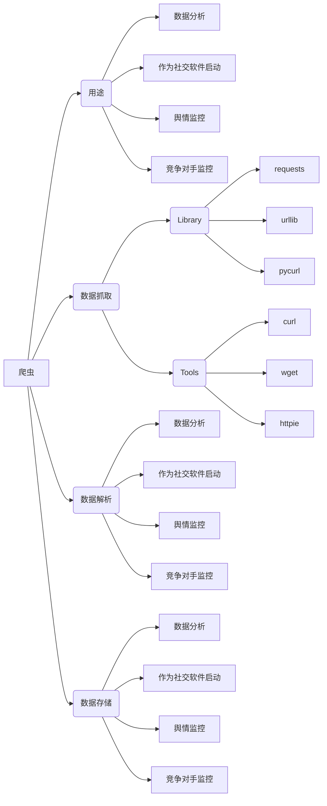

# 爬虫

```mermaid
graph LR
A[爬虫]-->B(用途)
    B-->B1[数据分析]
    B-->B2[作为社交软件启动]
    B-->B3[舆情监控]
    B-->B4[竞争对手监控]
A[爬虫]-->C(数据抓取)
    C(数据抓取)-->F(Library)
        F-->F1[requests]
        F-->F2[urllib]
        F-->F3[pycurl]
    C(数据抓取)-->G(Tools)
        G-->G1[curl]
        G-->G2[wget]
        G-->G3[httpie]
A[爬虫]-->D(数据解析)
    D-->D1[数据分析]
    D-->D2[作为社交软件启动]
    D-->D3[舆情监控]
    D-->D4[竞争对手监控]
A[爬虫]-->E(数据存储)
    E-->E1[数据分析]
    E-->E2[作为社交软件启动]
    E-->E3[舆情监控]
    E-->E4[竞争对手监控]
```
       
## [curl的使用](notes/python/爬虫/内容/curl的使用.md)