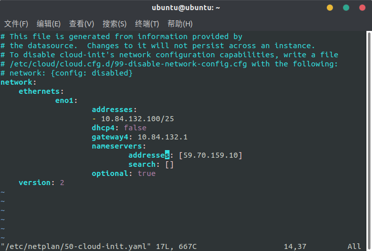

# 系统安装
                     
**安装时设置不联网进行安装，安装完毕之后再进行网络配置**
                  
<iframe src="//player.bilibili.com/player.html?aid=71783542&cid=124384489&page=2" scrolling="no" border="0" frameborder="no" framespacing="0" allowfullscreen="true" height="500px"> </iframe>
                     
# 服务器网络配置
输入以下命令：         
                     
```bash
sudo vim /etc/netplan/50-cloud-init.yaml 
```
                          
修改如下图：                   
                 

                     
# 设置国内软件源
华为云：                 
运行以下命令：                  
               
```bash
sed -i "s@http://.*archive.ubuntu.com@http://repo.huaweicloud.com@g" /etc/apt/sources.list
sed -i "s@http://.*security.ubuntu.com@http://repo.huaweicloud.com@g" /etc/apt/sources.list
```
                               
也可以选择其他的软件源。
                              
# 安装Docker
## 使用APT安装
由于 apt 源使用 HTTPS 以确保软件下载过程中不被篡改。因此，我们首先需要添加使用 HTTPS 传输的软件包以及 CA 证书。      
               
```
sudo apt-get update

sudo apt-get install \
    apt-transport-https \
    ca-certificates \
    curl \
    software-properties-common
```
      
## 更换国内源
### 如果过去安装过docker，则先删掉
```bash
sudo apt-get remove docker docker-engine docker.io
```
                
### 安装依赖
```bash
sudo apt-get install apt-transport-https ca-certificates curl gnupg2 software-properties-common
```
                             
### 信任Docker的GPG公钥
```bash
curl -fsSL https://download.docker.com/linux/ubuntu/gpg | sudo apt-key add -
```
                        
### 添加软件仓库
```bash
sudo add-apt-repository \
   "deb [arch=amd64] https://mirrors.tuna.tsinghua.edu.cn/docker-ce/linux/ubuntu \
   $(lsb_release -cs) \
   stable"
```
                     
其他详细内容参考以下文章：
                   
- [Docker Community Edition 镜像使用帮助](https://mirror.tuna.tsinghua.edu.cn/help/docker-ce/)
                 
## 安装 Docker CE

```
sudo apt update
sudo apt install docker-ce
```

## 建立 docker 用户组
建立docker组:   
   
```
sudo groupadd docker
```
    
将当前用户加入docker组：    
    
```
sudo usermod -aG docker $USER
```
                     
退出重新登录即生效。
               
### 关于重新登录后该用户无法正常使用docker的问题
#### 重启docker服务
```bash
sudo service docker restart
```
                      
#### 切换当前会话到新group或者重启X会话
```bash
newgrp - docker
```
                       
## 更换国内Docker仓库
创建文件：       
    
```
sudo vim /etc/docker/daemon.json
```
     
加入以下内容：     
      
```
{
  "registry-mirrors": [
    "https://docker.mirrors.ustc.edu.cn"
  ]
}
```
         
然后重启系统。    
     
## 验证
输入以下命令：       
       
```
docker run hello-world
```
             
若输出以下内容则为成功。          
         
```
Unable to find image 'hello-world:latest' locally
latest: Pulling from library/hello-world
ca4f61b1923c: Pull complete
Digest: sha256:be0cd392e45be79ffeffa6b05338b98ebb16c87b255f48e297ec7f98e123905c
Status: Downloaded newer image for hello-world:latest

Hello from Docker!
This message shows that your installation appears to be working correctly.

To generate this message, Docker took the following steps:
 1. The Docker client contacted the Docker daemon.
 2. The Docker daemon pulled the "hello-world" image from the Docker Hub.
    (amd64)
 3. The Docker daemon created a new container from that image which runs the
    executable that produces the output you are currently reading.
 4. The Docker daemon streamed that output to the Docker client, which sent it
    to your terminal.

To try something more ambitious, you can run an Ubuntu container with:
 $ docker run -it ubuntu bash

Share images, automate workflows, and more with a free Docker ID:
 https://cloud.docker.com/

For more examples and ideas, visit:
 https://docs.docker.com/engine/userguide/
```

# Docker相关基础操作

<iframe src="//player.bilibili.com/player.html?aid=71783542&cid=124383794&page=1" scrolling="no" border="0" frameborder="no" framespacing="0" allowfullscreen="true" height="500px"> </iframe>
                               
# 安装显卡程序
# 安装nvidia-docker
# Tensorflow
## 拉取镜像
## 运行容器
## 相关操作
# 其他