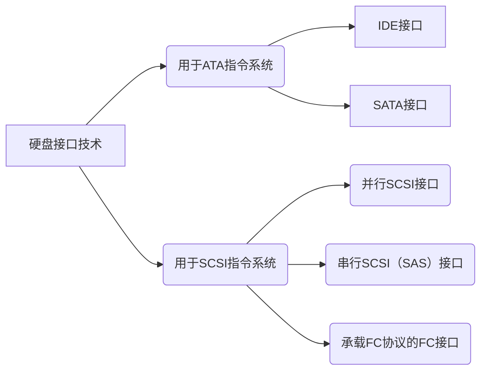

# 1. 智能存储组件
## 1.1. 控制框
### 1.1.1. 存储产品形态

         
### 1.1.2. 控制框形态
控制框采用部件模块化设计，主要由系统插框、控制器（内含风扇模块）、BBU模块、电源模块、管理模块和接口模块等组成。
           

        
### 1.1.3. 控制框正视图详解

      
### 1.1.4. 控制框后视图详解

            
【功能介绍】          
- 管理网口：维护终端的网口通过网线连接存储设备的管理网口，建立管理通道，实现维护终端对存储设备的管理和维护。       
- 维护网口：维护网口在用于管理维护功能时，仅限华为技术支持工程师在紧急情况下的特殊维护使用，且不能与管理网口接入同一网络，否则可能会导致网络回环，造成网络风暴。          
请勿将管理网口和维护网口连接于同一个交换机       
- 串口：维护终端的串口通过串口线缆连接存储设备的串口，现维护终端对存储设备的管理和维护。       

          
【登录方式介绍】       
- 通过串口登录：         
用串口线缆连接维护终端和控制框后，您可以使用终端程序（例如PuTTY软件）通登录存储系统CLI控制界面。（需要用户名和密码）      
      
- 通过管理网口登录：         
1. 用网线连接维护终端和控制框后，您可以使用终端程序（例如PuTTY软件）登录存储系统CLI控制界面。（需要管理网口IP地址、用户名和密码）
2. 用网线连接维护终端和控制框后，通过浏览器访问控制器的管理网口IP地址，可以登录DeviceManager管理界面。（需要管理网口IP地址、用户名和密码）
         
说明：维护网口仅限华为技术支持工程师在紧急情况下的特殊维护使用，登录方式不在这里介绍。
        
### 1.1.5. 控制器
控制器是设备中的核心部件，主要负责处理存储业务、接收用户的配置管理命令、保存配置信息、接入硬盘和保存关键信息到保险箱硬盘。
        
### 1.1.6. BBU模块和风扇模块

        
### 1.1.7. 保险箱盘

        
### 1.1.8. 电源模块
电源模块为交流电源模块，可以支持控制框在最大功耗模式下正常运行。
        

        
## 1.2. 硬盘框
### 1.2.1. 硬盘框形态
硬盘框采用部件模块化设计，主要由系统插框、级联模块、电源模块和硬盘模块等组成。
        

       
### 1.2.2. 硬盘框正视图

       
### 1.2.3. 硬盘框后视图

         
## 1.3. 级联模块

        
### 1.3.1. CE交换机

       
### 1.3.2. FC交换机

        
### 1.3.3. 设备线缆

       
## 1.4. 硬盘
### 1.4.1. 机械硬盘
#### 1.4.1.1. 机械硬盘结构
机械硬盘的结构大致包括：盘片、磁头臂、读/写磁头、主轴、硬盘接口和控制电路等。
          

       
#### 1.4.1.2. 机械硬盘工作原理
- 盘片 Platters
- 磁道 Track
- 柱面 Cylinder
- 扇区 Sector
- 磁头 Head
           

           
参考：
- [硬盘基本知识（磁头、磁道、扇区、柱面)](https://www.cnblogs.com/skying555/p/10366152.html)
         
#### 1.4.1.3. 硬盘上的数据组织

        
#### 1.4.1.4. 硬盘容量和缓存
+ 硬盘容量
    - 硬盘容量=柱面数*磁头数*扇区数*扇区大小，单位为MB或GB，影响磁盘容量的因素由**单碟容量**和**磁片数量**。
+ 缓存（Cache）
    - 由于CPU和硬盘之间存在巨大的速度差异，为解决硬盘在读写数据时CPU的等待问题，在硬盘上设置适当的高速缓存，以解决二者之间速度不匹配的问题，硬盘缓存与CPU上的高速缓存作用一样，是为了提高硬盘的读写速度。
      
#### 1.4.1.5. 影响硬盘性能的因素
- 转速：影响硬盘连续IO时吞吐量性能的首要因素
- 寻道速度：影响磁盘随机IO性能的首要因素
- 单碟容量：影响硬盘性能的一个间接因素
- 接口速度：影响硬盘性能的一个最不重要的因素
       
#### 1.4.1.6. 平均访问时间
平均访问时间由以下两项构成：
- 平均寻道时间（Average Seek Time）
- 平均等待时间（Average Latency Time）
          

       
平均访问时间（Average Access Time）是指磁头从起始位置到到达目标磁道位置，并且从目标磁道上找到要读写的数据扇区所需的时间。
          
平均访问时间体现了硬盘的读写速度，它包括了硬盘的寻道时间和等待时间，即：平均访问时间=平均寻道时间+平均等待时间。
          
硬盘的平均寻道时间（Average Seek Time）是指硬盘的磁头移动到盘面指定磁道所需的时间。这个时间当然越小越好，硬盘的平均寻道时间通常在8ms到12ms之间，而SCSI硬盘则应小于或等于8ms。
            
硬盘的等待时间，又叫潜伏期（Latency），是指磁头已处于要访问的磁道，等待所要访问的扇区旋转至磁头下方的时间。平均等待时间为盘片旋转一周所需的时间的一半，一般应在4ms以下。

####  1.4.1.7. 数据传输速率
数据传输速率（Data Transfer Rate)：硬盘的数据传输速率是指硬盘读写数据的速度，单位为兆字节每秒（MB/s）。硬盘数据传输速率又包括了内部数据传输速率和外部数据传输速率。
      
内部传输速率（Internal Transfer Rate) 也称为持续传输速率（Sustained Transfer Rate），它反映了硬盘缓冲区未用时的性能。内部传输速率主要依赖于硬盘的旋转速度。
      
外部传输速率（External Transfer Rate）也称为突发数据传输速率（Burst Data Transfer Rate）或接口传输率，它标称的是系统总线与硬盘缓冲区之间的数据传输率，外部数据传输率与硬盘接口类型和硬盘缓存的大小有关。
        
#### 1.4.1.8. 硬盘的IOPS和传输带宽
+ IOPS
    - IOPS (Input/Output Per Second)即每秒的输入输出量(或读写次数)，是衡量磁盘性能的主要指标之一。
    - IOPS的计算：由寻道时间、旋转延迟和数据传输时间三部分组成
+ 传输带宽（Throughput吞吐量）
    - 数据吞吐量(Throughput)，指单位时间内可以成功传输的数据数量，即传输数据流的速度。
      
#### 1.4.1.9. 并行传输和串行传输

        
#### 1.4.1.10. 硬盘接口技术

       
- [硬盘接口大全](https://zhuanlan.zhihu.com/p/41669022)
         
### 1.4.2. 固态硬盘
#### 1.4.2.1. 固态硬盘概述
- 相对于HDD而言，固态硬盘SSD在性能、可靠性、能耗、轻便性方面有着绝对的又是，目前已经在各领域得到广泛应用。
+ SSD特点：
  - 使用flash技术存储信息，数据传输速度比HDD快
  - 内部没有机械结构，因此耗电量更小、散热小、噪音小
  - SSD盘使用寿命受擦写次数影响
       
#### 1.4.2.2. SSD架构
SSH主要由控制单元和存储单元（当前主要是Flash闪存颗粒）组成。
- 控制单元：SSD控制器、主机接口、DRAM等；
- 存储单元：NAND FLASH颗粒。
        

        
#### 1.4.2.3. NAND Flash
- NAND Flash 内部存储单元组成包括：LUN、Plane、Block、Page、Cell
- 对NAND Flash 的读写数据的操作主要涉及擦除（Erase）、编程（Program）和读（Read）
- NAND Flash是非易失性介质，在写入新数据之前必须保证Block被擦除过。对Block擦除一次后再写入一次被称为一次P/E Cycle。
         

       
#### 1.4.2.4. SLC、MLC、TLC和QLC

       
#### 1.4.2.5. 闪存颗粒数据关系

       
#### 1.4.2.6. 地址映射管理

       
#### 1.4.2.7. FTL闪存转换层

       
#### 1.4.2.8. SSD数据读写过程
对于SSD的写操作，针对不同的情况，有不同的处理流程，主要是受到NAND Flash的如下特性限制:
- NAND Flash每次写必须以page为单位，且只能写入空闲的page，不能覆盖写原先有内容的page
- 擦除数据时，由于电压较高，只能以block为单位擦除
        
SSD的写分为新写入和更新两种，处理流程不同。
        

         
假设新写入了一个page，其流程如下：
- 找到一个空闲page
- 把数据写入到空闲page中
- 更新mapping table
       

         
假设是更新了page G中的某些字节，流程如下：
- 由于SSD不能覆盖写，因此，先找到一个空闲页H
- 读取page G中的数据到SSD内部的buffer中，把更新的字节更新到buffer
- 把buffer中的数据写入到H
- 更新mapping table中G页，置为无效页
- 更新mapping table中H页，添加映射关系
          
#### 1.4.2.9. SSD在存储中的应用

        
## 1.5. 接口模块
### 1.5.1. GE接口模块

      
### 1.5.2. SAS级联模块和RDMA接口模块

        
### 1.5.3. SmartIO接口模块

       
### 1.5.4. PEle接口模块和56Gb IB接口模块

       
### 1.5.5. FC接口和FCoE接口模块
