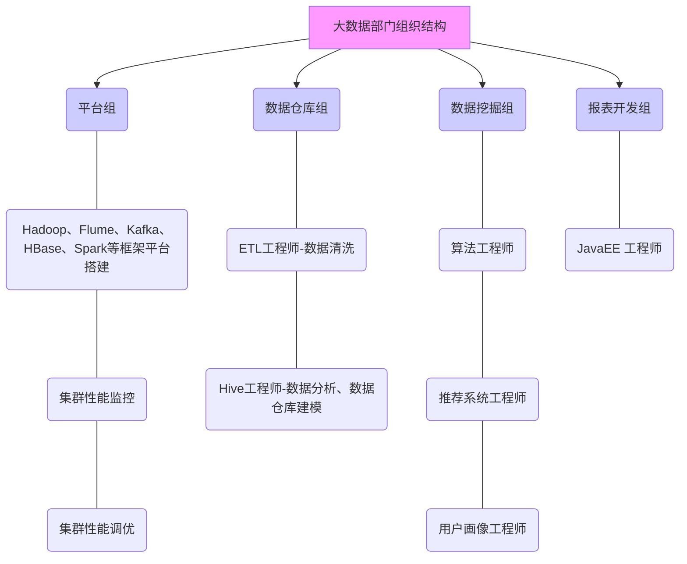
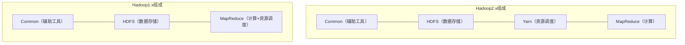

# 1. Hadoop
       
## 1.1. 大数据概论
         
### 1.1.1. 大数据概念
>大数据（big data）：指无法在一定时间范围内用常规软件工具进行捕捉、管理和处理的数据集合，是需要新处理模式才能具有更强的决策力、洞察发现力和流程优化能力的海量、高增长率和多样化的信息资产。
          
>主要解决的问题：海量数据的存储和海量数据的分析计算问题。
          
#### 1.1.1.1. 数据存储单位
按顺序给出数据存储单位：bit、Byte、KB、MB、GB、TB、PB、EB、ZB、YB、BB、NB、DB。
           
1Byte=8bit     
1K=1024Byte    
1M=1024K    
1G=1024M    
1T=1024G    
1P=1024T       

### 1.1.2. 大数据特点（4V）
1. Volume（大量）
2. Velocity（高速）
3. Variety（多样）
      
这种类型的多样性也让数据被分为结构化数据和非结构化数据。相对于以往更便于存储的以数据库/文本为主的结构化数据，非结构化数据越来越多，包括网络日志、音频、视频、图片、地理位置信息等，这些多类型的数据对数据的处理能力提出了更高要求。
              
4. Value（低价值密度）
      
价值密度的高低与数据总量的大小成反比。如何快速对有价值数据“提纯”成为目前大数据背景下待解决的难题。
          
### 1.1.3. 大数据应用场景
- 物流存储：大数据分析系统助力商家精细化运营、提升销量、节约成本
- 零售：分析用户消费习惯，为用户购买商品提供方便，从而提升商品销售
- 旅游：深度结合大数据能力与旅游行业需求，共建路旅游产业智慧管理、智慧服务和智慧营销的未来
- 商品广告推荐：给用户推荐可能喜欢的商品
- 保险：海量数据挖掘及风险预测，助力保险行业精准营销，提升精细化定价能力
- 金融：多维度体现用户特征，帮助金融机构推荐优质客户，防范欺诈风险
- 房产：大数据全面助力房地产行业，打造精准投策与营销，选出更适合的地，建造更合适的楼，卖给更合适的人
- 人工智能
          
### 1.1.4. 大数据发展前景
- 国家政策
- 人才缺口
- 高校开设大数据课程
- 大数据属于高新技术，升职竞争小
- 发展势头好
      
### 1.1.5. 大数据部门业务流程分析
业务流程：
       

           
### 1.1.6. 大数据部门组织结构
组织结构：
            

      
## 1.2. 从Hadoop框架讨论大数据
         
### 1.2.1. Hadoop是什么
1. Hadoop是一个由Apache基金会所开发的分布式系统基础架构
2. 主要解决，海量数据的存储和海量数据的分析计算问题
3. 广义上来说，Hadoop通常是指一个更广泛的概念——Hadoop生态圈
      

               
### 1.2.2. Hadoop发展历史
1. Lucene框架是Doug Cutting开创的开源软件，用Java书写代码，实现与Google类似的全文搜索功能，它提供了全文检索引擎的架构，包括完整的查询引擎和索引引擎。
2. 2001年年底Lucene成为Apache基金会的一个子项目。
3. 对于海量数据的场景，Lucene面对与Google同样的困难，存储数据困难，检索速度慢。
4. 学习和模仿Google解决这些问题的办法：微型版Nutch
5. 可以说Google是Hadoop的思想之源（Google在大数据方面的三篇论文）
    - GFS-->HDFS
    - Map-Reduce-->MR
    - BitTable-->Hbase
6. 2003-2004年，Google公开了部分GFS和MapReduce思想的细节，以此为基础实现了DFS和MapReduce机制，使Nutch性能飙升。
7. 2005年Hadoop作为Lucene的子项目Nutch的一部分正式引入Apache基金会。
8. 2006年3月，Map-Reduce和Nutch Distributed File System(NDFS)分别被纳入为Hadoop的项目中。
9. 名字来源与Doug Cutting儿子的玩具大象。
10. Hadoop就此诞生并迅速发展，标志着大数据时代来临。
          
### 1.2.3. Hadoop三大发行版本
Hadoop三大发行版本：Apache、Cloudera、Hortonworks。       
Apache版本最原始（最基础）的版本，对于入门学习最好。      
Cloudera在大型互联网企业中用的较多。      
Hortonworks文档较好        

#### 1.2.3.1. Apache Hadoop
官网地址：http://hadoop.apache.org/releases.html        
下载地址：https://archive.apache.org/dist/hadoop/common/

#### 1.2.3.2. Cloudera Hadoop
官网地址：https://www.cloudera.com/downloads/cdh/5-10-0.html        
下载地址：http://archive-primary.cloudera.com/cdh5/cdh/5/         
（1）2008年成立的Cloudera是最早将Hadoop商用的公司，为合作伙伴提供Hadoop的商用解决方案，主要是包括支持、咨询服务、培训。
       
（2）2009年Hadoop的创始人Doug Cutting也加盟Cloudera公司。Cloudera产品主要为CDH，Cloudera Manager，Cloudera Support
        
（3）CDH是Cloudera的Hadoop发行版，完全开源，比Apache Hadoop在兼容性，安全性，稳定性上有所增强。
        
（4）Cloudera Manager是集群的软件分发及管理监控平台，可以在几个小时内部署好一个Hadoop集群，并对集群的节点及服务进行实时监控。Cloudera Support即是对Hadoop的技术支持。
      
（5）Cloudera的标价为每年每个节点4000美元。Cloudera开发并贡献了可实时处理大数据的Impala项目。
          
#### 1.2.3.3. Hortonworks Hadoop
官网地址：https://hortonworks.com/products/data-center/hdp/      
下载地址：https://hortonworks.com/downloads/#data-platform       
（1）2011年成立的Hortonworks是雅虎与硅谷风投公司Benchmark Capital合资组建。
       
（2）公司成立之初就吸纳了大约25名至30名专门研究Hadoop的雅虎工程师，上述工程师均在2005年开始协助雅虎开发Hadoop，贡献了Hadoop80%的代码。
        
（3）雅虎工程副总裁、雅虎Hadoop开发团队负责人Eric Baldeschwieler出任Hortonworks的首席执行官。
          
（4）Hortonworks的主打产品是Hortonworks Data Platform（HDP），也同样是100%开源的产品，HDP除常见的项目外还包括了Ambari，一款开源的安装和管理系统。
          
（5）HCatalog，一个元数据管理系统，HCatalog现已集成到Facebook开源的Hive中。Hortonworks的Stinger开创性的极大的优化了Hive项目。Hortonworks为入门提供了一个非常好的，易于使用的沙盒。
                
（6）Hortonworks开发了很多增强特性并提交至核心主干，这使得Apache Hadoop能够在包括Window Server和Windows Azure在内的Microsoft Windows平台上本地运行。定价以集群为基础，每10个节点每年为12500美元。
           
### 1.2.4. Hadoop的优势（4高）
1. 高可靠性：Hadoop底层维护多个数据副本，所以即使Hadoop某个计算元素或存储出现故障，也不会导致数据的丢失。
2. 高扩展性：在集群间分配任务数据，可方便的扩展数以千计的节点。
3. 高效性：在MapReduce的思想下，Hadoop是并行工作的，以加快任务处理速度。
4. 高容错性：能够自动将失败的任务重新分配。
            
### 1.2.5. Hadoop组成
#### 1.2.5.1. Hadoop1.x和Hadoop2.x区别
两者的区别：
           

            
>在Hadoop1.x时代，Hadoop中的MapReduce同时处理业务逻辑运算和资源的调度，耦合性较大，在Hadoop2.x时代，增加了Yarn。Yarn只负责资源的调度，MapReduce只负责运算。
               
#### 1.2.5.2. HDFS架构概述
1. NameNode（nm）：存储文件的元数据，如文件名、文件目录结构、文件属性（生成时间、副本数、文件权限），以及每个文件的块列表和块所在的DataNode等。
2. DataNode（dn）：在本地文件系统存储文件块数据，以及块数据的校验和。
3. Second NameNode（2nn）：用来监控HDFS状态的辅助后台程序，每隔一段时间获取HDFS元数据的快照。
       
#### 1.2.5.3. YARN架构概述

          
- ResourceManager(RM)
负责对各NM上的资源进行统一管理和调度。将AM分配空闲的Container运行并监控其运行状态。对AM申请的资源请求分配相应的空闲Container。主要由两个组件构成：调度器和应用程序管理器：
           
1. 调度器(Scheduler)：调度器根据容量、队列等限制条件（如每个队列分配一定的资源，最多执行一定数量的作业等），将系统中的资源分配给各个正在运行的应用程序。调度器仅根据各个应用程序的资源需求进行资源分配，而资源分配单位是Container，从而限定每个任务使用的资源量。Shceduler不负责监控或者跟踪应用程序的状态，也不负责任务因为各种原因而需要的重启（由ApplicationMaster负责）。总之，调度器根据应用程序的资源要求，以及集群机器的资源情况，为应用程序分配封装在Container中的资源。
调度器是可插拔的，例如CapacityScheduler、FairScheduler。具体看下文的调度算法。
           
2. 应用程序管理器(Applications Manager)：应用程序管理器负责管理整个系统中所有应用程序，包括应用程序提交、与调度器协商资源以启动AM、监控AM运行状态并在失败时重新启动等，跟踪分给的Container的进度、状态也是其职责。
           
- NodeManager (NM)
NM是每个节点上的资源和任务管理器。它会定时地向RM汇报本节点上的资源使用情况和各个Container的运行状态；同时会接收并处理来自AM的Container 启动/停止等请求。
            
- ApplicationMaster (AM)：
用户提交的应用程序均包含一个AM，负责应用的监控，跟踪应用执行状态，重启失败任务等。ApplicationMaster是应用框架，它负责向ResourceManager协调资源，并且与NodeManager协同工作完成Task的执行和监控。MapReduce就是原生支持的一种框架，可以在YARN上运行Mapreduce作业。有很多分布式应用都开发了对应的应用程序框架，用于在YARN上运行任务，例如Spark，Storm等。如果需要，我们也可以自己写一个符合规范的YARN application。
           
- Container：
Container是YARN中的资源抽象，它封装了某个节点上的多维度资源，如内存、CPU、磁盘、网络等，当AM向RM申请资源时，RM为AM返回的资源便是用Container 表示的。 YARN会为每个任务分配一个Container且该任务只能使用该Container中描述的资源。
           
##### 1.2.5.3.1. YARN工作流程
当用户向 YARN 中提交一个应用程序后，YARN 将分两个阶段运行该应用程序：第一个阶段是启动 ApplicationMaster；第二个阶段是由 ApplicationMaster 创建应用程序，为它申请资源，并监控它的整个运行过程，直到运行完成，如下图所示:
          

           
上图所示的 YARN 工作流程分为以下几个步骤：

YARN应用工作流程图

1、用户向YARN中提交应用程序，其中包括AM程序、启动AM的命令、命令参数、用户程序等；事实上，需要准确描述运行ApplicationMaster的unix进程的所有信息。提交工作通常由YarnClient来完成。

2、RM为该应用程序分配第一个Container，并与对应的NM通信，要求它在这个Container中启动AM；

3、AM首先向RM注册，这样用户可以直接通过RM査看应用程序的运行状态，运行状态通过 AMRMClientAsync.CallbackHandler的getProgress() 方法来传递给RM。 然后它将为各个任务申请资源，并监控它的运行状态，直到运行结束，即重复步骤4〜7；

4、AM采用轮询的方式通过RPC协议向RM申请和领取资源；资源的协调通过 AMRMClientAsync异步完成,相应的处理方法封装在AMRMClientAsync.CallbackHandler中。

5、—旦AM申请到资源后，便与对应的NM通信，要求它启动任务；通常需要指定一个ContainerLaunchContext，提供Container启动时需要的信息。

6、NM为任务设置好运行环境(包括环境变量、JAR包、二进制程序等)后，将任务启动命令写到一个脚本中，并通过运行该脚本启动任务；

7、各个任务通过某个RPC协议向AM汇报自己的状态和进度，以让AM随时掌握各个任务的运行状态，从而可以在任务失败时重新启动任务；ApplicationMaster与NM的通信通过NMClientAsync object来完成，容器的所有事件通过NMClientAsync.CallbackHandler来处理。例如启动、状态更新、停止等。

8、应用程序运行完成后，AM向RM注销并关闭自己。
          
#### 1.2.5.4. MapReduce架构概述
### 1.2.6. 大数据技术生态体系
### 1.2.7. 推荐系统构架图
             
## 1.3. Hadoop运行环境搭建
           
### 1.3.1. 虚拟机环境准备
### 1.3.2. 安装JDK
### 1.3.3. 安装Hadoop
### 1.3.4. Hadoop目录结构
          
## 1.4. Hadoop运行模式
            
### 1.4.1. 本地运行模式
#### 1.4.1.1. 官方Grep案例
#### 1.4.1.2. 官方WordCount案例
### 1.4.2. 伪分布式运行模式
#### 1.4.2.1. 启动HDFS并运行MapReduce程序
#### 1.4.2.2. Yarn上运行MapReduce程序
#### 1.4.2.3. 配置历史服务器
#### 1.4.2.4. 配置日志的聚集
#### 1.4.2.5. 配置文件说明
### 1.4.3. 完全分布式运行模式
#### 1.4.3.1. 虚拟机准备
#### 1.4.3.2. 编写集群分发脚本xsync
#### 1.4.3.3. 集群配置
#### 1.4.3.4. 集群单点启动
#### 1.4.3.5. ssh免密登录
#### 1.4.3.6. 群起集群
#### 1.4.3.7. 集群启动/停止方式
#### 1.4.3.8. 集群时间同步

## 1.5. Hadoop编译源码
        
### 1.5.1. 前期准备工作
### 1.5.2. jar包安装
### 1.5.3. 编译源码

## 1.6. 常见错误及解决方案
                 