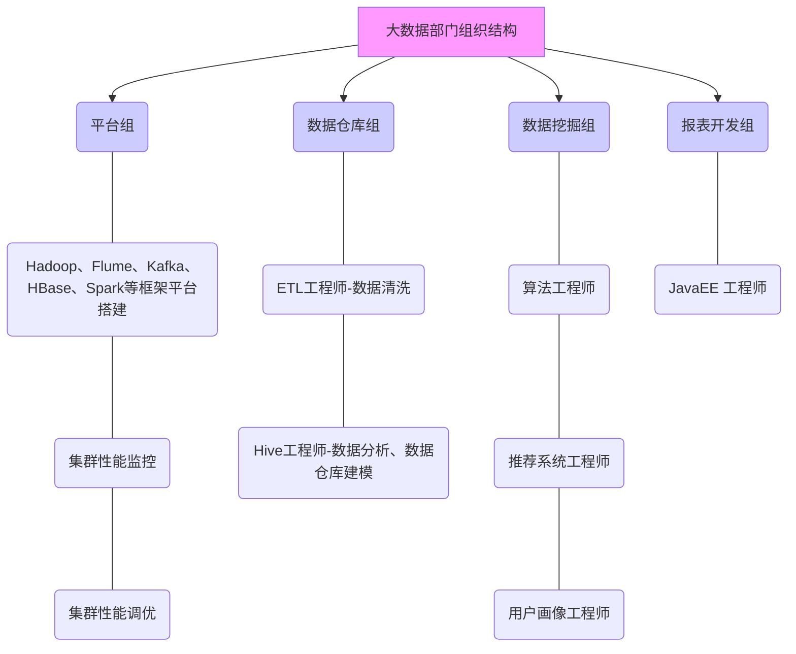

# 1. Hadoop
       
## 1.1. 大数据概论
         
### 1.1.1. 大数据概念
>大数据（big data）：指无法在一定时间范围内用常规软件工具进行捕捉、管理和处理的数据集合，是需要新处理模式才能具有更强的决策力、洞察发现力和流程优化能力的海量、高增长率和多样化的信息资产。
          
>主要解决的问题：海量数据的存储和海量数据的分析计算问题。
          
#### 1.1.1.1. 数据存储单位
按顺序给出数据存储单位：bit、Byte、KB、MB、GB、TB、PB、EB、ZB、YB、BB、NB、DB。
           
1Byte=8bit     
1K=1024Byte    
1M=1024K    
1G=1024M    
1T=1024G    
1P=1024T       

### 1.1.2. 大数据特点（4V）
1. Volume（大量）
2. Velocity（高速）
3. Variety（多样）
      
这种类型的多样性也让数据被分为结构化数据和非结构化数据。相对于以往更便于存储的以数据库/文本为主的结构化数据，非结构化数据越来越多，包括网络日志、音频、视频、图片、地理位置信息等，这些多类型的数据对数据的处理能力提出了更高要求。
              
4. Value（低价值密度）
      
价值密度的高低与数据总量的大小成反比。如何快速对有价值数据“提纯”成为目前大数据背景下待解决的难题。
          
### 1.1.3. 大数据应用场景
- 物流存储：大数据分析系统助力商家精细化运营、提升销量、节约成本
- 零售：分析用户消费习惯，为用户购买商品提供方便，从而提升商品销售
- 旅游：深度结合大数据能力与旅游行业需求，共建路旅游产业智慧管理、智慧服务和智慧营销的未来
- 商品广告推荐：给用户推荐可能喜欢的商品
- 保险：海量数据挖掘及风险预测，助力保险行业精准营销，提升精细化定价能力
- 金融：多维度体现用户特征，帮助金融机构推荐优质客户，防范欺诈风险
- 房产：大数据全面助力房地产行业，打造精准投策与营销，选出更适合的地，建造更合适的楼，卖给更合适的人
- 人工智能
          
### 1.1.4. 大数据发展前景
- 国家政策
- 人才缺口
- 高校开设大数据课程
- 大数据属于高新技术，升职竞争小
- 发展势头好
      
### 1.1.5. 大数据部门业务流程分析
业务流程：
       

           
### 1.1.6. 大数据部门组织结构
组织结构：
            

      
## 1.2. 从Hadoop框架讨论大数据
         
### 1.2.1. Hadoop是什么
### 1.2.2. Hadoop发展历史
### 1.2.3. Hadoop三大发行版本
### 1.2.4. Hadoop的优势（4高）
### 1.2.5. Hadoop组成
#### 1.2.5.1. HDFS架构概述
#### 1.2.5.2. YARN架构概述
#### 1.2.5.3. MapReduce架构概述
### 1.2.6. 大数据技术生态体系
### 1.2.7. 推荐系统构架图
             
## 1.3. Hadoop运行环境搭建
           
### 1.3.1. 虚拟机环境准备
### 1.3.2. 安装JDK
### 1.3.3. 安装Hadoop
### 1.3.4. Hadoop目录结构
          
## 1.4. Hadoop运行模式
            
### 1.4.1. 本地运行模式
#### 1.4.1.1. 官方Grep案例
#### 1.4.1.2. 官方WordCount案例
### 1.4.2. 伪分布式运行模式
#### 1.4.2.1. 启动HDFS并运行MapReduce程序
#### 1.4.2.2. Yarn上运行MapReduce程序
#### 1.4.2.3. 配置历史服务器
#### 1.4.2.4. 配置日志的聚集
#### 1.4.2.5. 配置文件说明
### 1.4.3. 完全分布式运行模式
#### 1.4.3.1. 虚拟机准备
#### 1.4.3.2. 编写集群分发脚本xsync
#### 1.4.3.3. 集群配置
#### 1.4.3.4. 集群单点启动
#### 1.4.3.5. ssh免密登录
#### 1.4.3.6. 群起集群
#### 1.4.3.7. 集群启动/停止方式
#### 1.4.3.8. 集群时间同步

## 1.5. Hadoop编译源码
        
### 1.5.1. 前期准备工作
### 1.5.2. jar包安装
### 1.5.3. 编译源码

## 1.6. 常见错误及解决方案
                 