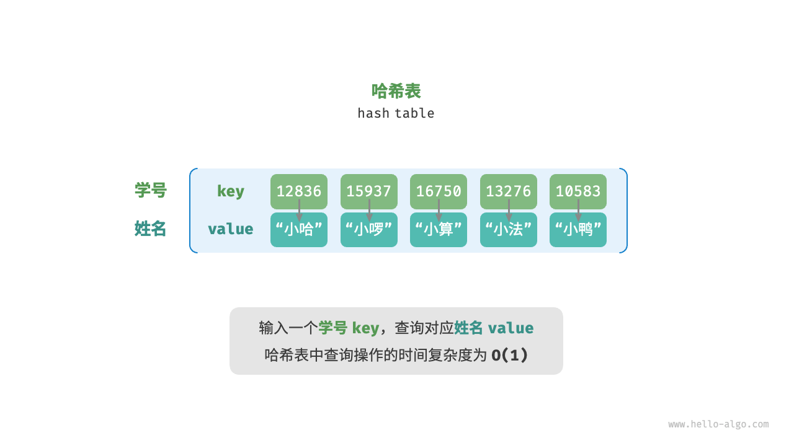

# 1. 哈希表

## 1.1. 哈希表
哈希表（hash table），又称散列表，它通过建立键 key 与值 value 之间的映射，实现高效的元素查询。

### 1.1.1. 哈希表常用操作
### 1.1.2. 哈希表简单实现
### 1.1.3. 哈希冲突与扩容

## 1.2. 哈希冲突
### 1.2.1. 链式地址
### 1.2.2. 开放寻址
#### 1.2.2.1. 线性探测
#### 1.2.2.2. 平方探测
#### 1.2.2.3. 多次哈希

## 1.3. 哈希算法

