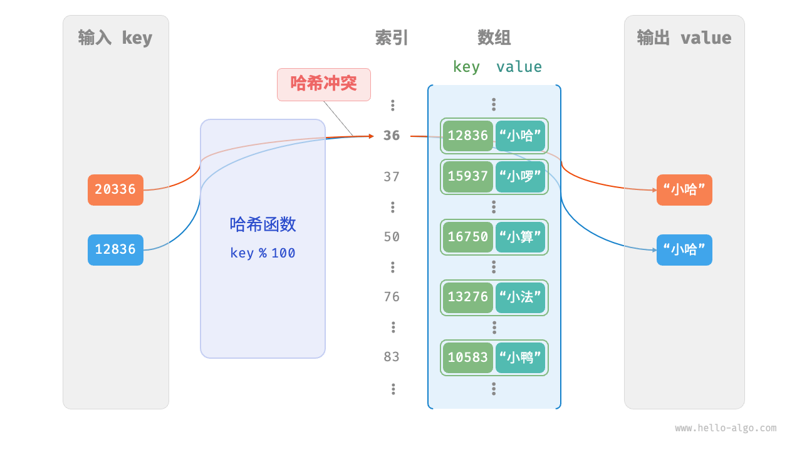

# 1. 哈希表

## 1.1. 哈希表
哈希表（hash table），又称散列表，它通过建立键 key 与值 value 之间的映射，实现高效的元素查询。在哈希表中进行增删查改的时间复杂度都是O(1)。


### 1.1.1. 哈希表常用操作
初始化、查询操作、添加键值对和删除键值对等。

```java
/* 初始化哈希表 */
Map<Integer, String> map = new HashMap<>();

/* 添加操作 */
// 在哈希表中添加键值对 (key, value)
map.put(12836, "小哈");
map.put(15937, "小啰");
map.put(16750, "小算");
map.put(13276, "小法");
map.put(10583, "小鸭");

/* 查询操作 */
// 向哈希表中输入键 key ，得到值 value
String name = map.get(15937);

/* 删除操作 */
// 在哈希表中删除键值对 (key, value)
map.remove(10583);
```

哈希表有三种常用的遍历方式：遍历键值对、遍历键和遍历值。

```java
/* 遍历哈希表 */
// 遍历键值对 key->value
for (Map.Entry <Integer, String> kv: map.entrySet()) {
    System.out.println(kv.getKey() + " -> " + kv.getValue());
}
// 单独遍历键 key
for (int key: map.keySet()) {
    System.out.println(key);
}
// 单独遍历值 value
for (String val: map.values()) {
    System.out.println(val);
}
```

### 1.1.2. 哈希表简单实现


```java
/* 键值对 */
class Pair {
    public int key;
    public String val;

    public Pair(int key, String val) {
        this.key = key;
        this.val = val;
    }
}

/* 基于数组实现的哈希表 */
class ArrayHashMap {
    private List<Pair> buckets;

    public ArrayHashMap() {
        // 初始化数组，包含 100 个桶
        buckets = new ArrayList<>();
        for (int i = 0; i < 100; i++) {
            buckets.add(null);
        }
    }

    /* 哈希函数 */
    private int hashFunc(int key) {
        int index = key % 100;
        return index;
    }

    /* 查询操作 */
    public String get(int key) {
        int index = hashFunc(key);
        Pair pair = buckets.get(index);
        if (pair == null)
            return null;
        return pair.val;
    }

    /* 添加操作 */
    public void put(int key, String val) {
        Pair pair = new Pair(key, val);
        int index = hashFunc(key);
        buckets.set(index, pair);
    }

    /* 删除操作 */
    public void remove(int key) {
        int index = hashFunc(key);
        // 置为 null ，代表删除
        buckets.set(index, null);
    }

    /* 获取所有键值对 */
    public List<Pair> pairSet() {
        List<Pair> pairSet = new ArrayList<>();
        for (Pair pair : buckets) {
            if (pair != null)
                pairSet.add(pair);
        }
        return pairSet;
    }

    /* 获取所有键 */
    public List<Integer> keySet() {
        List<Integer> keySet = new ArrayList<>();
        for (Pair pair : buckets) {
            if (pair != null)
                keySet.add(pair.key);
        }
        return keySet;
    }

    /* 获取所有值 */
    public List<String> valueSet() {
        List<String> valueSet = new ArrayList<>();
        for (Pair pair : buckets) {
            if (pair != null)
                valueSet.add(pair.val);
        }
        return valueSet;
    }

    /* 打印哈希表 */
    public void print() {
        for (Pair kv : pairSet()) {
            System.out.println(kv.key + " -> " + kv.val);
        }
    }
}
```

### 1.1.3. 哈希冲突与扩容
理论上一定存在“多个输入对应相同的输出”的情况。如以下情况：



哈希表容量n越大，多个 key 被分配到同一个桶中的概率就越低，冲突就越少。因此可以通过扩容哈希表来减少哈希冲突。


## 1.2. 哈希冲突
哈希表的结构改良方法主要包括“链式地址”和“开放寻址”。

### 1.2.1. 链式地址
链式地址（separate chaining）将单个元素转换为链表，将键值对作为链表节点，将所有发生冲突的键值对都存储在同一链表中。


基于链式地址实现的哈希表的操作方法发生了以下变化。
- 查询元素：输入 key ，经过哈希函数得到桶索引，即可访问链表头节点，然后遍历链表并对比 key 以查找目标键值对。
- 添加元素：首先通过哈希函数访问链表头节点，然后将节点（键值对）添加到链表中。
- 删除元素：根据哈希函数的结果访问链表头部，接着遍历链表以查找目标节点并将其删除。

链式地址存在以下局限性。
- 占用空间增大：链表包含节点指针，它相比数组更加耗费内存空间。
- 查询效率降低：因为需要线性遍历链表来查找对应元素。

```java
/* 链式地址哈希表 */
class HashMapChaining {
    int size; // 键值对数量
    int capacity; // 哈希表容量
    double loadThres; // 触发扩容的负载因子阈值
    int extendRatio; // 扩容倍数
    List<List<Pair>> buckets; // 桶数组

    /* 构造方法 */
    public HashMapChaining() {
        size = 0;
        capacity = 4;
        loadThres = 2.0 / 3.0;
        extendRatio = 2;
        buckets = new ArrayList<>(capacity);
        for (int i = 0; i < capacity; i++) {
            buckets.add(new ArrayList<>());
        }
    }

    /* 哈希函数 */
    int hashFunc(int key) {
        return key % capacity;
    }

    /* 负载因子 */
    double loadFactor() {
        return (double) size / capacity;
    }

    /* 查询操作 */
    String get(int key) {
        int index = hashFunc(key);
        List<Pair> bucket = buckets.get(index);
        // 遍历桶，若找到 key ，则返回对应 val
        for (Pair pair : bucket) {
            if (pair.key == key) {
                return pair.val;
            }
        }
        // 若未找到 key ，则返回 null
        return null;
    }

    /* 添加操作 */
    void put(int key, String val) {
        // 当负载因子超过阈值时，执行扩容
        if (loadFactor() > loadThres) {
            extend();
        }
        int index = hashFunc(key);
        List<Pair> bucket = buckets.get(index);
        // 遍历桶，若遇到指定 key ，则更新对应 val 并返回
        for (Pair pair : bucket) {
            if (pair.key == key) {
                pair.val = val;
                return;
            }
        }
        // 若无该 key ，则将键值对添加至尾部
        Pair pair = new Pair(key, val);
        bucket.add(pair);
        size++;
    }

    /* 删除操作 */
    void remove(int key) {
        int index = hashFunc(key);
        List<Pair> bucket = buckets.get(index);
        // 遍历桶，从中删除键值对
        for (Pair pair : bucket) {
            if (pair.key == key) {
                bucket.remove(pair);
                size--;
                break;
            }
        }
    }

    /* 扩容哈希表 */
    void extend() {
        // 暂存原哈希表
        List<List<Pair>> bucketsTmp = buckets;
        // 初始化扩容后的新哈希表
        capacity *= extendRatio;
        buckets = new ArrayList<>(capacity);
        for (int i = 0; i < capacity; i++) {
            buckets.add(new ArrayList<>());
        }
        size = 0;
        // 将键值对从原哈希表搬运至新哈希表
        for (List<Pair> bucket : bucketsTmp) {
            for (Pair pair : bucket) {
                put(pair.key, pair.val);
            }
        }
    }

    /* 打印哈希表 */
    void print() {
        for (List<Pair> bucket : buckets) {
            List<String> res = new ArrayList<>();
            for (Pair pair : bucket) {
                res.add(pair.key + " -> " + pair.val);
            }
            System.out.println(res);
        }
    }
}
```

### 1.2.2. 开放寻址

#### 1.2.2.1. 线性探测
#### 1.2.2.2. 平方探测
#### 1.2.2.3. 多次哈希

## 1.3. 哈希算法

