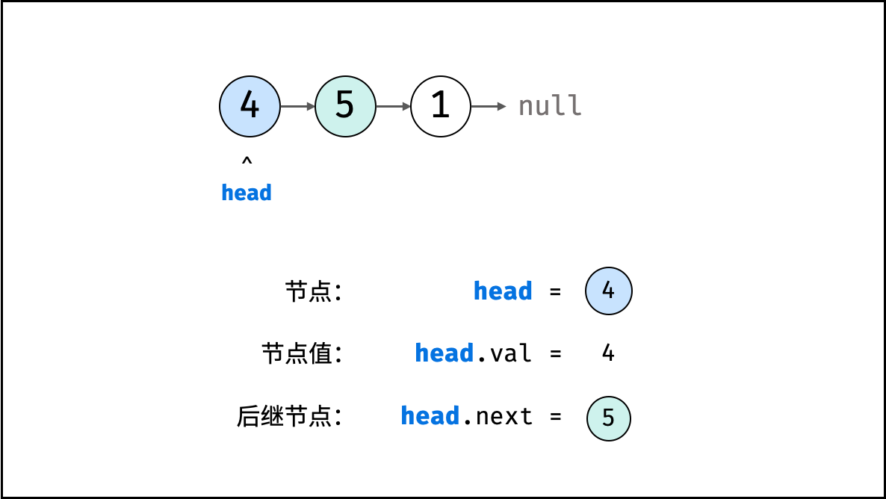
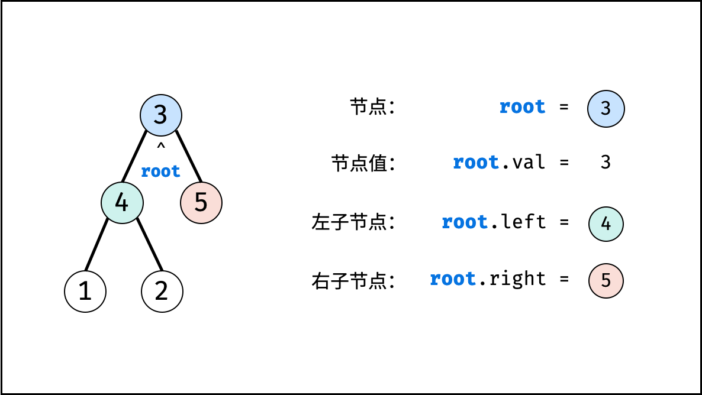
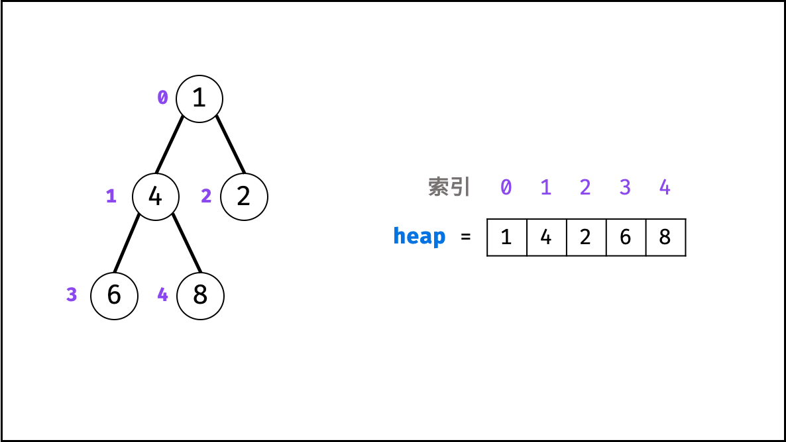

# 1. 基础知识
常见的数据结构可分为线性数据结构和非线性数据结构。如下图：


## 1.1. 数据结构简介
### 1.1.1. 数组
- 数组是将相同类型的元素存储于连续内存空间的数据结构，其长度不可变。
- 可变数组是经常使用的数据结构，其基于数组和扩容机制实现，相比普通数组更加灵活。常用操作：访问元素、添加元素、删除元素。

1、 初始化时给定长度，并对数组每个索引元素赋值
```java
// 初始化一个长度为 5 的数组 array
int[] array = new int[5];
// 元素赋值
array[0] = 2;
array[1] = 3;
array[2] = 1;
array[3] = 0;
array[4] = 2;
```

2、 使用直接赋值的初始化方法
```java
int[] array = {2, 3, 1, 0, 2};
```

3、 可变数组
```java
// 初始化可变数组
List<Integer> array = new ArrayList<>();

// 向尾部添加元素
array.add(2);
array.add(3);
array.add(1);
array.add(0);
array.add(2);
```

### 1.1.2. 链表
链表以节点为单位，每个元素都是一个独立元素，在内存空间的存储是非连续的。链表的节点对象具有两个成员变量：`值val`和`后继节点引用next`



```java
class ListNode {
    int val;       // 节点值
    ListNode next; // 后继节点引用
    ListNode(int x) { val = x; }
}
```

建立此链表需要实例化每个节点，并构建各节点的引用指向。
```java
// 实例化节点
ListNode n1 = new ListNode(4); // 节点 head
ListNode n2 = new ListNode(5);
ListNode n3 = new ListNode(1);

// 构建引用指向
n1.next = n2;
n2.next = n3;
```

### 1.1.3. 栈
栈是一种具有`先入后出`的特点的抽象数据结构，可使用数组和链表实现。


- 通常情况下，不推荐使用 Java 的 Vector 以及其子类 Stack ，而一般将 LinkedList 作为栈来使用。

```java
LinkedList<Integer> stack = new LinkedList<>();

stack.addLast(1);   // 元素 1 入栈
stack.addLast(2);   // 元素 2 入栈
stack.removeLast(); // 出栈 -> 元素 2
stack.removeLast(); // 出栈 -> 元素 1
```

### 1.1.4. 队列
队列是一种具有`先入先出`的特点的抽象数据结构，可使用链表实现。


```java
queue.offer(1); // 元素 1 入队
queue.offer(2); // 元素 2 入队
queue.poll();   // 出队 -> 元素 1
queue.poll();   // 出队 -> 元素 2
```

### 1.1.5. 树
- 树是一种非线性数据结构，根据子节点数量可分为`二叉树`和`多叉树`，最顶层节点成为`根节点root`。
- 二叉树，每个节点包含三个成员变量：`值val`、`左节点left`、`右节点right`



```java
class TreeNode {
    int val;        // 节点值
    TreeNode left;  // 左子节点
    TreeNode right; // 右子节点
    TreeNode(int x) { val = x; }
}

```

建立二叉树需要实例化每个节点，并构建各节点的引用指向。
```java
// 初始化节点
TreeNode n1 = new TreeNode(3); // 根节点 root
TreeNode n2 = new TreeNode(4);
TreeNode n3 = new TreeNode(5);
TreeNode n4 = new TreeNode(1);
TreeNode n5 = new TreeNode(2);

// 构建引用指向
n1.left = n2;
n1.right = n3;
n2.left = n4;
n2.right = n5;
```

### 1.1.6. 图
图是一种非线性数据结构，由`节点（顶点）vertex`和`边edge`组成，每条边连接一对顶点。根据边的方向有无，图可分为`有向图`和`无向图`

以无向图为例：
- 顶点集合：vertices = {1, 2, 3, 4, 5}
- 边集合： edges = {(1, 2), (1, 3), (1, 4), (1, 5), (2, 4), (3, 5), (4, 5)}


#### 1.1.6.1. 表示图的方法
##### 1.1.6.1.1. 邻接矩阵
使用数组`vertices`存储顶点，邻接矩阵`edges`存储边；edges[i][j]代表节点`i+1`和节点`j+1`直接是否有边。

```java
int[] vertices = {1, 2, 3, 4, 5};
int[][] edges = {{0, 1, 1, 1, 1},
                 {1, 0, 0, 1, 0},
                 {1, 0, 0, 0, 1},
                 {1, 1, 0, 0, 1},
                 {1, 0, 1, 1, 0}};
```

##### 1.1.6.1.2. 邻接表
使用数组vertices存储顶点，邻接表edges存储边。edges为一个二维容器，第一维i代表顶点索引，第二维edges[i]存储此顶点对应的边集合。

```java
int[] vertices = {1, 2, 3, 4, 5};
List<List<Integer>> edges = new ArrayList<>();

List<Integer> edge_1 = new ArrayList<>(Arrays.asList(1, 2, 3, 4));
List<Integer> edge_2 = new ArrayList<>(Arrays.asList(0, 3));
List<Integer> edge_3 = new ArrayList<>(Arrays.asList(0, 4));
List<Integer> edge_4 = new ArrayList<>(Arrays.asList(0, 1, 4));
List<Integer> edge_5 = new ArrayList<>(Arrays.asList(0, 2, 3));
edges.add(edge_1);
edges.add(edge_2);
edges.add(edge_3);
edges.add(edge_4);
edges.add(edge_5);
```

##### 1.1.6.1.3. 邻接矩阵和邻接表的不同
邻接矩阵的大小只与节点数量有关，即N^2，其中N 为节点数量。因此，当边数量明显少于节点数量时，使用邻接矩阵存储图会造成较大的内存浪费。
因此，邻接表 适合存储稀疏图（顶点较多、边较少）； 邻接矩阵 适合存储稠密图（顶点较少、边较多）。

### 1.1.7. 散列表
散列表是一种非线性数据结构，通过利用Hash函数将指定的`键key`映射至对应的`值value`，以实现高效的元素查找。    
实际的 Hash 函数需保证低碰撞率、 高鲁棒性等，以适用于各类数据和场景。    
设想一个简单场景：小力、小特、小扣的学号分别为 10001, 10002, 10003 。    
现需求从「姓名」查找「学号」。    

```java
// 初始化散列表
Map<String, Integer> dic = new HashMap<>();

// 添加 key -> value 键值对
dic.put("小力", 10001);
dic.put("小特", 10002);
dic.put("小扣", 10003);

// 从姓名查找学号
dic.get("小力"); // -> 10001
dic.get("小特"); // -> 10002
dic.get("小扣"); // -> 10003
```


### 1.1.8. 堆
堆是一种基于`完全二叉树`的数据结构，可使用`数组`实现。以`堆`为原理的排序算法成为`堆排序`，基于`堆`实现的数据结构为`优先队列`。`堆`分为`大顶堆`和`小顶堆`。`大（小）顶堆`：任意节点的值不大于（小于）`其父节点的值`。

完全二叉树：设二叉树深度为k，若二叉树除第k层外的其他各层（第1至k-1层）的节点达到最大个数，且处于第k层的节点都连续集中在最左边，则称此二叉树为完全二叉树。

如下图所示，为包含 1, 4, 2, 6, 8 元素的小顶堆。将堆（完全二叉树）中的结点按层编号，即可映射到右边的数组存储形式。

通过使用「优先队列」的「压入 push()」和「弹出 pop()」操作，即可完成堆排序。



```java
// 初始化小顶堆
Queue<Integer> heap = new PriorityQueue<>();

// 元素入堆
heap.add(1);
heap.add(4);
heap.add(2);
heap.add(6);
heap.add(8);

// 元素出堆（从小到大）
heap.poll(); // -> 1
heap.poll(); // -> 2
heap.poll(); // -> 4
heap.poll(); // -> 6
heap.poll(); // -> 8
```
## 1.2. 算法复杂度
算法复杂度旨在计算在输入数据量`N`的情况下，算法的`时间使`和`空间使用`情况；体现算法运行使用的时间和空间随 `数据大小 N `而增大的速度。

算法复杂度主要可从 `时间` 、`空间` 两个角度评价：
- 时间： 假设各操作的运行时间为固定常数，统计算法运行的「计算操作的数量」 ，以代表算法运行所需时间；
- 空间： 统计在最差情况下，算法运行所需使用的「最大空间」；

输入数据大小 N 指算法处理的输入数据量；根据不同算法，具有不同定义，例如：
- 排序算法： N 代表需要排序的元素数量；
- 搜索算法： N 代表搜索范围的元素总数，例如数组大小、矩阵大小、二叉树节点数、图节点和边数等；

### 1.2.1. 时间复杂度
### 1.2.2. 空间复杂度