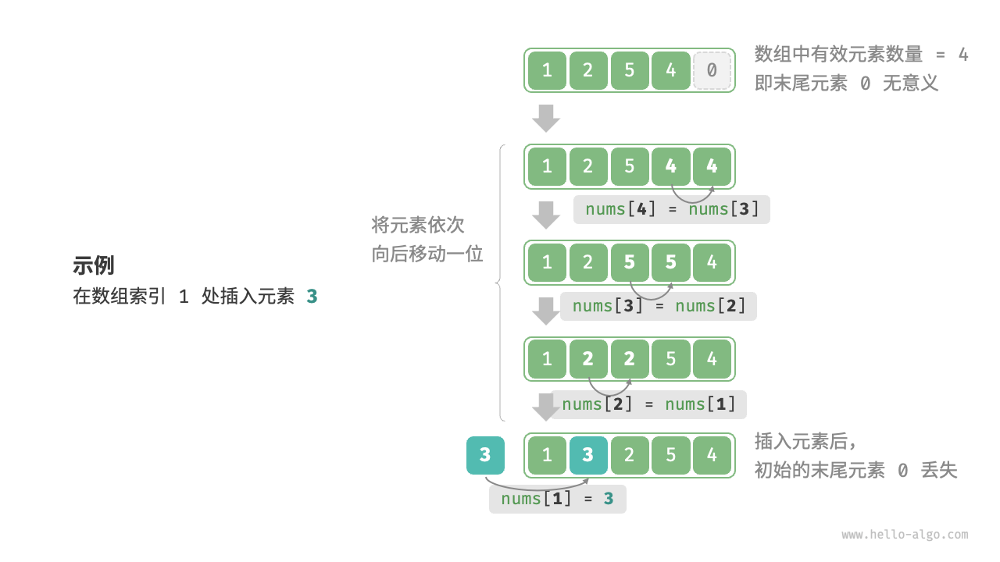
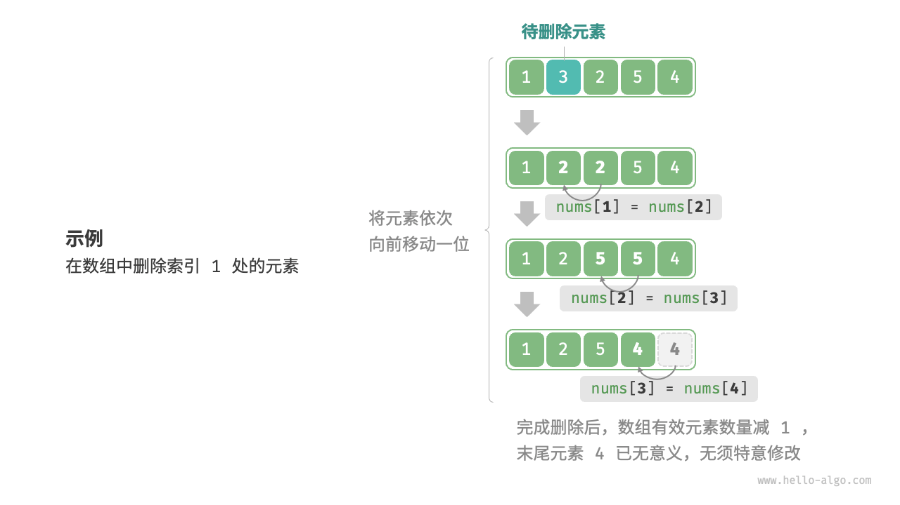

# 1. 数组与链表
## 1.1. 数组
>`数组（array）`是一种线性数据结构，其将相同类型的元素存储在连续的内存空间中。元素在数组中的位置称为该元素的`索引（index）`。


### 1.1.1. 数组常用操作
#### 1.1.1.1. 初始化数组
两种初始化数组方式：`无初始值`、`给定初始值`。

```java
/* 初始化数组 */
int[] arr = new int[5]; // { 0, 0, 0, 0, 0 }     # 在未指定初始值的情况下，大多数编程语言会将数组元素初始化为0
int[] nums = { 1, 3, 2, 5, 4 };
```

#### 1.1.1.2. 访问元素


```java
/* 随机访问元素 */
int randomAccess(int[] nums) {
    // 在区间 [0, nums.length) 中随机抽取一个数字
    int randomIndex = ThreadLocalRandom.current().nextInt(0, nums.length);
    // 获取并返回随机元素
    int randomNum = nums[randomIndex];
    return randomNum;
}
```

#### 1.1.1.3. 插入元素


```java
/* 在数组的索引 index 处插入元素 num */
void insert(int[] nums, int num, int index) {
    // 把索引 index 以及之后的所有元素向后移动一位
    for (int i = nums.length - 1; i > index; i--) {
        nums[i] = nums[i - 1];
    }
    // 将 num 赋给 index 处的元素
    nums[index] = num;
}
```

#### 1.1.1.4. 删除元素


```java

```

#### 1.1.1.5. 遍历数组
```java
/* 遍历数组 */
void traverse(int[] nums) {
    int count = 0;
    // 通过索引遍历数组
    for (int i = 0; i < nums.length; i++) {
        count += nums[i];
    }
    // 直接遍历数组元素
    for (int num : nums) {
        count += num;
    }
}
```

#### 1.1.1.6. 查找元素
在数组中查找指定元素需要遍历数组，每轮判断元素值是否匹配，若匹配则输出对应索引。
因为数组是线性数据结构，所以上述查找操作被称为“线性查找”。

```java
/* 在数组中查找指定元素 */
int find(int[] nums, int target) {
    for (int i = 0; i < nums.length; i++) {
        if (nums[i] == target)
            return i;
    }
    return -1;
}
```

#### 1.1.1.7. 扩容数组
在复杂的系统环境中，程序难以保证数组之后的内存空间是可用的，从而无法安全地扩展数组容量。因此在大多数编程语言中，数组的长度是不可变的。
如果我们希望扩容数组，则需重新建立一个更大的数组，然后把原数组元素依次复制到新数组。这是一个O(n)的操作，在数组很大的情况下非常耗时。

```java
/* 扩展数组长度 */
int[] extend(int[] nums, int enlarge) {
    // 初始化一个扩展长度后的数组
    int[] res = new int[nums.length + enlarge];
    // 将原数组中的所有元素复制到新数组
    for (int i = 0; i < nums.length; i++) {
        res[i] = nums[i];
    }
    // 返回扩展后的新数组
    return res;
}
```

## 1.2. 链表
## 1.3. 列表
## 1.4. 内容与缓存