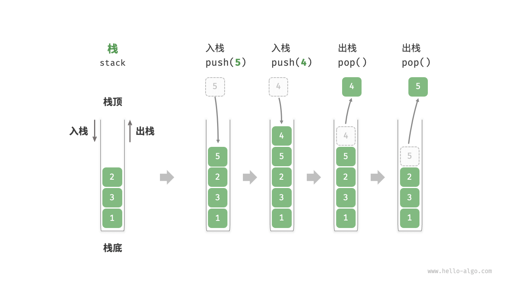

# 1. 栈与队列
## 1.1. 栈
栈是一种遵循先入后出逻辑的线性数据结构。



### 1.1.1. 栈的常用操作
| 方法   | 描述                   | 时间复杂度 |
|-:-:----|-:-:--------------------|-:-:--------|
| push() | 元素入栈（添加至栈顶） | O(1)       |
| pop()  | 栈顶元素出栈           | O(1)       |
| peek() | 访问栈顶元素           | O(1)       |

```java
/* 初始化栈 */
Stack<Integer> stack = new Stack<>();

/* 元素入栈 */
stack.push(1);
stack.push(3);
stack.push(2);
stack.push(5);
stack.push(4);

/* 访问栈顶元素 */
int peek = stack.peek();

/* 元素出栈 */
int pop = stack.pop();

/* 获取栈的长度 */
int size = stack.size();

/* 判断是否为空 */
boolean isEmpty = stack.isEmpty();
```

### 1.1.2. 栈的实现
#### 1.1.2.1. 基于链表的实现
```java
/* 基于链表实现的栈 */
class LinkedListStack {
    private ListNode stackPeek; // 将头节点作为栈顶
    private int stkSize = 0; // 栈的长度

    public LinkedListStack() {
        stackPeek = null;
    }

    /* 获取栈的长度 */
    public int size() {
        return stkSize;
    }

    /* 判断栈是否为空 */
    public boolean isEmpty() {
        return size() == 0;
    }

    /* 入栈 */
    public void push(int num) {
        ListNode node = new ListNode(num);
        node.next = stackPeek;
        stackPeek = node;
        stkSize++;
    }

    /* 出栈 */
    public int pop() {
        int num = peek();
        stackPeek = stackPeek.next;
        stkSize--;
        return num;
    }

    /* 访问栈顶元素 */
    public int peek() {
        if (isEmpty())
            throw new IndexOutOfBoundsException();
        return stackPeek.val;
    }

    /* 将 List 转化为 Array 并返回 */
    public int[] toArray() {
        ListNode node = stackPeek;
        int[] res = new int[size()];
        for (int i = res.length - 1; i >= 0; i--) {
            res[i] = node.val;
            node = node.next;
        }
        return res;
    }
}
```

#### 1.1.2.2. 基于数组的实现
### 1.1.3. 两种实现的对比


## 1.2. 队列
## 1.3. 双向队列