# 1. Cisco Packet Tracer
## 1.1. 组件小型局域网
`实验设备：switch_2960 1台、PC 2台、直通线`
       
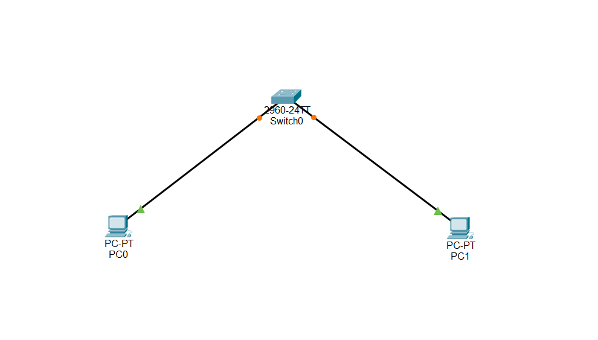
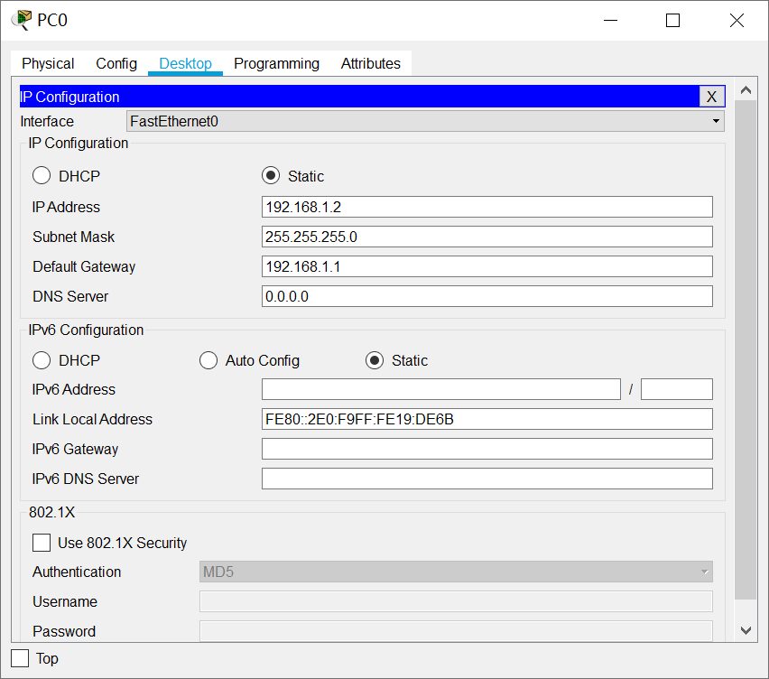
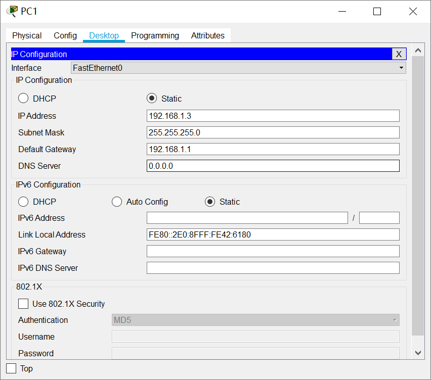   
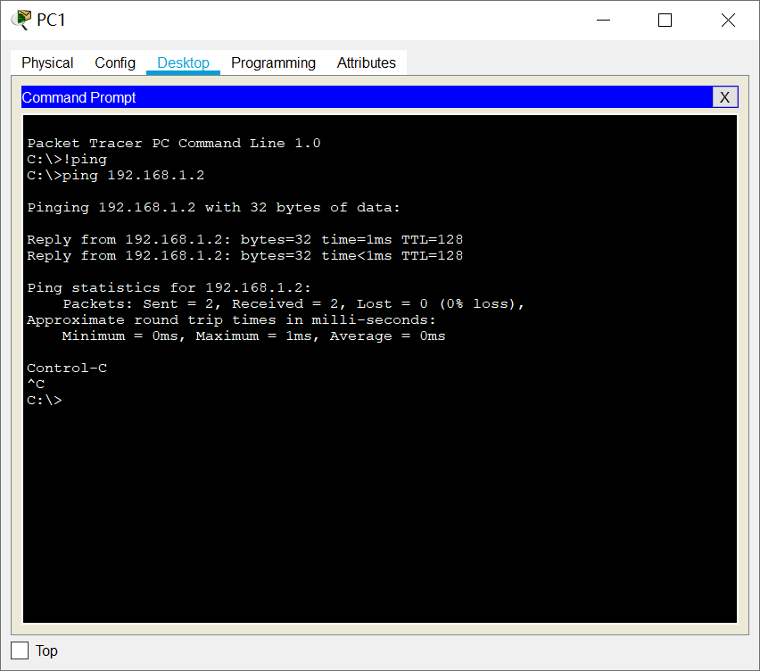 
           
## 1.2. 交换机的配置与管理
>交换机的管理方式基本分为两种：带内管理和带外管理。       
>通过交换机的Console端口管理交换机属于带外管理。第一次配置交换机必须利用Console端口进行配置。
           
### 1.2.1. 思科和华为交换机常用命令对比
#### 1.2.1.1. 调试命令
思科：
            
```html
Switch#show run 显示所有配置命令

Switch#show ip inter brief 显示所有接口状态

Switch#show vlan brief 显示所有VLAN的信息

Switch#show version 显示版本信息
```

华为：
          
```html
[Quidway]dis cur 显示所有配置命令
[Quidway]display interfaces 显示所有接口状态
[Quidway]display vlan all 显示所有VLAN的信息
[Quidway]display version 显示版本信息
```
           
#### 1.2.1.2. 接口配置命令
思科：
           
```html
Switch（config）#interface f0/8 进入接口视图

Switch（config-if）#no shutdown 此命令开启接口

Switch（config-if）#description to server01 端口描述

Switch（config-if）#ip add 192.168.1.100 255.255.255.0 设置接口IP
```
    
华为：
        
```html
[Quidway]interface e0/1 进入接口视图

[Quidway]undo shutdown 此命令开启接口

[Quidway]description to server02 端口描述

[Quidway]ip add 192.168.1.102 255.255.255.0 设置接口 IP
```
         
#### 1.2.1.3. VLAN 配置命令
思科：
          
```html
建立和删除VLAN ：
Switch# vlan database
Switch（vlan）# vlan 20 name test20
Switch（vlan）# no vlan 20
Switch（vlan）# exit

将端口分配给一个 VLAN ：
Switch（config）# interface f0/1
Switch（config-if）# switchport mode access
Switch（config-if）# switchport access vlan 20

设置VLAN TRUNK ：

Switch（config）# interface f0/24
Switch（config-if）# switchport mode trunk
Switch（config-if）# switchport trunk encapsulation dot1q
```
               
华为：
          
```html
建立和删除VLAN ：
[Quidway]vlan 30
[Quidway]undo vlan 30

将端口分配给一个 VLAN
[Quidway]int ethernet0/1
[Quidway-Ethernet0/1]port access vlan 30（ port default vlan 30）

或

[Quidway]vlan 30
[Quidway-vlan3]port ethernet 0/1 在VLAN中增加端口
[Quidway-vlan3]port ethernet 0/1 to ethernet 0/4 在VLAN中增加多个连续端口

设置VLAN TRUNK

[Quidway]int e0/24
[Quidway-Ethernet0/24] port link-type trunk
[Quidway-Ethernet0/24]port trunk permit vlan {ID|All}
```
      
### 1.2.2. 交换机的配置与管理
`实验设备：switch_2960 1台，PC 1台，配置线，直通线`
        
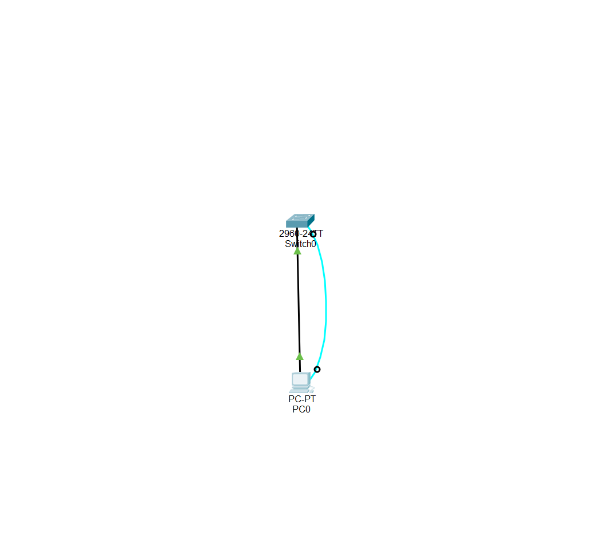
       
#### 1.2.2.1. 配置设备
`PC console端口：【PC-->Desktop-->Terminal】`
       
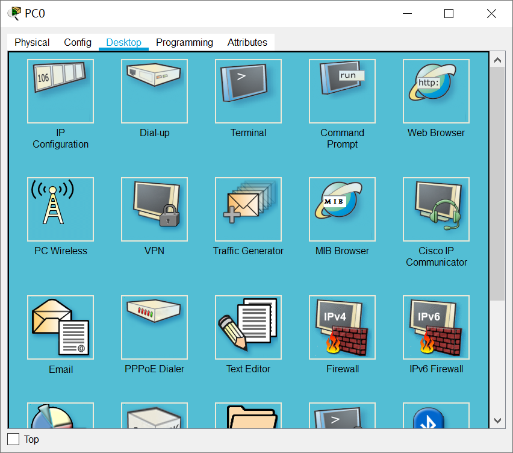
        
```html
Switch>en    ## 特权模式

## 修改特权密码
s2960(config)#enable password cisco

## 查看fastEthernet 0/1端口信息
s2960#show interfaces fastEthernet 0/1   
FastEthernet0/1 is up, line protocol is up (connected)
  Hardware is Lance, address is 00e0.a3b4.2101 (bia 00e0.a3b4.2101)
 BW 100000 Kbit, DLY 1000 usec,
     reliability 255/255, txload 1/255, rxload 1/255
  Encapsulation ARPA, loopback not set
  Keepalive set (10 sec)
  Full-duplex, 100Mb/s
  input flow-control is off, output flow-control is off
  ARP type: ARPA, ARP Timeout 04:00:00
  Last input 00:00:08, output 00:00:05, output hang never
  Last clearing of "show interface" counters never
  Input queue: 0/75/0/0 (size/max/drops/flushes); Total output drops: 0
  Queueing strategy: fifo
  Output queue :0/40 (size/max)
  5 minute input rate 0 bits/sec, 0 packets/sec
  5 minute output rate 0 bits/sec, 0 packets/sec
     956 packets input, 193351 bytes, 0 no buffer
     Received 956 broadcasts, 0 runts, 0 giants, 0 throttles
     0 input errors, 0 CRC, 0 frame, 0 overrun, 0 ignored, 0 abort
     0 watchdog, 0 multicast, 0 pause input
     0 input packets with dribble condition detected
     2357 packets output, 263570 bytes, 0 underruns
     0 output errors, 0 collisions, 10 interface resets
     0 babbles, 0 late collision, 0 deferred
     0 lost carrier, 0 no carrier
     0 output buffer failures, 0 output buffers swapped out
 


## 全局配置
Switch#conf t   
Enter configuration commands, one per line.  End with CNTL/Z.

## 修改交换机名称
Switch(config)#hostname s2960   

## 修改端口配置
s2960(config-if)#speed 100

## 设置端口单双工
s2960(config-if)#duplex full
s2960(config-if)#exit
```

`配置端口时也需要调整PC的网卡，如下图：`
        
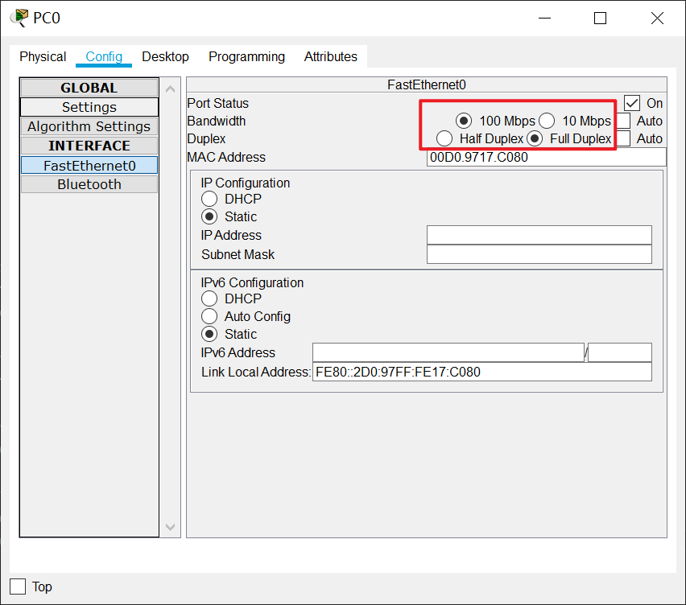
         
#### 1.2.2.2. 配置telnet
        
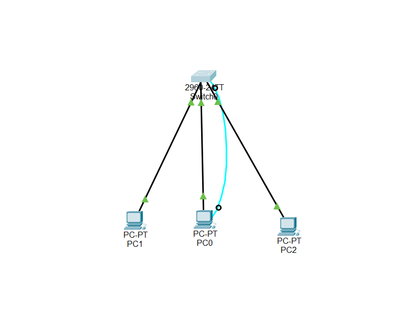
```html
## telnet登录
s2960#conf t
Enter configuration commands, one per line.  End with CNTL/Z.
s2960(config)#line vty 0 1  ## 设置连接数
s2960(config-line)#password 123   ## 设置telnet连接时的登陆密码
s2960(config-line)#login   ## 使配置生效
s2960(config)#interface vlan1
s2960(config-if)#ip address 192.168.1.1 255.255.255.0
s2960(config-if)#no shutdown 
s2960(config-if)#exit
```

PC设置：             
```
## PC0设置
192.168.1.2
255.255.255.0
192.168.1.1

## PC1设置
192.168.1.3
255.255.255.0
192.168.1.1

## PC2设置
192.168.1.4
255.255.255.0
192.168.1.1
```
           
PC通过telnet连接：
           
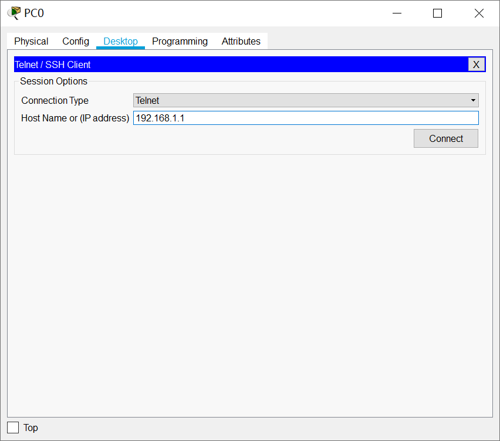
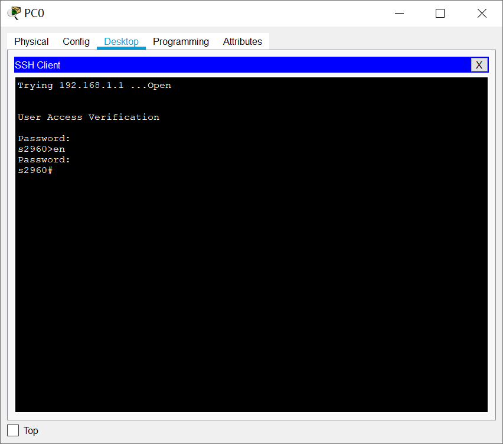
             
#### 1.2.2.3. 交换机的端口聚合配置
>端口聚合（又称为链路聚合），将交换机上的多个端口在物理上连接起来，在逻辑上捆绑在一起，形成一个拥有较大宽带的端口，可以实现负载分担，并提供冗余链路。    
>一台S2000系列以太网交换机只能有一个汇聚组，一个汇聚组最多可以有4个端口。组内的端口号必须连续，但对起始端口无特殊要求。在一个端口汇聚组中，端口号最小的作为主端口，其他的作为成员端口。同一个汇聚组中成员端口的链路类型与主端口的链路类型保持一致，即如果主端口为Trunk端口，则成员端口也为Trunk端口；如果主端口的链路类型改为Access端口，则成员端口的链路类型也变为Access端口。      
>所有参加聚合的端口都必须工作在全双工模式下，且工作速率相同才能进行聚合。并且聚合功能需要在链路两端同时配置方能生效。

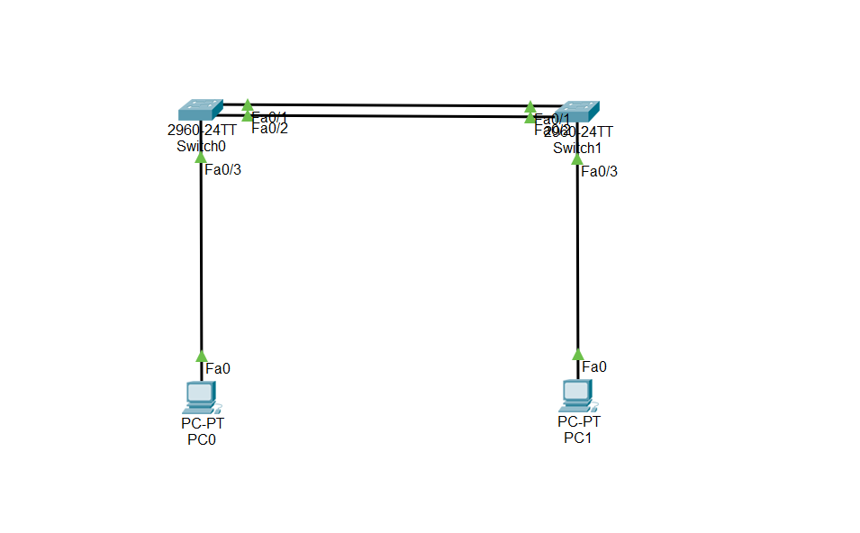     
           
`switch0`和`switch1`都需要进行以下配置：
          
```html
Switch>en
Switch#con
Switch#conf t
Enter configuration commands, one per line.  End with CNTL/Z.
Switch(config)#interface range fastEthernet 0/1-2
Switch(config-if-range)#switchport mode trunk 
Switch(config-if-range)#channel-group 1 mode on 
Switch(config-if-range)#exit
Switch(config)#port-channel load-balance dst-ip 
Switch(config)#exit
Switch#show etherchannel summary 
Flags:  D - down        P - in port-channel
        I - stand-alone s - suspended
        H - Hot-standby (LACP only)
        R - Layer3      S - Layer2
        U - in use      f - failed to allocate aggregator
        u - unsuitable for bundling
        w - waiting to be aggregated
        d - default port


Number of channel-groups in use: 1
Number of aggregators:           1

Group  Port-channel  Protocol    Ports
------+-------------+-----------+----------------------------------------------

1      Po1(SU)           -      Fa0/1(P) Fa0/2(P) 
```
           
#### 1.2.2.4. 交换机划分VLAN配置
>VLAN是指一个物理网段内，进行逻辑的划分，划分成若干个虚拟局域网，VLAN最大的特性是不受物理物理位置的限制，可以进行灵活的划分。VLAN具备一个物理网段所具备的特性。相同VLAN内的主机可以相互直接通信，不同VLAN间的主机之间互相访问必须经路由设备进行转发，广播数据包只可以在本VLAN内进行广播，不能传输到其他的VLAN中。
       
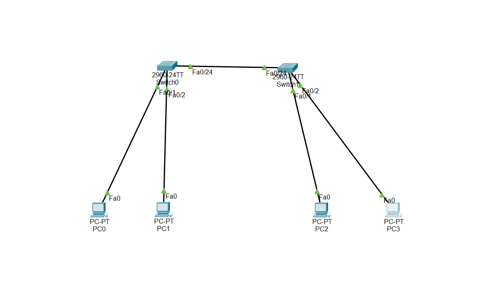
           
`switch0和switch1进行以下设置：`
         
```html
Switch>en
Switch#conf t
Enter configuration commands, one per line.  End with CNTL/Z.
Switch(config)#vlan 2
Switch(config-vlan)#exit
Switch(config)#vlan 3
Switch(config-vlan)#exit
Switch(config)#end

Switch#show vlan

VLAN Name                             Status    Ports
---- -------------------------------- --------- -------------------------------
1    default                          active    Fa0/1, Fa0/2, Fa0/3, Fa0/4
                                                Fa0/5, Fa0/6, Fa0/7, Fa0/8
                                                Fa0/9, Fa0/10, Fa0/11, Fa0/12
                                                Fa0/13, Fa0/14, Fa0/15, Fa0/16
                                                Fa0/17, Fa0/18, Fa0/19, Fa0/20
                                                Fa0/21, Fa0/22, Fa0/23, Gig0/1
                                                Gig0/2
2    VLAN0002                         active    
3    VLAN0003                         active    
1002 fddi-default                     active    
1003 token-ring-default               active    
1004 fddinet-default                  active    
1005 trnet-default                    active    

VLAN Type  SAID       MTU   Parent RingNo BridgeNo Stp  BrdgMode Trans1 Trans2
---- ----- ---------- ----- ------ ------ -------- ---- -------- ------ ------
1    enet  100001     1500  -      -      -        -    -        0      0
2    enet  100002     1500  -      -      -        -    -        0      0
3    enet  100003     1500  -      -      -        -    -        0      0
1002 fddi  101002     1500  -      -      -        -    -        0      0   
1003 tr    101003     1500  -      -      -        -    -        0      0   
1004 fdnet 101004     1500  -      -      -        ieee -        0      0   
1005 trnet 101005     1500  -      -      -        ibm  -        0      0   

VLAN Type  SAID       MTU   Parent RingNo BridgeNo Stp  BrdgMode Trans1 Trans2
---- ----- ---------- ----- ------ ------ -------- ---- -------- ------ ------

Remote SPAN VLANs
------------------------------------------------------------------------------

Primary Secondary Type              Ports
------- --------- ----------------- ------------------------------------------
Switch#conf t
Enter configuration commands, one per line.  End with CNTL/Z.
Switch(config)#interface fastEthernet 0/1
Switch(config-if)#switchport access vlan 2
Switch(config-if)#exit
Switch(config)#interface fastEthernet 0/2
Switch(config-if)#switchport access vlan 3
Switch(config-if)#end
Switch#show vlan

VLAN Name                             Status    Ports
---- -------------------------------- --------- -------------------------------
1    default                          active    Fa0/3, Fa0/4, Fa0/5, Fa0/6
                                                Fa0/7, Fa0/8, Fa0/9, Fa0/10
                                                Fa0/11, Fa0/12, Fa0/13, Fa0/14
                                                Fa0/15, Fa0/16, Fa0/17, Fa0/18
                                                Fa0/19, Fa0/20, Fa0/21, Fa0/22
                                                Fa0/23, Gig0/1, Gig0/2
2    VLAN0002                         active    Fa0/1
3    VLAN0003                         active    Fa0/2
1002 fddi-default                     active    
1003 token-ring-default               active    
1004 fddinet-default                  active    
1005 trnet-default                    active    

VLAN Type  SAID       MTU   Parent RingNo BridgeNo Stp  BrdgMode Trans1 Trans2
---- ----- ---------- ----- ------ ------ -------- ---- -------- ------ ------
1    enet  100001     1500  -      -      -        -    -        0      0
2    enet  100002     1500  -      -      -        -    -        0      0
3    enet  100003     1500  -      -      -        -    -        0      0
1002 fddi  101002     1500  -      -      -        -    -        0      0   
1003 tr    101003     1500  -      -      -        -    -        0      0   
1004 fdnet 101004     1500  -      -      -        ieee -        0      0   
1005 trnet 101005     1500  -      -      -        ibm  -        0      0   

VLAN Type  SAID       MTU   Parent RingNo BridgeNo Stp  BrdgMode Trans1 Trans2
---- ----- ---------- ----- ------ ------ -------- ---- -------- ------ ------

Remote SPAN VLANs
------------------------------------------------------------------------------

Primary Secondary Type              Ports
------- --------- ----------------- ------------------------------------------
Switch#conf t
Enter configuration commands, one per line.  End with CNTL/Z.
Switch(config)#interface fastEthernet 0/24
Switch(config-if)#switchport mode trunk 
Switch(config-if)#end

Switch#show vlan

VLAN Name                             Status    Ports
---- -------------------------------- --------- -------------------------------
1    default                          active    Fa0/3, Fa0/4, Fa0/5, Fa0/6
                                                Fa0/7, Fa0/8, Fa0/9, Fa0/10
                                                Fa0/11, Fa0/12, Fa0/13, Fa0/14
                                                Fa0/15, Fa0/16, Fa0/17, Fa0/18
                                                Fa0/19, Fa0/20, Fa0/21, Fa0/22
                                                Fa0/23, Gig0/1, Gig0/2
2    VLAN0002                         active    Fa0/1
3    VLAN0003                         active    Fa0/2
1002 fddi-default                     active    
1003 token-ring-default               active    
1004 fddinet-default                  active    
1005 trnet-default                    active    

VLAN Type  SAID       MTU   Parent RingNo BridgeNo Stp  BrdgMode Trans1 Trans2
---- ----- ---------- ----- ------ ------ -------- ---- -------- ------ ------
1    enet  100001     1500  -      -      -        -    -        0      0
2    enet  100002     1500  -      -      -        -    -        0      0
3    enet  100003     1500  -      -      -        -    -        0      0
1002 fddi  101002     1500  -      -      -        -    -        0      0   
1003 tr    101003     1500  -      -      -        -    -        0      0   
1004 fdnet 101004     1500  -      -      -        ieee -        0      0   
1005 trnet 101005     1500  -      -      -        ibm  -        0      0   

VLAN Type  SAID       MTU   Parent RingNo BridgeNo Stp  BrdgMode Trans1 Trans2
---- ----- ---------- ----- ------ ------ -------- ---- -------- ------ ------

Remote SPAN VLANs
------------------------------------------------------------------------------

Primary Secondary Type              Ports
------- --------- ----------------- ------------------------------------------
```
       
`PC设置：`
        
```html
PC0:
192.168.1.2
255.255.255.0
192.168.1.1

PC0:
192.168.1.3
255.255.255.0
192.168.1.1

PC0:
192.168.1.4
255.255.255.0
192.168.1.1

PC0:
192.168.1.5
255.255.255.0
192.168.1.1
```
         
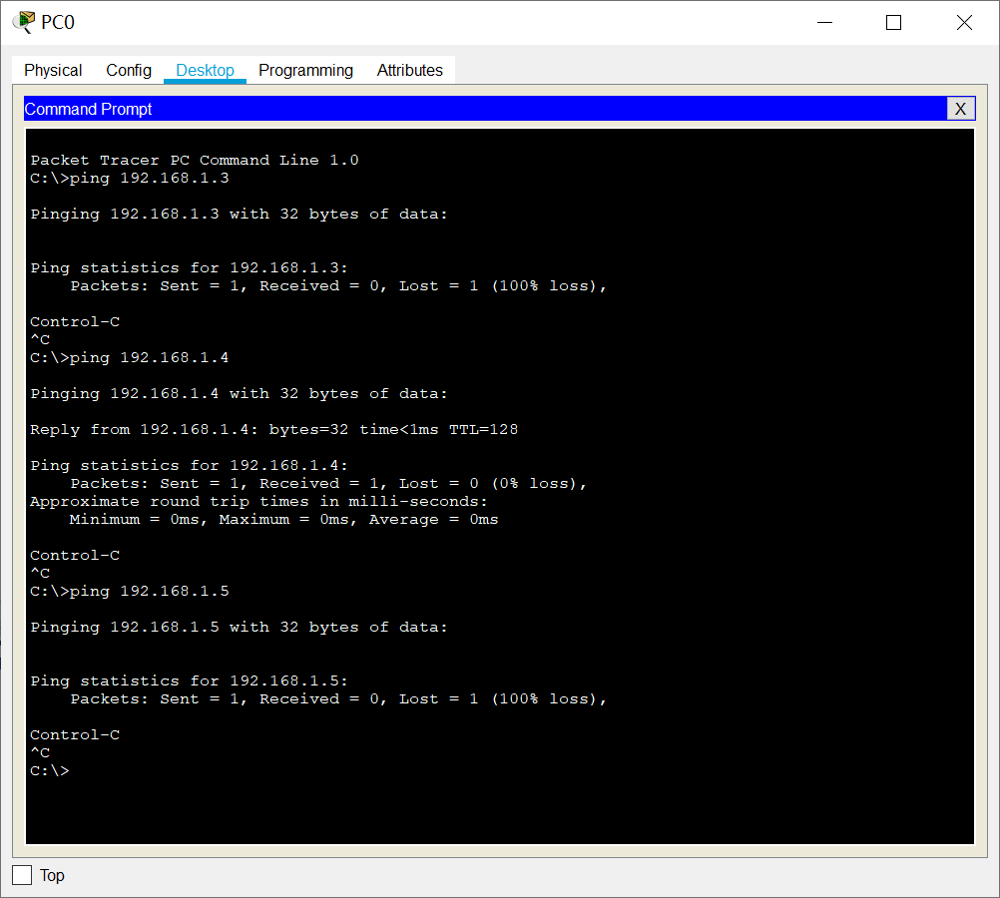
         
#### 1.2.2.5. 利用三层交换机实现VLAN间路由
>三层交换机是带有三层路由功能的交换机，也就是这台交换机的端口既有三层路由功能，也具有二层交换功能。三层交换机端口默认为二层口，如果需要启动三层功能就需要在此端口输入no switchport命令。           
>三层交换机具备网络层的功能，实现VLAN相互访问的原理：
>- 利用三层交换机的路由功能，通过识别数据包的IP地址，查找路由表进行选路转发，三层交换机利用直连路由可以实现不同VLAN之间的相互访问；
>- 三层交换机给接口配置IP地址，采用SVI（交换虚拟接口）的方式实现VLAN间互连，SVI是指为交换机中的VLAN创建虚拟接口，并且配置IP地址。

       
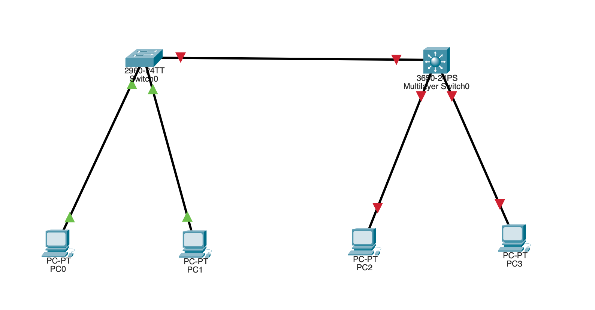
      
switch0配置如下：
      
```html
Switch#conf t
Enter configuration commands, one per line.  End with CNTL/Z.
Switch(config)#vlan 2

Switch(config-vlan)#exit
Switch(config)#vlan 3
Switch(config-vlan)#end
Switch#show vlan

VLAN Name                             Status    Ports
---- -------------------------------- --------- -------------------------------
1    default                          active    Fa0/1, Fa0/2, Fa0/3, Fa0/4
                                                Fa0/5, Fa0/6, Fa0/7, Fa0/8
                                                Fa0/9, Fa0/10, Fa0/11, Fa0/12
                                                Fa0/13, Fa0/14, Fa0/15, Fa0/16
                                                Fa0/17, Fa0/18, Fa0/19, Fa0/20
                                                Fa0/21, Fa0/22, Fa0/23, Fa0/24
                                                Gig0/1, Gig0/2
2    VLAN0002                         active    
3    VLAN0003                         active    
1002 fddi-default                     active    
1003 token-ring-default               active    
1004 fddinet-default                  active    
1005 trnet-default                    active    

VLAN Type  SAID       MTU   Parent RingNo BridgeNo Stp  BrdgMode Trans1 Trans2
---- ----- ---------- ----- ------ ------ -------- ---- -------- ------ ------
1    enet  100001     1500  -      -      -        -    -        0      0
2    enet  100002     1500  -      -      -        -    -        0      0
3    enet  100003     1500  -      -      -        -    -        0      0
1002 fddi  101002     1500  -      -      -        -    -        0      0   
1003 tr    101003     1500  -      -      -        -    -        0      0   
1004 fdnet 101004     1500  -      -      -        ieee -        0      0   
1005 trnet 101005     1500  -      -      -        ibm  -        0      0   

VLAN Type  SAID       MTU   Parent RingNo BridgeNo Stp  BrdgMode Trans1 Trans2
---- ----- ---------- ----- ------ ------ -------- ---- -------- ------ ------

Remote SPAN VLANs
------------------------------------------------------------------------------

Primary Secondary Type              Ports
------- --------- ----------------- ------------------------------------------
Switch#conf t

Switch(config)#interface fastEthernet 0/2
Switch(config-if)#switchport access vlan 2
Switch(config-if)#exit

Switch(config)#interface fastEthernet 0/3
Switch(config-if)#switchport access vlan 3
Switch(config-if)#end

Switch#show vlan

VLAN Name                             Status    Ports
---- -------------------------------- --------- -------------------------------
1    default                          active    Fa0/1, Fa0/4, Fa0/5, Fa0/6
                                                Fa0/7, Fa0/8, Fa0/9, Fa0/10
                                                Fa0/11, Fa0/12, Fa0/13, Fa0/14
                                                Fa0/15, Fa0/16, Fa0/17, Fa0/18
                                                Fa0/19, Fa0/20, Fa0/21, Fa0/22
                                                Fa0/23, Fa0/24, Gig0/1, Gig0/2
2    VLAN0002                         active    Fa0/2
3    VLAN0003                         active    Fa0/3
1002 fddi-default                     active    
1003 token-ring-default               active    
1004 fddinet-default                  active    
1005 trnet-default                    active    

VLAN Type  SAID       MTU   Parent RingNo BridgeNo Stp  BrdgMode Trans1 Trans2
---- ----- ---------- ----- ------ ------ -------- ---- -------- ------ ------
1    enet  100001     1500  -      -      -        -    -        0      0
2    enet  100002     1500  -      -      -        -    -        0      0
3    enet  100003     1500  -      -      -        -    -        0      0
1002 fddi  101002     1500  -      -      -        -    -        0      0   
1003 tr    101003     1500  -      -      -        -    -        0      0   
1004 fdnet 101004     1500  -      -      -        ieee -        0      0   
1005 trnet 101005     1500  -      -      -        ibm  -        0      0   

VLAN Type  SAID       MTU   Parent RingNo BridgeNo Stp  BrdgMode Trans1 Trans2
---- ----- ---------- ----- ------ ------ -------- ---- -------- ------ ------

Remote SPAN VLANs
------------------------------------------------------------------------------

Primary Secondary Type              Ports
------- --------- ----------------- ------------------------------------------
Switch#conf t

Switch(config)#interface fastEthernet 0/1

Switch(config-if)#switchport mode trunk 
Switch(config-if)#end

Switch#show vlan

VLAN Name                             Status    Ports
---- -------------------------------- --------- -------------------------------
1    default                          active    Fa0/1, Fa0/4, Fa0/5, Fa0/6
                                                Fa0/7, Fa0/8, Fa0/9, Fa0/10
                                                Fa0/11, Fa0/12, Fa0/13, Fa0/14
                                                Fa0/15, Fa0/16, Fa0/17, Fa0/18
                                                Fa0/19, Fa0/20, Fa0/21, Fa0/22
                                                Fa0/23, Fa0/24, Gig0/1, Gig0/2
2    VLAN0002                         active    Fa0/2
3    VLAN0003                         active    Fa0/3
1002 fddi-default                     active    
1003 token-ring-default               active    
1004 fddinet-default                  active    
1005 trnet-default                    active    

VLAN Type  SAID       MTU   Parent RingNo BridgeNo Stp  BrdgMode Trans1 Trans2
---- ----- ---------- ----- ------ ------ -------- ---- -------- ------ ------
1    enet  100001     1500  -      -      -        -    -        0      0
2    enet  100002     1500  -      -      -        -    -        0      0
3    enet  100003     1500  -      -      -        -    -        0      0
1002 fddi  101002     1500  -      -      -        -    -        0      0   
1003 tr    101003     1500  -      -      -        -    -        0      0   
1004 fdnet 101004     1500  -      -      -        ieee -        0      0   
1005 trnet 101005     1500  -      -      -        ibm  -        0      0   

VLAN Type  SAID       MTU   Parent RingNo BridgeNo Stp  BrdgMode Trans1 Trans2
---- ----- ---------- ----- ------ ------ -------- ---- -------- ------ ------

Remote SPAN VLANs
------------------------------------------------------------------------------

Primary Secondary Type              Ports
------- --------- ----------------- ------------------------------------------
```

switch1配置如下：

```html
Switch>en
Switch#conf t
Switch(config)#ip routing
Switch(config)#vlan 2
Switch(config-vlan)#exit
Switch(config)#vlan 3
Switch(config-vlan)#exit
Switch(config)#end

Switch#show vlan

VLAN Name                             Status    Ports
---- -------------------------------- --------- -------------------------------
1    default                          active    Gig1/0/2, Gig1/0/3, Gig1/0/4, Gig1/0/5
                                                Gig1/0/6, Gig1/0/7, Gig1/0/8, Gig1/0/9
                                                Gig1/0/10, Gig1/0/11, Gig1/0/12, Gig1/0/13
                                                Gig1/0/14, Gig1/0/15, Gig1/0/16, Gig1/0/17
                                                Gig1/0/18, Gig1/0/19, Gig1/0/20, Gig1/0/21
                                                Gig1/0/22, Gig1/0/23, Gig1/0/24, Gig1/1/1
                                                Gig1/1/2, Gig1/1/3, Gig1/1/4
2    VLAN0002                         active    
3    VLAN0003                         active    
1002 fddi-default                     active    
1003 token-ring-default               active    
1004 fddinet-default                  active    
1005 trnet-default                    active    

VLAN Type  SAID       MTU   Parent RingNo BridgeNo Stp  BrdgMode Trans1 Trans2
---- ----- ---------- ----- ------ ------ -------- ---- -------- ------ ------
1    enet  100001     1500  -      -      -        -    -        0      0
2    enet  100002     1500  -      -      -        -    -        0      0
3    enet  100003     1500  -      -      -        -    -        0      0
1002 fddi  101002     1500  -      -      -        -    -        0      0   
1003 tr    101003     1500  -      -      -        -    -        0      0   
1004 fdnet 101004     1500  -      -      -        ieee -        0      0   
1005 trnet 101005     1500  -      -      -        ibm  -        0      0   

VLAN Type  SAID       MTU   Parent RingNo BridgeNo Stp  BrdgMode Trans1 Trans2
---- ----- ---------- ----- ------ ------ -------- ---- -------- ------ ------

Remote SPAN VLANs
------------------------------------------------------------------------------

Primary Secondary Type              Ports
------- --------- ----------------- ------------------------------------------
Switch#conf t

Switch(config)#interface gigabitEthernet 1/0/2

Switch(config-if)#switchport access vlan 2
Switch(config-if)#exit

Switch(config)#interface gigabitEthernet 1/0/3
Switch(config-if)#switchport access vlan 3
Switch(config-if)#exit
Switch(config)#end

Switch#show vlan

VLAN Name                             Status    Ports
---- -------------------------------- --------- -------------------------------
1    default                          active    Gig1/0/4, Gig1/0/5, Gig1/0/6, Gig1/0/7
                                                Gig1/0/8, Gig1/0/9, Gig1/0/10, Gig1/0/11
                                                Gig1/0/12, Gig1/0/13, Gig1/0/14, Gig1/0/15
                                                Gig1/0/16, Gig1/0/17, Gig1/0/18, Gig1/0/19
                                                Gig1/0/20, Gig1/0/21, Gig1/0/22, Gig1/0/23
                                                Gig1/0/24, Gig1/1/1, Gig1/1/2, Gig1/1/3
                                                Gig1/1/4
2    VLAN0002                         active    Gig1/0/2
3    VLAN0003                         active    Gig1/0/3
1002 fddi-default                     active    
1003 token-ring-default               active    
1004 fddinet-default                  active    
1005 trnet-default                    active    

VLAN Type  SAID       MTU   Parent RingNo BridgeNo Stp  BrdgMode Trans1 Trans2
---- ----- ---------- ----- ------ ------ -------- ---- -------- ------ ------
1    enet  100001     1500  -      -      -        -    -        0      0
2    enet  100002     1500  -      -      -        -    -        0      0
3    enet  100003     1500  -      -      -        -    -        0      0
1002 fddi  101002     1500  -      -      -        -    -        0      0   
1003 tr    101003     1500  -      -      -        -    -        0      0   
1004 fdnet 101004     1500  -      -      -        ieee -        0      0   
1005 trnet 101005     1500  -      -      -        ibm  -        0      0   

VLAN Type  SAID       MTU   Parent RingNo BridgeNo Stp  BrdgMode Trans1 Trans2
---- ----- ---------- ----- ------ ------ -------- ---- -------- ------ ------

Remote SPAN VLANs
------------------------------------------------------------------------------

Primary Secondary Type              Ports
------- --------- ----------------- ------------------------------------------
Switch#conf t
Switch(config)#interface gigabitEthernet 1/0/1
Switch(config-if)#switchport trunk encapsulation dot1q
Switch(config-if)#switchport mode trunk 
Switch(config-if)#exit

Switch(config)#interface vlan 2
Switch(config-if)#ip address 192.168.1.1 255.255.255.0
Switch(config-if)#no shutdown 
Switch(config-if)#exit

Switch(config)#interface vlan 3
Switch(config-if)#ip address 192.168.2.1 255.255.255.0
Switch(config-if)#no shutdown 
Switch(config-if)#exit
Switch(config)#exit

Switch#show ip route
Codes: C - connected, S - static, I - IGRP, R - RIP, M - mobile, B - BGP
       D - EIGRP, EX - EIGRP external, O - OSPF, IA - OSPF inter area
       N1 - OSPF NSSA external type 1, N2 - OSPF NSSA external type 2
       E1 - OSPF external type 1, E2 - OSPF external type 2, E - EGP
       i - IS-IS, L1 - IS-IS level-1, L2 - IS-IS level-2, ia - IS-IS inter area
       * - candidate default, U - per-user static route, o - ODR
       P - periodic downloaded static route

Gateway of last resort is not set

C    192.168.1.0/24 is directly connected, Vlan2
C    192.168.2.0/24 is directly connected, Vlan3

Switch#show vlan

VLAN Name                             Status    Ports
---- -------------------------------- --------- -------------------------------
1    default                          active    Gig1/0/4, Gig1/0/5, Gig1/0/6, Gig1/0/7
                                                Gig1/0/8, Gig1/0/9, Gig1/0/10, Gig1/0/11
                                                Gig1/0/12, Gig1/0/13, Gig1/0/14, Gig1/0/15
                                                Gig1/0/16, Gig1/0/17, Gig1/0/18, Gig1/0/19
                                                Gig1/0/20, Gig1/0/21, Gig1/0/22, Gig1/0/23
                                                Gig1/0/24, Gig1/1/1, Gig1/1/2, Gig1/1/3
                                                Gig1/1/4
2    VLAN0002                         active    Gig1/0/2
3    VLAN0003                         active    Gig1/0/3
1002 fddi-default                     active    
1003 token-ring-default               active    
1004 fddinet-default                  active    
1005 trnet-default                    active    

VLAN Type  SAID       MTU   Parent RingNo BridgeNo Stp  BrdgMode Trans1 Trans2
---- ----- ---------- ----- ------ ------ -------- ---- -------- ------ ------
1    enet  100001     1500  -      -      -        -    -        0      0
2    enet  100002     1500  -      -      -        -    -        0      0
3    enet  100003     1500  -      -      -        -    -        0      0
1002 fddi  101002     1500  -      -      -        -    -        0      0   
1003 tr    101003     1500  -      -      -        -    -        0      0   
1004 fdnet 101004     1500  -      -      -        ieee -        0      0   
1005 trnet 101005     1500  -      -      -        ibm  -        0      0   

VLAN Type  SAID       MTU   Parent RingNo BridgeNo Stp  BrdgMode Trans1 Trans2
---- ----- ---------- ----- ------ ------ -------- ---- -------- ------ ------

Remote SPAN VLANs
------------------------------------------------------------------------------

Primary Secondary Type              Ports
------- --------- ----------------- ------------------------------------------
```
       
在PC0上进行测试：
      
```html

Packet Tracer PC Command Line 1.0
C:\>ping 192.168.1.1

Pinging 192.168.1.1 with 32 bytes of data:

Reply from 192.168.1.1: bytes=32 time<1ms TTL=255
Reply from 192.168.1.1: bytes=32 time<1ms TTL=255
Reply from 192.168.1.1: bytes=32 time<1ms TTL=255
Reply from 192.168.1.1: bytes=32 time=18ms TTL=255

Ping statistics for 192.168.1.1:
    Packets: Sent = 4, Received = 4, Lost = 0 (0% loss),
Approximate round trip times in milli-seconds:
    Minimum = 0ms, Maximum = 18ms, Average = 4ms

C:\>ping 192.168.1.2

Pinging 192.168.1.2 with 32 bytes of data:

Request timed out.
Reply from 192.168.1.2: bytes=32 time=13ms TTL=127
Reply from 192.168.1.2: bytes=32 time<1ms TTL=127
Reply from 192.168.1.2: bytes=32 time<1ms TTL=127

Ping statistics for 192.168.1.2:
    Packets: Sent = 4, Received = 3, Lost = 1 (25% loss),
Approximate round trip times in milli-seconds:
    Minimum = 0ms, Maximum = 13ms, Average = 4ms

C:\>ping 192.168.1.3

Pinging 192.168.1.3 with 32 bytes of data:

Request timed out.
Reply from 192.168.1.3: bytes=32 time<1ms TTL=127
Reply from 192.168.1.3: bytes=32 time<1ms TTL=127
Reply from 192.168.1.3: bytes=32 time<1ms TTL=127

Ping statistics for 192.168.1.3:
    Packets: Sent = 4, Received = 3, Lost = 1 (25% loss),
Approximate round trip times in milli-seconds:
    Minimum = 0ms, Maximum = 0ms, Average = 0ms

C:\>ping 192.168.2.1

Pinging 192.168.2.1 with 32 bytes of data:

Reply from 192.168.2.1: bytes=32 time<1ms TTL=255
Reply from 192.168.2.1: bytes=32 time<1ms TTL=255
Reply from 192.168.2.1: bytes=32 time<1ms TTL=255
Reply from 192.168.2.1: bytes=32 time<1ms TTL=255

Ping statistics for 192.168.2.1:
    Packets: Sent = 4, Received = 4, Lost = 0 (0% loss),
Approximate round trip times in milli-seconds:
    Minimum = 0ms, Maximum = 0ms, Average = 0ms

C:\>ping 192.168.2.2

Pinging 192.168.2.2 with 32 bytes of data:

Reply from 192.168.2.2: bytes=32 time=11ms TTL=128
Reply from 192.168.2.2: bytes=32 time=2ms TTL=128
Reply from 192.168.2.2: bytes=32 time=5ms TTL=128
Reply from 192.168.2.2: bytes=32 time=2ms TTL=128

Ping statistics for 192.168.2.2:
    Packets: Sent = 4, Received = 4, Lost = 0 (0% loss),
Approximate round trip times in milli-seconds:
    Minimum = 2ms, Maximum = 11ms, Average = 5ms

C:\>ping 192.168.2.3

Pinging 192.168.2.3 with 32 bytes of data:

Reply from 192.168.2.3: bytes=32 time<1ms TTL=128
Reply from 192.168.2.3: bytes=32 time<1ms TTL=128
Reply from 192.168.2.3: bytes=32 time<1ms TTL=128
Reply from 192.168.2.3: bytes=32 time<1ms TTL=128

Ping statistics for 192.168.2.3:
    Packets: Sent = 4, Received = 4, Lost = 0 (0% loss),
Approximate round trip times in milli-seconds:
    Minimum = 0ms, Maximum = 0ms, Average = 0ms
```