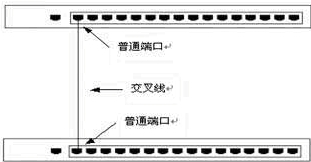
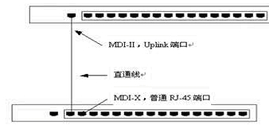
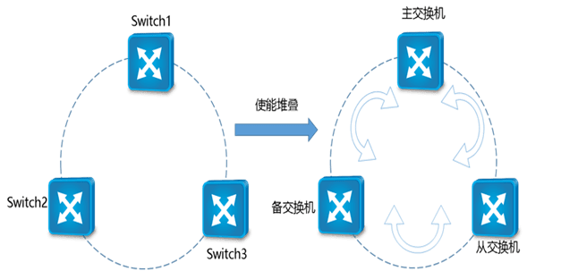
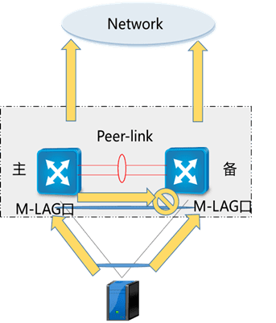
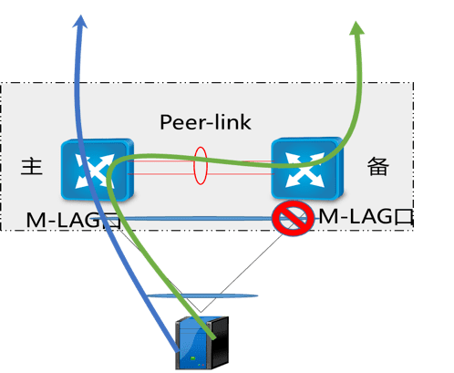
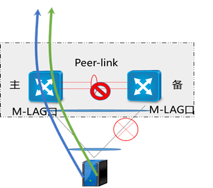
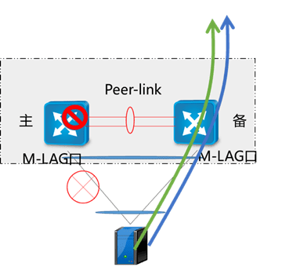

# 1. 交换机级联、堆叠和M-LAG
## 1.1. 级联
>级联可以定义为两台或两台以上的交换机通过一定的方式相互连接。可以实现多台交换机之间的互连。
          
城域网实际上就是由各层次的许多台交换机级联而成的。核心交换机（或路由器）下连若干台汇聚交换机，汇聚交换机下联若干台小区中心交换机，小区中心交换机下连若干台楼宇交换机，楼宇交换机下连若干台楼层（或单元）交换机（或集线器）。
        
交换机间一般是通过普通用户端口进行级联，有些交换机则提供了专门的级联端口（Uplink Port）。这两种端口的区别仅仅在于普通端口符合MDI标准，而级联端口（或称上行口）符合MDIX标准。由此导致了两种方式下接线方式度不同：当两台交换机都通过普通端口级联时，端口间电缆采用直通电缆（Straight Throurh Cable）；当且仅当中一台通过级联端口时，采用交叉电缆（Crossover Cable）。
          

           

           
相关问题：
1. 原则上任何厂家、任何型号的以太网交换机均可进行级联，但也不排除一些特殊情况下两台交换机无法进行级联。
2. 交换机间级联的层数是有一定限度的。成功实现级联的最更本原则就是任意两站点之间的距离不能超过媒体段的最大跨度。
3. 多台交换机级联时，应保证它们都支持生成树（Spanning-Tree）协议，既要防止网内出现环路，又要允许冗余链路存在。
4. 下层的交换机的总体速度，受限于上层交换机的端口带宽。下级的设备只能共享较窄的出口。进行级联时，应该尽力保证交换机间中继链路具有足够的带宽，为此可采用全双工技术和链路汇聚技术。
          
级连层数一般不要超过4层。
            
举一个简单的例子，一个200节点的网络，如果使用普通24口交换机级连几乎无法实现，因为 24 个端口乘以 7 台交换机等于 168个端口，级连还要用掉一些，大约还有156个端口可用：
                       
```html
可用端口 = 6台交换机 * （24个端口 - 1个级连端口） + 1台交换机 * (24个端口 - 与其他6台交换机的级连端口）
        = 6 * (24-1) + 1 *(24 - 6)
        = 6 * 23 + 18
        = 256
```
        
## 1.2. 堆叠
>堆叠是指将一台以上的交换机组合起来共同工作，以便在有限的空间内提供尽可能多的端口。可以将多台交换机组成一个单元，从而提高更大的端口密度和更高的性能。所谓堆叠，是指把多个支持堆叠特性的单机设备组合在一起，从逻辑上合为一台整体设备。堆叠没有建立前，每台交换机都是单独的实体，有自己独立的IP地址，对外体现为多台交换机，用户需要独立的管理所有的设备，堆叠建立后系统整体对外体现一个全局的IP地址和MAC地址。
         

           
在堆叠系统有三种角色：
- 主交换机：负责整个堆叠系统的管理，只有一台；
- 备交换机：是主交换机的备份，只有一台，当主交换机故障时，备交换机接管主交换机所有业务；
- 从交换机：系统中除了主交换机、其余都是从交换机（备交换机又是从交换机），主要是实现二层MAC地址以及三层单播与组播路由的分布式转发。
         
### 1.2.1. 堆叠的优点
- 高密度端口        
不同品牌的交换机支持堆叠的层数有所不同，一般情况下，最少可堆叠2层，而最多可堆叠至8层，因此，可在一个狭小的空间内为密集的计算机网络提供上百个端口。
- 高速传输             
由于叠堆中所有的计算机都连接至同一高速背板模块，位于不同交换机端口的计算机之间的通信不再需要层层转发，减少了交换机之间的转发延迟，避免了端口冲突，所有端口的计算机间均可以线速进行交换，提高了不同交换机间计算机的通讯速率。
- 便于管理           
一个叠堆的若干台交换机可视为一台交换机进行管理，只需赋予其1个IP地址，即可通过该IP地址对所有的交换机进行管理，从而大大减少了管理的强度和难度，极大地节约了管理成本。
          
### 1.2.2. 堆叠的缺点
- 堆叠组网下交换机升级会中断网络（60秒）；
+ CE交换机在L3能力和可靠性方面无法满足部署要求，导致交付困难：（主要是IPV6的问题，如果不使用IPV6则没有影响）
  - IPv6，MPLS关键L3特性无法支持NFV大规模商用；
  - 路由条目数，BFD会话数，OSPF邻居数规格不足；
  - BFD性能不足，支持500ms*4检测周期，无法满足中移动等<1s倒换要求。所以，当前CloudEdge主推外置L3 GW组网方案，EOR只做L2交换；
- CE交换机不支持IPV6下的BFD绑板。（对IPV6及CSLB的影响，CSLB场景堆叠交换机有一个故障时，业务会有影响，业务会概率断连）
           
### 1.2.3. 堆叠与级联的区别
简单的说：堆叠是平等关系，而级联是上下级关系。
           
堆叠实际上把每台交换机的母板总线连接在一起，不同交换机任意二端口之间的延时是相等的，就是一台交换机的延时。而级联就会产生比较大的延时（级联是上下级的关系）。级联的层次是有限制的。而且每层的性能都不同，最后层的性能最差。而堆叠是把所有堆叠的交换机的背板带宽共享。例如一台交换机的背板带宽为2G，那么3台交换机堆叠的话，每台交换机在交换时就有6G的背板带宽。而且堆叠是同级关系，每台交换机的性能是一样的。
           
###  1.2.4. 堆叠注意事项
- 首先实现堆叠的交换机必须是支持交换机端口级联堆叠的;
- 另外由于厂家提供的交换机端口级联堆叠连接电缆一般都在1米左右，故只能在很近的距离内使用交换机端口级联功能。
- 目前，市场上的主流交换机可以细分为可堆叠型和非堆叠型两大类。堆叠又分为真实堆叠和虚拟堆叠，所谓的虚拟堆叠，实际就是交换机之间的级联。交换机并不是通过专用堆叠模块和堆叠电缆，而是通过Fast Ethernet端口或Giga Ethernet端口进行堆叠，实际上这是一种变相的级联。
                
堆叠层数一般为4~9层。
        
## 1.3. M-LAG技术
>定义：即跨设备链路聚合组，是一种实现跨设备链路聚合的机制，能够实现多台设备间的链路聚合，从而把链路可靠性提高到了设备级，组成双活系统。
        
### 1.3.1. 目的
M-LAG作为一种跨设备链路聚合的技术，除了具备增加带宽、提高链路可靠性、负载分担的优势外，还具备以下优势：         
1）、更高的可靠性：把链路可靠性从单板级提高到了设备级。       
2）、简化组网及配置：可以将M-LAG理解为一种横向虚拟化技术，将双归接入的两台设备在逻辑上虚拟成一台设备。M-LAG提供了一个没有环路的二层拓扑同时实现冗余备份，不再需要繁琐的生成树协议配置，极大的简化了组网及配置。       
3）、独立升级：两台设备可以分别进行升级，保证有一台设备正常工作即可，对正在运行的业务几乎没有影响。      
          
### 1.3.2. 基础概念
1）、DFS Group：动态交换服务组DFS Group（Dynamic Fabric Service Group），主要用于部署M-LAG设备之间的配对，M-LAG双归设备之间的接口状态，表项等信息同步需要依赖DFS Group协议进行同步。     
2）、DFS主/备设备：部署M-LAG且状态为主的设备，通常也称为M-LAG主/备设备。（注：DFS Group的角色区分为主和备，正常情况下，主设备和备设备同时进行业务流量的转发，转发行为没有区别，仅在故障场景下，主备设备的行为会有差别）      
3）、双主检测链路：又称为心跳链路，是一条三层互通链路，用于M-LAG主备设备间发送双主检测报文。（注：正常情况下，双主检测链路不会参与M-LAG的任何转发行为，只在故障场景下，用于检查是否出现双主的情况）     
4）、peer-link接口：peer-link链路两端直连的接口均为peer-link接口。     
5）、peer-link链路：peer-link链路是一条直连链路且必须做链路聚合，用于交换协商报文及传输部分流量。接口配置为peer-link接口后，该接口上不能再配置其它业务。         
6）、M-LAG成员接口：M-LAG主备设备上连接用户侧主机（或交换设备）的Eth-Trunk接口。        
          
### 1.3.3. 流量模型
#### 1.3.3.1. 正常转发

             
1. 服务器侧上行的流量，基于流负载分担到两台M-LAG设备上；
2. 流量转发到M-LAG的成员设备上，不管是上行还是下行，都是本地优先转发；
3. 广播流量会经过peer-link，peer-link与双归的M-LAG成员口是单向隔离的（peer-link进的流量，不可以从M-LAG相应的成员口出）。
       
#### 1.3.3.2. 流量故障转发

             
支持M-LAG成员口故障后，需要放开Peer-link与另一侧成员口的隔离，让流量可以绕行。
         

         
支持peer-link故障后，联动备设备上所有物理口Down，只保证主设备可以正常转发。
           

          
单台设备掉电，正常设备继续转发报文。
         
#### 1.3.3.3.  M-LAG优点
网络可靠性非常高，设备控制层面独立，能单独设备升级且不影响业务，充分发挥设备性能。
                       
#### 1.3.3.4.  M-LAG缺点
管理节点多（控制层面无法虚拟化）