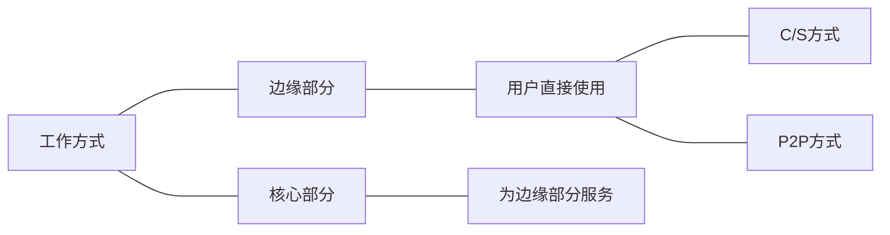
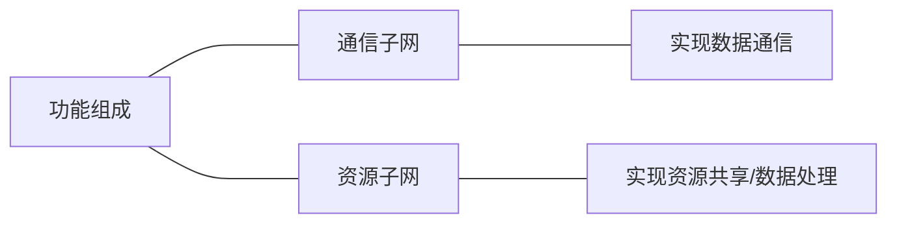

# 计算机网络体系结构
## 计算机网络的概念
计算机网络：是一个将分散的、具有独立功能的计算机系统，通过通信设备与线路连接起来，由功能完善的软件实现资源共享和信息传递的系统。
     
计算机网络是互连的、自治的计算机集合。
    - 互连-互联互通
    - 自治-无主从关系
     
## 计算机网络的功能
1. 数据通信（连通性）
2. 资源共享（硬件、软件、数据）
3. 分布式处理（多台计算机各自承担同一工作任务的不同部分）
4. 提高可靠性（替代机）
5. 负载均衡（各计算机之间更亲密）
     
## 计算机网络的组成
1. 组成部分：硬件、软件、协议
2. 工作方式
     

      
3. 功能组成
     

     

     
## 计算机网络的分类
1. 按分布范围分
2. 